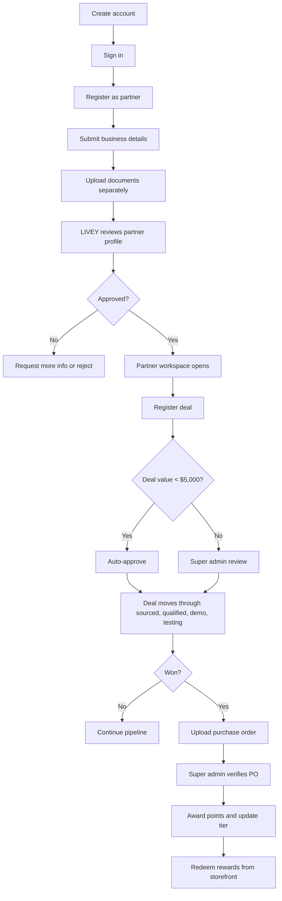

# LIVEY Partner Portal System Flowchart

This document maps the primary production workflow in the portal so future feature work can stay aligned with the actual business process.

## Coverage Notes

- Notifications are surfaced when partner, deal, and reward events happen.
- Audit logs capture approval and reward actions for later review.
- Empty states are intentional when no records exist yet.
- The portal uses PostgreSQL as the shared source of truth.
