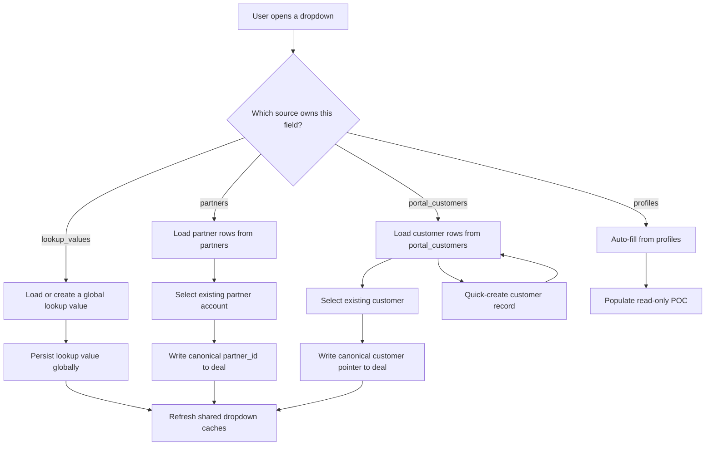

# Canonical Dropdown Source Registry Design

**Goal:** Make every major dropdown in LIVEY read from one canonical source of truth, write back to that same source when a new value is introduced, and keep related tabs, customer/account records, and news feed events in sync.

**Architecture:** Introduce a source registry that classifies dropdowns by ownership instead of treating them all as generic lookups. Partner accounts come from `partners`, customers come from `portal_customers`, people/POCs come from `profiles`, and only true enumerations remain in `lookup_values`. The combobox stays reusable, but its behavior changes by source: selection-only for account CRUD, quick-create for customers, and read-only auto-fill for profile-derived values. Feed items and notifications are published from the same business events so deal activity and partner milestones appear globally and consistently.

**Tech Stack:** TanStack Start, React, TypeScript, PostgreSQL, Radix UI, cmdk, existing local server bridge, current notification/feed tables.

---

## Scope

This spec covers the canonical data model for:

- Account dropdowns
- Client dropdowns
- POC defaults
- Global lookup dropdowns
- Stage/status handling
- News feed propagation for deals and partner milestones

It does not change the visual style of the dropdown component. It changes what each dropdown means, where it reads from, and what record gets written when users create a new value.

## Canonical Source Rules

The portal needs four distinct dropdown source classes:

1. **Partner-backed**
   - Source of truth: `partners`
   - Used for: account selectors in deal flows
   - Editable from: partner CRUD / admin partner review screens, not inline from the deal form
   - Visible to: partner admins and super admins
   - Hidden from: partner users, who are always locked to their own partner company

2. **Customer-backed**
   - Source of truth: `portal_customers`
   - Used for: client dropdowns and the Customers tab
   - Editable from: Customers tab, plus quick-create from a dropdown when the user wants to add a new client
   - Visible to: users who can access customer records
   - Behavior: when a new client is created from a dropdown, the exact same row must appear in the Customers tab after refresh because both surfaces read the same table

3. **Profile-derived**
   - Source of truth: `profiles`
   - Used for: POC defaults and read-only actor labels
   - Editable from: user/account management, not from deal dropdowns
   - Behavior: the POC field is auto-selected from the authoritative profile for the current deal creator context and shown as read-only unless an admin review flow explicitly edits it

4. **Lookup-backed**
   - Source of truth: `lookup_values`
   - Used for: real shared enumerations such as source labels, non-workflow categories, and reusable business terms
   - Editable from: dropdown creation for values that are not entity records
   - Behavior: these values are globally persisted and searchable, but they are not used for accounts or customers

## Canonical Entity Mapping

The user interface should treat these as the canonical relationships:

- `portal_deals.partner_id` is the account key for the selected partner company.
- `portal_deals.account_name` is the display label for that account, not the source of truth.
- `portal_deals.customer_id` is the canonical client pointer for customer-backed selection so the chosen client can resolve back to `portal_customers.id`; `contact_name` remains the display label.
- `owner_name` is no longer a user-editable dropdown. It becomes the POC display field and should default from the authenticated creator profile context.
- `status` is removed from the user-facing deal flow. `stage` is the canonical workflow field.

This means the app needs to stop relying on string-only dropdown values for account and client selection. The dropdown can still show a label, but the canonical record must be stored behind that label.

## User Journey Rules

### Account selection

- Partner users do not see an account dropdown.
- Their deal is automatically attached to their own partner account.
- Partner admins and super admins can choose an account from the partner list.
- If a partner account changes name in the partner CRUD surface, all account dropdowns must show the new label on refresh because they read from `partners`.

### Client selection

- Client dropdowns show rows from `portal_customers`.
- When a user types a new client that does not already exist, the dropdown should offer a quick-create path.
- Quick-create must write a real `portal_customers` record, not a separate shadow lookup row.
- Because `portal_customers` has required fields, quick-create should collect `company_name`, `account_owner`, `region`, `segment`, `renewal_date`, `status`, `next_step`, and `mrr` before saving, while defaulting `health_score` and `last_touch` to safe values.
- After save, the Customers tab and all client dropdowns must show the same row because they query the same table.

### POC handling

- The POC field is auto-filled from the current authenticated profile context, using the selected profile's display name as the label and the profile id as the canonical key when the review flow needs one.
- The field is read-only by default.
- If an admin review flow needs to adjust the POC, that edit happens in the review screen, not in the generic dropdown.
- No separate owner dropdown should remain in the deal creation flow.

### Stage and status

- `stage` is the canonical workflow field for deals.
- `status` is not a user-facing dropdown anymore.
- Any existing status logic should be treated as compatibility logic or removed from the visible forms during implementation.
- Workflow moves, approval states, and finalization should all key off stage.

## Data Flow

### Account dropdown flow

1. The combobox requests the partner source registry.
2. The registry returns `partners` rows for the visible scope.
3. The user selects an existing partner account.
4. The deal stores the canonical partner id plus a display label.
5. Partner CRUD remains the place where accounts are created, edited, and deleted.

### Client dropdown flow

1. The combobox requests `portal_customers`.
2. If the typed value matches an existing customer, select that row.
3. If no customer exists, open a quick-create customer drawer or modal.
4. The modal collects the required customer fields and saves directly into `portal_customers`.
5. The Customers tab refetches from the same table, so the new client appears there immediately after reload.
6. The dropdown cache invalidates and the new customer appears in other dropdowns that use the same source.

### POC flow

1. The system resolves the creator context from the authenticated profile.
2. The deal form fills the POC field from that profile.
3. The field is shown read-only unless the admin review experience explicitly edits it.
4. Partner users never choose a POC from a generic dropdown.

## News Feed and Goals

The news feed should act as the global activity stream for the whole portal.

- Deal creation, deal stage changes, approvals, won deals, and failed deals should publish feed items.
- Global partner milestones and goal completions should also publish feed items.
- Feed posts from LIVEY admin remain editorial posts, but system-generated items must appear alongside them.
- Activity should be labeled so users can tell whether a post came from their own partner, another partner, or LIVEY admin.

The key rule is that the feed is global, but attribution is explicit. A partner should see their own milestones, and they should also see other partners' milestones as portal-wide progress updates.

## Error Handling and Consistency Rules

- If a create-from-dropdown action fails, keep the user's typed text in the input so the form state is not lost.
- If a dropdown value already exists, select the existing canonical record instead of inserting a duplicate.
- Duplicate customer names should resolve against `portal_customers` normalization rules.
- Account dropdowns must not create partner rows inline from deal forms.
- Client quick-create must not write partial rows that violate `portal_customers` required columns.
- If a role cannot access a source, hide that source instead of rendering an empty, broken selector.
- If feed publishing fails, the core record save still stands, but the UI should surface a non-blocking error so the user knows the activity post was not written.

## Verification Criteria

The design is complete when these behaviors are true:

- Adding a client from a dropdown creates a `portal_customers` row and that row appears in the Customers tab.
- Editing a customer in the Customers tab changes what client dropdowns show after refresh.
- Partner users cannot choose an account manually and their deals are locked to their own partner company.
- Partner admins and super admins can select accounts from the partner source.
- POC is auto-filled and no owner dropdown remains in the deal form.
- `status` is not visible as a deal dropdown; `stage` carries the workflow.
- Deal events and partner milestones appear in the shared news feed for all partners.

## Out of Scope

- Rewriting the visual design of the combobox
- Changing the core portal shell layout
- Adding new unrelated business modules
- Creating a separate duplicate table for clients or accounts
