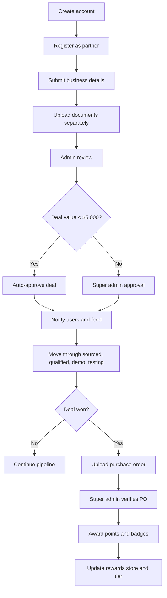

# LIVEY Partner Portal Phased Rollout Design

**Goal:** Break the partner portal work into ordered delivery phases so we can land the foundation first, then onboard, approve, operate, and finally gamify the platform without creating brittle one-off flows.

**Architecture:** Keep the current TanStack Start app, local Postgres data model, and Railway deployment model, but organize the work into phases with hard dependency boundaries. The foundation phase stabilizes auth, RBAC, lookup persistence, and record ownership rules. Later phases build on those primitives for onboarding, deal management, approvals, notifications, rewards, and integrations.

**Tech Stack:** TanStack Start, React, TypeScript, PostgreSQL, Radix UI, cmdk, TanStack Router, local server helpers, Railway.

---

## Product Principles

- Keep new account and partner registration free-form where users are introducing brand-new business data.
- Use searchable, globally persisted dropdowns for repeatable business values after the record exists.
- Let super admins own shared data, approvals, rewards configuration, and catalog governance.
- Let partner admins manage partner users and monitor their workspace, but not edit global system configuration.
- Keep every sensitive or destructive action behind explicit approval states and clear audit visibility.

## Delivery Phases

### Phase 1: Platform Foundation

**Objective:** Make auth, recovery, RBAC, lookup persistence, and environment setup reliable enough to support all later work.

**Includes:**
- Sign-in, sign-up, and forgot-password recovery flow
- Super admin bootstrap account and local/prod credential parity
- RBAC enforcement for admin, partner admin, and partner user
- Global searchable/addable dropdown values stored in Postgres
- Removal of seed/demo data from runtime screens
- Railway / local Postgres parity and deploy health checks

**Why first:** Every later feature depends on trusted identity, stable roles, and reusable data-entry primitives.

**Exit criteria:**
- The app works against local Postgres and Railway Postgres.
- One super admin account exists and can create/approve partner admins.
- Dropdown values are no longer hardcoded and persist globally.
- Empty states appear when real data is absent.

### Phase 2: Partner Registration and Onboarding

**Objective:** Replace the current onboarding experience with a detailed business submission flow that collects what LIVEY needs for partner approval.

**Includes:**
- Detailed partner registration form with business details, GST, PAN, CIN, website, annual turnover, employee count, business focus, and company identity
- Separate media/document step so uploads do not wipe form state
- Country and region split with country-aware regional choices
- Currency behavior based on country
- Approval gating so unapproved users see limited access and notes appear as modal/popup prompts
- Admin review tools for verifying submissions
- Zoho Sign follow-up after approval to pull business data where needed

**Why second:** Onboarding is the entry point for every partner record and needs the foundation primitives already in place.

**Exit criteria:**
- New partner records are submitted in a multi-step flow.
- Business data is saved before document upload starts.
- Media uploads are isolated from the main form state.
- Admin can approve or request changes without exposing full workspace access prematurely.

### Phase 3: Deal Lifecycle and Pipeline

**Objective:** Turn the deals area into a real operational workflow for registration, review, approval, and progression.

**Includes:**
- Deal creation with account, client/contact, POC, product, quantity, source, region, budget, and dates
- Auto-linking of deal accounts so the selected account is actually bound to the record
- Standard deal auto-approval below $5,000
- Super admin approval above $5,000
- Admin edit-in-approval capability
- Stage-based flow with sourced, qualified, demo, testing, approval, won, and lost
- Close date vs possible close date behavior
- Notes surfaced as modal/popup interactions, especially before approval
- Stage-change notifications and feed entries
- Purchase order upload when a deal is won

**Why third:** The pipeline depends on the approved partner structure and shared lookup values from earlier phases.

**Exit criteria:**
- Deal records can move through the intended business stages.
- Approval logic respects the deal value threshold.
- Every stage change creates visible system activity.
- Won deals can attach a purchase order document.

### Phase 4: Admin Operations and Governance

**Objective:** Give super admins the tools to govern the shared portal data and review operational records.

**Includes:**
- Admin CRUD over approved operational data
- Global management of products, sources, regions, and other shared dropdown-backed values
- CSV export for admin, partner admin, and user views where applicable
- News feed ownership by LIVEY admin with image-first posts and captions
- Notes, review history, and approval feedback surfaced in a controlled way
- File viewing and document inspection for admin users

**Why fourth:** Governance tools are only meaningful after the portal can collect and route records correctly.

**Exit criteria:**
- Super admins can manage shared business data without editing the database directly.
- Admin feeds look like a real social-style product feed instead of text-only updates.
- Exports produce usable CSVs for downstream reporting.

### Phase 5: Rewards, Recognition, and Tiering

**Objective:** Add the incentive model that rewards adoption and deal completion.

**Includes:**
- Points awarded for winning deals
- Points awarded after super admin approves the deal and verifies the purchase order
- Reward store visible to everyone
- Reward catalog editable only by super admin
- Redemption flow similar in spirit to a storefront marketplace
- Badges and tiers based on accumulated points: Bronze, Silver, Gold, Platinum
- Recognition model tied to user deal performance

**Why fifth:** Rewards should be driven by trusted deal outcomes, not by draft records or partial approvals.

**Exit criteria:**
- Points are assigned by business rules, not manually in random screens.
- Users can view rewards and their own standing.
- Super admin can manage the reward catalog and redemption options.

### Phase 6: Integrations, Automation, and Documentation

**Objective:** Add the remaining integrations and operational visibility that make the portal feel complete.

**Includes:**
- Notification coverage for approvals, stage movement, and important actions
- Audit trail improvements
- Integration touchpoints such as Zoho Sign and other future external systems
- System flowchart documentation
- Remaining polish and cleanup for pages, routes, and empty states

**Why last:** These items are most effective once the core workflows already behave correctly.

**Exit criteria:**
- The major process flows are documented and reflected in the app.
- Operational events are visible to the right people at the right time.

## Process Flow

## Phase Ordering Notes

- Phase 1 must land before any other phase because it provides auth, roles, and lookup persistence.
- Phase 2 and Phase 3 can be implemented sequentially, not in parallel, because onboarding data becomes the source of truth for deal creation and approval.
- Phase 4 depends on the data shapes introduced in Phases 2 and 3.
- Phase 5 depends on finalized deal outcomes from Phase 3 and approval signals from Phase 4.
- Phase 6 should absorb anything that remains after the primary workflows are stable.

## Definition of Done for the Full Program

- All major workflows are usable end to end from sign-in through rewards.
- The portal uses Postgres as the only backend and data store.
- The app is deployable on Railway and reachable from any network using a valid public domain or custom domain.
- Empty states are intentional, and demo data is not presented as real live data.
- The UI reflects the LIVEY business process rather than placeholder scaffolding.
