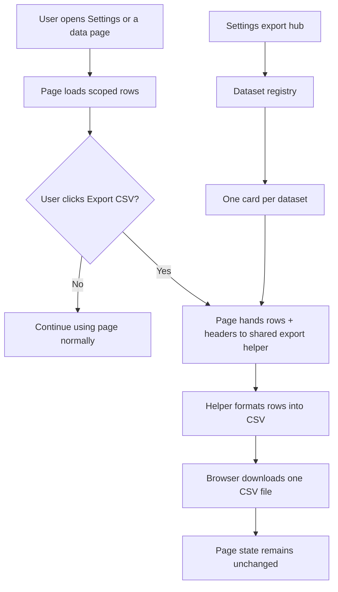

# Settings CSV Export Center Design

**Goal:** Give every role a reliable way to export the data they can see as separate CSV downloads, while also adding a master export center inside Settings for the full set of app datasets.

**Architecture:** Build one shared CSV export helper, one dataset registry, and page-level adapters that each provide rows plus headers. The Settings page becomes a discovery hub that lists every exportable dataset as its own card or row. Existing data pages keep their own export buttons so users can export the current filtered view without leaving the page. All exports stay scope-aware: super admins can export global data, partner admins can export partner-scoped data, and partner users can export only their own records.

**Tech Stack:** TanStack Start, React, TypeScript, PostgreSQL, existing local server bridge, existing route pages, browser-native CSV download.

---

## Scope

This spec covers:

- A real export section on `/_authenticated/settings`
- Separate CSV export buttons on data-bearing pages
- A shared CSV formatter/downloader
- Scope-aware dataset loaders for all exportable data
- Consistent filename, header, and empty-state behavior

It does not introduce ZIP bundles, spreadsheet workbooks, or a new reporting engine.

## Export Model

Every export must be independent. One button downloads one CSV file for one dataset.

The Settings export center acts as the master index:

- Each dataset gets its own export card
- Each card exposes one `Export CSV` action
- Cards can show a record count and a short description
- The page can group datasets into:
  - Operational data
  - Governance data
  - Configuration data

The existing data pages also keep or gain export actions:

- Audit logs
- Deals
- Customers
- Pipeline
- Notifications
- Documents
- Rewards
- Admin partner review screens
- Admin users
- Admin rewards
- Admin catalog
- Admin news
- Partner team
- Partner onboarding review screens

Page exports should reflect the current filtered view when the page has user filters. The Settings hub should export the full scoped dataset for that category.

## Canonical Datasets

The export registry should cover the app’s real data sources, not duplicated UI strings:

- `partners`
- `profiles`
- `user_roles`
- `portal_customers`
- `portal_deals`
- `portal_team_members`
- `notifications`
- `partner_documents`
- `portal_audit_events`
- `portal_news_posts`
- `portal_catalog_items`
- `partner_review_notes`
- `reward_catalog_items`
- `reward_point_events`
- `reward_redemptions`
- `lookup_values`
- any other existing configuration table that powers dropdowns or approval settings

The important rule is that the export source must match the canonical source of truth already used by the app.

## CSV Rules

All CSV downloads should follow the same rules:

- UTF-8 encoded
- Header row first
- Comma separated
- Double quotes escaped correctly
- Empty values rendered as blank cells
- Arrays flattened to a readable string, usually joined with `; `
- Objects serialized as JSON strings when no flatter mapping exists
- Date and timestamp fields preserved in ISO-like text

Filename format:

- `livey-<dataset>-YYYY-MM-DD.csv`

Examples:

- `livey-deals-2026-07-22.csv`
- `livey-lookups-2026-07-22.csv`
- `livey-audit-events-2026-07-22.csv`

Empty exports should still download a valid CSV with headers, even if there are zero rows.

## Access Rules

Export visibility must follow the same permission model as the page that owns the data:

- Super admin
  - Can export all datasets
  - Sees all settings cards
  - Exports are unscoped unless the page intentionally filters them

- Partner admin
  - Can export partner-scoped operational data
  - Can export partner-owned documents, deals, customers, team members, and rewards-related activity
  - Can see only configuration data that is safe for their role

- Partner user
  - Can export only their own records
  - Should not see admin-only governance exports
  - Can still export their scoped deals, customers, notifications, documents, and rewards views if the page already exposes them

Exports must never widen access beyond what the UI already allows.

## Data Flow

### Shared helper responsibilities

The shared helper should:

1. Accept a dataset name, headers, and rows
2. Normalize each value into a CSV-safe string
3. Generate a timestamped filename
4. Trigger a browser download
5. Surface a toast if generation fails

### Dataset adapters

Each page or settings card should use an adapter that:

1. Loads the canonical rows
2. Applies the correct role scope
3. Shapes rows into export columns
4. Passes them to the shared CSV helper

This avoids page components hand-building CSV strings in multiple places.

## Settings Page Design

The current Settings page is a placeholder. It should become a data export hub with three main sections:

### Operational exports

Examples:

- Deals
- Customers
- Pipeline
- Notifications
- Documents
- Team members
- Rewards activity

### Governance exports

Examples:

- Audit logs
- Users
- Partner review records
- Partner documents
- Admin news posts
- Catalog management data

### Configuration exports

Examples:

- Lookup values
- Dropdown source values
- Partner onboarding configuration values
- Shared business enums

Each card should include:

- Dataset label
- Short description
- Optional record count
- `Export CSV` button
- Optional link to the source page

If a dataset is not accessible for the current role, the card should be hidden rather than shown as broken.

## Page-Level Export Behavior

Every data-heavy page should expose an export action near the main filters or page toolbar.

Recommended behavior:

- Export what the user is currently looking at if the page has filters
- Respect the current role scope
- Use the same filename convention as Settings
- Use the same CSV formatter as Settings

This keeps exports intuitive:

- Settings = full scoped dataset export center
- Page = export the current working view

## Error Handling

- If a dataset cannot be loaded, that export should fail gracefully without breaking the page
- If the CSV formatter fails, show a toast and leave the page state intact
- If a dataset is empty, export headers anyway
- If the user lacks access, hide the export control instead of showing a broken button
- If a row contains nested data, flatten it or stringify it consistently instead of throwing

## Verification Criteria

This design is complete when:

- The Settings page shows separate CSV downloads for each allowed dataset
- The audit page and other data pages still export from their own toolbars
- Super admin exports are global
- Partner admin exports remain partner-scoped
- Partner user exports remain user-scoped
- Empty datasets still download a valid CSV with headers
- CSV filenames are consistent and readable
- Exporting one dataset does not affect the current page state

## Out of Scope

- ZIP archives
- XLSX or Google Sheets export
- Scheduled exports
- Email delivery of exports
- A new analytics warehouse
- Replacing the current app-level data model
