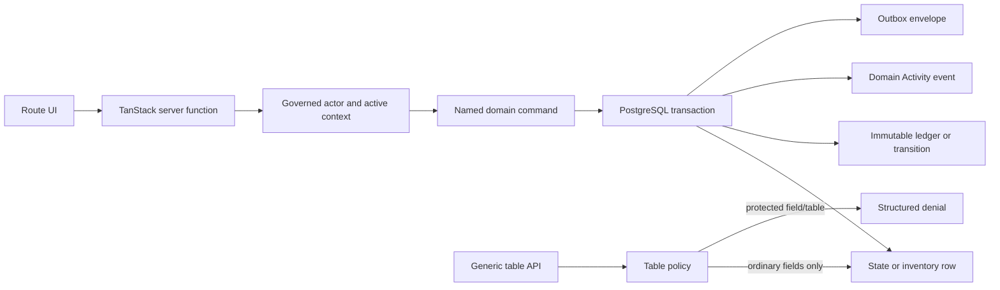

# LIVEY PAM CRM Risk-First Product Integrity Design

**Status:** Approved direction; specification pending user review

**Approved direction:** 2026-08-01

**Goal:** Close the highest-impact gaps between `product.md` and the shipped portal without overwriting the concurrent Claude session. The first implementation slice makes ticket creation usable, aligns LIVEY Support controls with server authority, reports pipeline value from open-deal DTP, separates editorial News from business Activity, prevents direct Task-state mutation, and makes reward redemption and catalogue history transactional and auditable.

**Architecture:** Keep the existing TanStack Start, PostgreSQL, Supabase-shaped local client, governed-assignment, domain-command, activity-event, and outbox architecture. Lifecycle and financial mutations move behind named server commands. Generic table APIs remain useful for ordinary CRUD, but must reject writes to protected lifecycle fields and protected reward-ledger tables. Database transactions, row locks, optimistic versions, idempotency keys, immutable ledger events, and additive migrations enforce the invariants independently of the UI.

**Primary blueprint sections:** `product.md` Sections 9.5, 9.13, 10.2, 11.1-11.3, 13.1-13.5, and 15.1-15.11.

---

## 1. Context and problem statement

The current application contains substantial implementations for deals, Tasks, ticket commands, rewards, Activity, and News. The remaining risk is concentrated at boundaries where the UI, generic table layer, domain commands, and schema do not enforce the same contract.

Confirmed gaps in this slice are:

1. `createTicket` writes `support_tickets.product_sku` and `support_tickets.serial_number`, but the canonical schema does not define those columns and the existing migration adds them non-idempotently.
2. `ticket-commands.server.ts` authorises `livey_support` and `super_admin`, while `support.tsx` renders ticket actions only for `super_admin`.
3. The dashboard sums every visible Deal, including Won and Lost, and falls back to free-text amount parsing instead of the latest effective DTP.
4. Deal and partner workflow screens insert business events directly into `portal_news_posts`, even though the blueprint makes News editorial and Activity append-only business history.
5. `transitionTask` implements the state machine, but the generic `tasks` update path can still write `status` directly.
6. Reward requests, approvals, point deductions, and catalogue inventory are independent client-side table writes. Concurrent requests can overspend points or stock, and partial failure can leave inconsistent state.
7. Deleting a reward catalogue item cascades into `reward_redemptions`, destroying redemption history.

These defects are treated as one product-integrity slice because they share a single architectural correction: workflow state and financial effects must be accepted by named server commands and committed atomically, never reconstructed from loosely ordered client CRUD calls.

## 2. Scope

### 2.1 Included

- Additive, repeatable ticket schema alignment.
- Ticket action visibility for authorised `livey_support` users.
- Open-pipeline value based on effective DTP.
- Removal of automatic business-event writes to the editorial News table.
- Fail-closed protection for Task status updates outside `transitionTask`.
- Transactional reward reservation, review, cancellation/rejection, and catalogue retirement.
- Immutable, idempotent reward ledger effects and retained redemption history.
- Focused unit, server-policy, transaction, route, build, and browser tests.
- Scoped commits that never stage unrelated or concurrent Claude changes.

### 2.2 Explicitly excluded from this slice

- Full Deal registration-status separation and the complete Negotiation -> Won/Lost -> PO -> Approved Won redesign.
- Full typed-participant authorisation. Claude is currently changing participant tagging.
- Complete News authoring lifecycle, audience expansion, scheduling, revisions, digests, and analytics.
- Full Ticket model expansion to multiple products, attachments, customer/contact relationships, or the final `LIV-SUP-YYYY-######` numbering contract.
- GyFTR/QuickSilver provider fulfilment.
- Task templates, reminders, escalation, dependencies, checklists, and multi-view workspace expansion.
- Dependency reinstall or lockfile normalisation while another session is running.

Excluded items remain tracked for subsequent slices. This design must not introduce interfaces that prevent those later implementations.

## 3. Design principles

1. **The server owns invariants.** Hiding a button is not authorisation; every protected operation is checked in its server command or table policy.
2. **Named commands own state machines.** Generic updates cannot change lifecycle fields.
3. **Transactions own money-like effects.** Points, reservations, stock, redemption state, ledger entries, Activity, and outbox records succeed or fail together.
4. **History is append-only.** Reward ledger entries, redemptions, Task transitions, and Activity are never deleted to make the present state look clean.
5. **News is editorial.** Domain events belong in Activity and recipient-specific Notifications, not in `portal_news_posts`.
6. **Migrations are repeatable.** Every additive migration uses `IF NOT EXISTS`; constraint changes inspect existing state before mutation.
7. **Fail closed.** Missing assignment, ambiguous tenant, stale version, insufficient points, unavailable stock, or an unrecognised transition returns a structured denial without partial effects.
8. **Concurrent-session safety is a delivery constraint.** A correct patch that overwrites Claude's uncommitted work is not acceptable.

## 4. Target architecture



The UI may load display data through the existing generic client. It calls named server functions for transitions and financial actions. Named server functions resolve the authenticated governed actor, call a domain command, and return `CommandExecutionResult`-style success or failure contracts. Domain commands own transaction boundaries and audit side effects.

## 5. Workstream A: Ticket contract alignment

### 5.1 Schema

Create a uniquely timestamped additive migration that performs:

```sql
ALTER TABLE public.support_tickets
  ADD COLUMN IF NOT EXISTS product_sku TEXT;

ALTER TABLE public.support_tickets
  ADD COLUMN IF NOT EXISTS serial_number TEXT;

ALTER TABLE public.support_ticket_comments
  ADD COLUMN IF NOT EXISTS is_internal BOOLEAN NOT NULL DEFAULT FALSE;
```

The same columns must be reflected in `db/schema.sql` after Claude releases that file. The migration may land before the canonical schema edit, but the implementation is not complete until both representations agree.

No destructive migration is permitted. Existing rows receive `NULL` product/serial values and `FALSE` for `is_internal`.

### 5.2 Authority and UI

Define one route-level predicate equivalent to:

```text
canManageTicket = role is super_admin or livey_support
```

Use it for Accept, Wait on Partner, Close, reopen-decision, internal-reply, priority, and assignment controls. Partner users retain create, reply, and reopen-request actions only.

The server remains authoritative:

- support-only transitions call the existing named ticket commands;
- `requireSupportRole` accepts only `super_admin` and `livey_support`;
- governed geography and partner scope still apply;
- the UI never substitutes a generic status update for a ticket command.

### 5.3 Errors

- If the schema migration is absent, ticket creation returns the database error and the UI presents `Ticket creation is temporarily unavailable` plus a correlation identifier when available.
- If a role can see a ticket but cannot manage it, action controls are absent and a direct server call is denied.
- A stale or invalid transition leaves the ticket unchanged and refreshes the displayed state after the error.

## 6. Workstream B: Correct pipeline value

### 6.1 Metric definition

The dashboard `Pipeline value` is:

```text
sum(effective DTP USD) for visible Deals in Sourced through Negotiation
```

Won and Lost are excluded. For each open Deal, effective DTP resolves in this order:

1. `pricing_revisions.total_dtp_usd` from the greatest `revision_number`, with
   `created_at` and stable row ID as tie-breakers; `is_final` describes workflow
   state and does not select an older revision over a newer effective revision;
2. structured `portal_deals.amount_usd`;
3. structured `portal_deals.amount_value` only when the Deal currency is USD;
4. zero, with a diagnostic count for Deals missing a reliable USD value.

Free-text `amount` parsing is not a source for a canonical metric.

### 6.2 Data flow

Add a scoped dashboard-metrics server query rather than issuing an unbounded pricing-revision read from the browser. The query must:

- resolve the authenticated assignment and active context;
- reuse the same Deal visibility and geography rules as the Deals workspace;
- select only open stages;
- use a lateral/latest-revision lookup or equivalent deterministic query ordered
  by revision number, creation time, and stable row ID;
- return aggregate values and counts, not other tenants' Deal rows;
- return `missingDtpCount` for observability without exposing hidden records.

The dashboard retains client-side region filtering only if the server response contains per-region aggregates. A global aggregate must never be narrowed cosmetically in the browser.

The metric hint changes from `Across all live opportunity rows` to `Open opportunities at current DTP`.

### 6.3 Errors

- A scoped metrics denial renders the metric as unavailable, not `$0`.
- A Deal with missing DTP contributes zero and increments `missingDtpCount`; it does not fall back to a potentially wrong free-text number.
- Pricing revision duplicates are resolved deterministically by revision number and creation timestamp; they are not double-counted.

## 7. Workstream C: News and Activity separation

### 7.1 Storage ownership

`portal_news_posts` is written only by the explicit News Publisher workflow. Deal stage changes, Deal registration decisions, Won/Lost actions, and partner approval/status changes must not create News rows.

Those accepted business changes already belong in:

- `domain_activity_events` for append-only subject history;
- `notifications` for named recipients who need attention;
- `portal_audit_events` for administrative/non-repudiation evidence where applicable;
- outbox envelopes for eventual delivery.

Remove automatic `portal_news_posts` writes from Deal, Pipeline, admin Deal, and partner approval flows. Do not delete existing posts in this slice; historical cleanup requires a separately reviewed migration because existing rows do not reliably distinguish editorial and fabricated records.

### 7.2 Dashboard presentation

The dashboard may visually place News and Activity near one another, but it keeps separate headings, empty states, and data sources. Activity failures cannot be silently represented as an empty News feed, and News count excludes Activity.

### 7.3 Errors

- Failure to create a recipient Notification must follow the owning command's transaction/outbox policy; it must not be masked by creating a global News post.
- Removing a fabricated News insert must not remove or weaken the corresponding Activity or audit event.

## 8. Workstream D: Protect Task transitions

### 8.1 Generic table policy

For `tasks`, reject generic `update` operations when `values` contains any protected lifecycle field:

- `status`;
- `version`;
- `completed_at`;
- `completion_note` or completion evidence fields;
- cancellation/reopen evidence fields introduced by the command model.

The denial applies to every role, including Super Admin. Administrators use the same named transition command so history and optimistic concurrency remain intact.

Ordinary generic updates may continue for non-lifecycle fields only when existing scope and capability checks allow them. The policy error must explain that the named Task transition action is required.

### 8.2 Named command

`transitionTask` remains the only status-changing path. It must continue to:

- lock or version-check the Task;
- reject self-transitions and unlisted pairs;
- require a reason where the blueprint requires one;
- increment version once;
- append `task_transitions`, Activity, and outbox evidence atomically;
- retain prior Completed/Cancelled evidence on reopen.

No trigger is added in this slice because the application command transaction already owns the actor, assignment, reason, correlation, and outbox context. A later database-level command boundary may strengthen this further.

### 8.3 Concurrent-file rule

`src/server/table-policy.server.ts` and its tests are currently modified by Claude. This workstream begins only after the file is stable or Claude has committed. The implementation rebases its reasoning on the resulting file and adds the smallest protected-field guard without reverting existing changes.

## 9. Workstream E: Transactional rewards and retained catalogue history

### 9.1 Data-model changes

Add additive reward columns and constraints needed for reservations:

- `reward_redemptions.idempotency_key TEXT` with a unique constraint for non-null values;
- `reward_redemptions.version INTEGER NOT NULL DEFAULT 1`;
- status values capable of representing `requested`, `points_reserved`, `pending_review`, `processing`, `fulfilled`, `cancelled`, `failed`, and `refunded`;
- `reward_point_events.idempotency_key TEXT` with a unique constraint for non-null values;
- `reward_point_events.reversal_of UUID NULL` referencing a prior point event with `ON DELETE RESTRICT`;
- `reward_catalog_items.retired_at TIMESTAMPTZ NULL` and `retired_by UUID NULL`;
- change `reward_redemptions.reward_id` from `ON DELETE CASCADE` to `ON DELETE RESTRICT` after verifying and replacing the existing foreign key by discovered constraint name.

If existing statuses cannot be constrained safely because legacy values exist, the migration first reports/normalises only explicitly mapped values. It must not coerce unknown values silently.

### 9.2 Request and reservation command

Add `requestRewardRedemption` in a reward command module and expose it through a TanStack server function. Its transaction is:

1. Resolve the governed actor and require an eligible partner-side user with a partner assignment.
2. Require a caller-provided idempotency key and return the prior logical result when replayed.
3. Lock the requesting profile or another stable per-user balance mutex row.
4. Lock the catalogue item `FOR UPDATE`.
5. Require `availability = available`, `retired_at IS NULL`, and `stock > 0`.
6. Derive posted balance from immutable point events and existing reservations while holding the per-user lock.
7. Require available points greater than or equal to the item's snapshotted points cost.
8. Insert the redemption with snapshotted reward title/cost data where the existing schema supports it, or retain the required catalogue reference under `ON DELETE RESTRICT`.
9. Insert one negative `Redemption Reservation` point event using a unique idempotency key.
10. Decrement catalogue stock with a guarded `stock > 0` update.
11. Append Activity and outbox records.
12. Commit once.

The UI's pre-check remains a convenience only. Server revalidation is authoritative.

### 9.3 Review commands

Add named commands for approval and rejection/cancellation.

Approval:

- requires Super Admin;
- locks the redemption and user mutex;
- accepts only the expected reserved/review state and version;
- revalidates catalogue and policy eligibility without charging points again;
- advances to processing/pending fulfilment once;
- writes Activity/outbox records atomically.

Rejection or eligible cancellation:

- locks the redemption, user mutex, and catalogue row;
- accepts only a cancellable state and expected version;
- inserts one positive `Reservation Release` event referencing the reservation;
- restores stock once;
- advances to `cancelled` with actor and reason;
- writes Activity/outbox records atomically.

Replay returns the prior result or a structured already-completed conflict. It never creates another ledger or stock effect.

### 9.4 Catalogue retirement

Replace Delete with Retire in the Super Admin UI.

Retire performs a named server command that:

- requires Super Admin;
- sets `availability = retired`, `retired_at`, `retired_by`, and `stock = 0`;
- preserves the catalogue row, redemptions, ledger, Activity, and audit history;
- prevents new requests immediately;
- is idempotent.

The generic table policy rejects `delete` on `reward_catalog_items` and rejects client inserts/updates to reward point events and redemption lifecycle fields. Catalogue create/edit may remain generic only for ordinary descriptive and inventory fields if policy remains explicit; retirement and all redemption effects use named commands.

### 9.5 Failure semantics

- Insufficient points: no redemption, ledger event, or stock change.
- Out of stock/retired: no redemption or point change.
- Duplicate idempotency key: return the original logical result.
- Stale version: return a conflict and refresh the queue.
- Activity or outbox insert failure: roll back every balance, stock, and state change.
- Notification delivery failure after commit: leave a durable outbox item for retry; never roll back an already accepted transaction through a second client write.

## 10. Public contracts and UI behaviour

All new commands return a structured result with:

- `ok`;
- `commandName` and `subjectId` on success;
- `newVersion` where versioned;
- `correlationId`;
- a stable failure code, human message, retryability, and field errors on failure.

The UI rules are:

- disable submit while a command is pending;
- generate one idempotency key when the user begins a logical request and reuse it for transport retries;
- do not optimistically deduct points or stock;
- refresh server truth after success or conflict;
- present denial, validation, conflict, and temporary failure differently;
- never display a success toast until the server command commits.

## 11. File boundaries

Expected implementation boundaries are:

- `supabase/migrations/<unique>_risk_first_integrity.sql` — additive ticket/reward schema and FK changes.
- `db/schema.sql` — canonical schema parity after Claude releases the file.
- `src/routes/_authenticated/support.tsx` — ticket action visibility and error presentation.
- `src/server/ticket-commands.server.test.ts` — role and schema-contract coverage.
- `src/server/dashboard-metrics.server.ts` — scoped DTP aggregation.
- `src/integrations/local/dashboard-metrics.ts` — authenticated server-function adapter.
- `src/routes/_authenticated/dashboard.tsx` — consume canonical metrics and correct copy.
- `src/routes/_authenticated/deals.tsx`, `pipeline.tsx`, `admin.deals.tsx`, and `admin.partners.tsx` — remove automatic News writes while retaining Activity/audit/notification effects.
- `src/server/table-policy.server.ts` and `.test.ts` — protected Task and reward generic-write guards after concurrent edits settle.
- `src/server/reward-commands.server.ts` and `.test.ts` — transactional reservation, review, release, and retirement.
- `src/integrations/local/reward-commands.ts` — authenticated server-function adapters.
- `src/routes/_authenticated/rewards.tsx` — request through the command and show available/reserved points.
- `src/routes/_authenticated/admin.rewards.tsx` — review commands and Retire UI.
- `src/lib/rewards.ts` and tests — pure presentation/ledger helpers only; no authority decisions.

If discovery shows an expected file is being changed concurrently, the implementation pauses that workstream and continues with a disjoint one. It never copies an older whole-file version over current workspace content.

## 12. Delivery sequence and concurrent-session protocol

### Batch 1: clean, additive, low-collision work

1. Add ticket/reward migration with a unique filename.
2. Add failing focused tests for ticket role visibility/schema and dashboard calculation.
3. Fix support controls and pipeline aggregation.
4. Remove fabricated News writes from currently clean route files.
5. Run focused tests, type/lint checks for touched files, production build, and browser smoke tests.

### Batch 2: new reward command files

1. Add failing transaction and concurrency tests.
2. Implement reward command module and server-function adapter.
3. Switch partner and admin Reward UIs to commands.
4. Run focused and concurrency verification.

### Batch 3: shared policy/schema files after Claude stabilises

1. Re-read Claude's final diffs and current tests.
2. Add Task protected-field and reward protected-table policy tests.
3. Implement minimal policy guards.
4. Update canonical schema without reverting Claude's additions.
5. Run the combined relevant test suites and production verification.

Before every batch:

- capture `git status --short` and `git diff --name-only`;
- compare file modification state with the prior snapshot;
- avoid any file with an unexplained new concurrent change;
- stage only the files owned by the completed batch;
- never amend, rebase, force-push, or rewrite Lovable-published history.

## 13. Testing strategy

### 13.1 Ticket tests

- Migration can run when columns are absent.
- Migration can run again when columns already exist.
- Ticket creation persists optional product and serial values.
- `livey_support` with authorised scope can accept, wait, close, and decide reopen.
- Partner users cannot call support-only transitions.
- UI shows support controls to `livey_support` and Super Admin only.

### 13.2 Dashboard tests

- Sourced through Negotiation contribute latest effective DTP.
- Won and Lost contribute zero to open Pipeline.
- Final/latest revision wins over Deal amount.
- Structured USD fallback works only under the documented conditions.
- Free-text amount never contributes.
- Hidden Deals do not affect returned aggregates.
- Missing DTP returns a diagnostic count and does not masquerade as a query failure.

### 13.3 News separation tests

- Deal stage, registration, Won/Lost, and partner-status operations do not insert `portal_news_posts`.
- The same operations still append Activity and required audit/notification evidence.
- The News Publisher can still create editorial News.

### 13.4 Task policy tests

- Generic Task `status` update is denied for partner, internal, and Super Admin actors.
- Mixed update containing an ordinary field plus `status` is wholly denied.
- Ordinary permitted Task metadata update still works.
- Named valid transition writes state, transition history, Activity, outbox, and one version increment.
- Invalid, stale, and replayed transitions have no partial effect.

### 13.5 Reward tests

- Two concurrent requests against the last stock unit produce one reservation.
- Two concurrent requests whose combined cost exceeds balance produce at most one accepted reservation.
- Request replay creates one redemption, one reservation event, and one stock decrement.
- Rejection/cancellation creates one release and one stock restoration.
- Approval does not deduct reserved points a second time.
- Failure inserting Activity/outbox rolls back redemption, ledger, and stock.
- Retiring an item preserves existing redemptions and blocks new requests.
- Generic reward ledger/lifecycle writes and catalogue deletes are denied.
- Super Admin and partner-side authority boundaries are enforced.

### 13.6 Repository verification

- Run focused Bun test files rather than the aggregate command that accidentally loads Playwright specifications.
- Run the configured lint/type checks for touched code.
- Run `bun run build`.
- Start the production bundle on an unused port and smoke-test sign-in plus each changed authorised route with available fixtures.
- Run Playwright only through the project's Playwright command/configuration.

## 14. Rollback and recovery

- Application commits are small and scoped by workstream, so a normal forward revert can disable a defective UI/command change without rewriting history.
- Additive columns remain harmless if application code is reverted.
- The reward FK change to `RESTRICT` is intentionally retained during an application rollback because restoring cascade deletion would reintroduce data loss.
- Accepted reward ledger entries are never deleted during rollback. Corrections use compensating events.
- No migration drops existing Ticket, reward, News, Activity, or Task data.

## 15. Acceptance criteria

### Ticket and support

- **RFI-001:** A fresh or previously partially migrated database accepts ticket creation with product SKU and serial number.
- **RFI-002:** Reapplying the migration succeeds without duplicate-column failure.
- **RFI-003:** An authorised `livey_support` user sees and can execute the same support workflow actions allowed by the server.
- **RFI-004:** Partner-side users cannot execute support-only commands by calling the server directly.

### Pipeline

- **RFI-005:** Pipeline value excludes Won and Lost.
- **RFI-006:** Pipeline value uses latest effective DTP and never free-text parsing.
- **RFI-007:** Scoped users receive only aggregates derived from Deals they may see.
- **RFI-008:** Missing DTP is distinguishable from a zero-valued healthy Pipeline.

### News and Activity

- **RFI-009:** Business workflow actions create no new `portal_news_posts` rows.
- **RFI-010:** Business workflow actions retain their Activity, audit, Notification, and outbox evidence.
- **RFI-011:** Editorial News publishing remains functional.

### Tasks

- **RFI-012:** No actor can change Task status through the generic table API.
- **RFI-013:** Every accepted Task status change has one transition record, one version increment, Activity, and outbox evidence.
- **RFI-014:** Invalid or stale Task transitions leave all Task and evidence tables unchanged.

### Rewards

- **RFI-015:** A redemption request reserves points and stock atomically.
- **RFI-016:** Concurrent requests cannot create a negative available balance or stock.
- **RFI-017:** Replay cannot duplicate redemption, ledger, inventory, Activity, or outbox effects.
- **RFI-018:** Rejection/cancellation releases reservation and stock exactly once.
- **RFI-019:** Approval cannot charge reserved points twice.
- **RFI-020:** Catalogue retirement preserves every historical redemption and ledger reference.
- **RFI-021:** Catalogue hard delete and direct client reward-ledger/lifecycle writes are denied.

### Delivery safety

- **RFI-022:** Claude-owned uncommitted changes are neither reverted nor staged by this work.
- **RFI-023:** Production build and changed-route browser smoke tests pass.
- **RFI-024:** Commits remain forward-only and Lovable-compatible.

## 16. Definition of done

This slice is complete only when all RFI acceptance criteria pass, the canonical schema and migrations agree, protected mutations use named server commands, tests demonstrate the race and replay protections, production build and UI smoke checks pass, and the final staged/committed paths contain no unrelated Claude or user changes.

The next product-gap design should address the Deal registration/status model and the complete Negotiation -> Won/Lost -> PO -> Approved Won flow, building on the pipeline and reward invariants established here.
