# LIVEY Partner Alliance Management CRM

## Canonical Product Blueprint

| Document attribute          | Value                                                                                                                                                    |
| --------------------------- | -------------------------------------------------------------------------------------------------------------------------------------------------------- |
| Status                      | Final future-state product specification                                                                                                                 |
| Blueprint version           | 1.0                                                                                                                                                      |
| Issued                      | 29 July 2026 (Asia/Kolkata)                                                                                                                              |
| Product                     | LIVEY Partner Alliance Management CRM (PAM CRM)                                                                                                          |
| Document owner              | LIVEY Strategic Team                                                                                                                                     |
| Primary audiences           | Product, design, engineering, security, data, operations, support, integration, and QA teams                                                             |
| Base and reporting currency | United States Dollar (USD)                                                                                                                               |
| Product priorities          | 1. Hierarchy and RBAC; 2. Deals and pipeline; 3. Assistant, Auto CRM, feeds, and UX; 4. Ticketing; 5. Insight Hub and external integrations              |
| Authority                   | This document is the product source of truth. Where mockups, backlog items, legacy behaviour, or informal notes disagree with it, this document governs. |

---

### Contents

1. [Product definition](#1-product-definition)
2. [Product principles and success measures](#2-product-principles-and-success-measures)
3. [Canonical terminology and naming](#3-canonical-terminology-and-naming)
4. [Experience, look, and interaction system](#4-experience-look-and-interaction-system)
5. [Hierarchy, identity, context, and RBAC](#5-hierarchy-identity-context-and-rbac)
6. [Authentication, onboarding, profiles, and teams](#6-authentication-onboarding-profiles-and-teams)
7. [Navigation and role-specific dashboards](#7-navigation-and-role-specific-dashboards)
8. [Partners, customers, contacts, and LIVEY assignments](#8-partners-customers-contacts-and-livey-assignments)
9. [Deals, pricing, approvals, and pipeline](#9-deals-pricing-approvals-and-pipeline)
10. [Tasks and work management](#10-tasks-and-work-management)
11. [News, Activity, notifications, and delivery](#11-news-activity-notifications-and-delivery)
12. [Assistant, website and WhatsApp workflows, and Auto CRM](#12-assistant-website-and-whatsapp-workflows-and-auto-crm)
13. [Support and ticketing](#13-support-and-ticketing)
14. [Insight Hub, assessments, and certification](#14-insight-hub-assessments-and-certification)
15. [Rewards, points, catalogue, and fulfillment](#15-rewards-points-catalogue-and-fulfillment)
16. [Analytics, imports, exports, settings, and administration](#16-analytics-imports-exports-settings-and-administration)
17. [External integrations](#17-external-integrations)
18. [Canonical data model and system architecture](#18-canonical-data-model-and-system-architecture)
19. [Security, privacy, reliability, performance, and accessibility](#19-security-privacy-reliability-performance-and-accessibility)
20. [Migration and phased delivery](#20-migration-and-phased-delivery)
21. [Acceptance and test catalogue](#21-acceptance-and-test-catalogue)
22. [Requirement traceability](#22-requirement-traceability)
23. [Governed defaults and reference data](#23-governed-defaults-and-reference-data)

---

## 1. Product Definition

### 1.1 Product vision

LIVEY PAM CRM is the operating system for LIVEY's partner-led revenue lifecycle. It connects LIVEY's strategic and regional teams, partner organisations, partner users, restricted distributors, customers, products, deals, learning, support, rewards, accounting, and fulfillment in one governed workspace.

The product must make the correct action obvious, make ownership visible, preserve commercial history, and enforce access consistently. A user should see one coherent workspace for the region, country, partner, and responsibilities they are currently operating in. They must never need separate accounts merely to work across several authorised territories.

The finished product is not a generic CRM with partner labels added. It is a hierarchy-aware Partner Alliance Management platform in which geography, organisation, functional role, record participation, and workflow state jointly determine:

- which records a person can discover;
- which records they can open;
- which fields and actions they can use;
- which approvals they can perform;
- which dashboards and metrics they see;
- which notifications they receive;
- which data the assistant may use in an answer;
- which rows and columns an export may contain; and
- which integrations may act on their behalf.

### 1.2 Business outcomes

The product must:

1. Give LIVEY a reliable global-to-local operating hierarchy without duplicating users or data.
2. Protect partner and customer information through enforceable, country- and assignment-aware RBAC.
3. Route each deal to the right ISR, PAM, KAM, RM, manager, and Distributor with an auditable history.
4. Standardise deal registration, pricing, discounts, approvals, pipeline movement, purchase-order review, and rewards.
5. Provide different dashboards for global, regional, country, partner, and individual contexts without creating separate products.
6. Turn website and WhatsApp enquiries into governed leads, tasks, customers, and deals.
7. Separate editorial News from transactional Activity and target both securely.
8. Give partners dependable training, support, certification, and reward experiences.
9. Synchronise approved commercial activity with Zoho Books and shipment status with DHL in India.
10. Preserve access to historical work when users change role, region, partner, manager, or employment status.

### 1.3 Product boundaries

This blueprint includes:

- authenticated web application experiences;
- partner self-registration and invited-user activation;
- mobile-responsive browser experiences;
- website and WhatsApp business workflows;
- in-app, email, and WhatsApp notification delivery;
- integrations with Zoho Sign, Zoho Books, GyFTR/QuickSilver, email, WhatsApp Business Platform, and DHL;
- administrative reference-data and policy management;
- data migration and backward-compatibility expectations; and
- operational, security, accessibility, analytics, and QA requirements.

The product does not:

- provide unrestricted consumer or general-purpose AI chat through WhatsApp;
- use client-side hiding as an authorisation mechanism;
- permit arbitrary user-created countries, regions, provinces, roles, or pipeline stages;
- treat local-currency display values as accounting authority;
- delete commercial history when a user resigns or a relationship ends;
- release reward points before a won deal and its purchase-order evidence are approved; or
- expose governance, configuration, secrets, password hashes, raw integration tokens, or unrestricted documents through partner exports.

### 1.4 Primary user groups

The product serves two team domains:

1. **LIVEY internal domain**
   - Super Admin / LIVEY Strategic Team
   - Regional Manager (RM)
   - Partner Account Manager (PAM)
   - Key Account Manager (KAM)
   - Inside Sales Representative (ISR)
   - LIVEY Support
   - Distributor, implemented as a restricted LIVEY-internal role

2. **Partner external domain**
   - Partner Admin
   - Partner User

Every person has one identity and may have multiple effective-dated assignments. Team domain and functional role are not inferred from email domain, company name, page URL, or UI state.

---

## 2. Product Principles and Success Measures

### 2.1 Product principles

#### 2.1.1 Context before content

The active context is always visible before the user sees business data. A global user must know whether a number represents Global, APAC, India, Maharashtra, one partner, or one account. Context controls all downstream data and actions.

#### 2.1.2 Authorisation is a platform capability

Authorisation is evaluated by server-side policy and database policy for every read, write, export, upload, download, assistant retrieval, background job, and webhook-triggered action. A hidden button is an experience decision, not a security control.

#### 2.1.3 Access and attention are separate

RBAC determines what a person is permitted to access. Tags and watchers determine which permitted people receive transactional attention. A regional manager can access all deals in the region because of scope, yet notifications are delivered only for deals on which the manager is automatically or manually tagged.

#### 2.1.4 One record, one history

Deals, tasks, tickets, partners, customers, assignments, prices, points, certificates, shipments, and integration events retain immutable business history. Corrections create new versions or events rather than silently replacing evidence.

#### 2.1.5 Guided work over hidden rules

The interface explains why an action is available, blocked, or awaiting approval. Required tasks, missing documents, approval thresholds, discount authority, role scope, and next steps are visible at the point of work.

#### 2.1.6 Structured operations, conversational discovery

Structured filters, saved views, tables, boards, forms, and timelines remain the operational source of truth. Free-text search bars are removed. The assistant is the conversational discovery and creation layer, but consequential changes always end in a structured preview and explicit confirmation.

#### 2.1.7 Mobile is operational, not observational

Phone and tablet users can complete core work, not merely view summaries. Pipeline actions, notes, tasks, approvals, ticket replies, document uploads, and context switching remain reachable without hover.

#### 2.1.8 Local clarity, global consistency

USD is the base and reporting currency. Local currency may appear as a labelled reference using a timestamped rate. Countries and subdivisions use governed codes, while LIVEY sales regions are administered mappings above countries.

### 2.2 Success measures

Success measures are calculated only from authorised, non-demo data and are filterable by active context.

| Outcome                 | Primary measure                                                  | Product expectation                                                                                                |
| ----------------------- | ---------------------------------------------------------------- | ------------------------------------------------------------------------------------------------------------------ |
| Correct access          | Confirmed cross-scope data exposures                             | Zero                                                                                                               |
| Fast partner activation | Median time from complete verified submission to approved access | At or below 5 business days, excluding time awaiting requested Partner corrections                                 |
| Deal registration speed | Time from valid submission to registration decision              | Auto-approved p95 at or below 5 seconds; at least 95% of LIVEY-reviewed submissions decided within 2 business days |
| Ownership completeness  | Active deals with all required hierarchy tags                    | 100%                                                                                                               |
| Pipeline hygiene        | Active deals with valid stage, probability, next task, and POC   | At least 95%                                                                                                       |
| Review discipline       | Won deals rewarded before PO approval                            | Zero                                                                                                               |
| Notification quality    | Transactional notifications delivered to untagged users          | Zero                                                                                                               |
| Support quality         | Tickets within configured first-response and resolution SLA      | At least 95%                                                                                                       |
| Learning quality        | Assigned learners completing certification by due date           | At least 80%, reported by role, Partner, Region, and course                                                        |
| Integration reliability | Sync operations resolved without manual data repair              | At least 99.5%, excluding provider outages                                                                         |
| Accessibility           | Critical WCAG 2.2 AA violations in release testing               | Zero                                                                                                               |
| Mobile completeness     | Priority workflows blocked on touch devices                      | Zero                                                                                                               |

### 2.3 Product analytics principles

- Product analytics events contain stable entity IDs, active-context IDs, assignment IDs, and workflow states, not sensitive free-form content.
- Analytics never weaken RBAC. Aggregate queries apply the same scope rules as record lists.
- Super Admin may view global product adoption; other roles see only their authorised aggregate scope.
- Seed, training, sandbox, and QA data are explicitly marked and excluded by default.
- All KPI definitions are documented and reused across dashboards, analytics, exports, and assistant answers.

---

## 3. Canonical Terminology and Naming

### 3.1 Business terminology

| Term                     | Canonical meaning                                                                                                                                                                                                                                                                                                                            |
| ------------------------ | -------------------------------------------------------------------------------------------------------------------------------------------------------------------------------------------------------------------------------------------------------------------------------------------------------------------------------------------- |
| LIVEY                    | The internal organisation operating the partner programme. Always displayed in uppercase.                                                                                                                                                                                                                                                    |
| Partner                  | An approved external organisation participating in the LIVEY partner programme.                                                                                                                                                                                                                                                              |
| Partner Admin            | An external user who administers a partner organisation within assigned geographic scope. “Global Partner Admin” is a Partner Admin with Global scope, not a separate role.                                                                                                                                                                  |
| Partner User             | An external contributor operating within assigned partner and geographic scope.                                                                                                                                                                                                                                                              |
| Customer / Account       | The end-customer organisation associated with leads, contacts, deals, tasks, tickets, and shipments. “Customer” is the primary UI term; “Account” may be used in sales analytics where familiar.                                                                                                                                             |
| Contact                  | An individual associated with a Partner or Customer.                                                                                                                                                                                                                                                                                         |
| Lead assignee            | The current effective-dated typed participant responsible for a Lead after routing or claim. Use “Lead assignee,” assigned ISR, or assigned PAM rather than the ambiguous label “owner.”                                                                                                                                                     |
| Point of Contact (POC)   | The Contact selected as the primary person for a record. First use on a page is “Point of Contact (POC)”; subsequent compact labels may use “POC.”                                                                                                                                                                                           |
| Sales Region             | A governed multi-country LIVEY commercial region, such as APAC.                                                                                                                                                                                                                                                                              |
| Country                  | A governed country record with stable code.                                                                                                                                                                                                                                                                                                  |
| Province/State           | A governed first-level country subdivision. The UI displays the locally appropriate word while the data concept remains one subdivision type.                                                                                                                                                                                                |
| Assignment               | An effective-dated link between a user, role, team domain, organisation, geographic ceiling, optional Partner/Account portfolio, manager, and permission policy. Selecting one Assignment establishes the session’s authorisation ceiling.                                                                                                   |
| Working scope            | A nullable narrowing expression beneath the selected Assignment. `null` means Full Assignment scope. A non-null value is one proper authorised geographic descendant or one authorised Partner/Account portfolio member. The selector may display the Assignment ceiling as “Full Assignment scope,” but the server normalises it to `null`. |
| Active context           | The server-issued combination of exactly one active Assignment and zero or one Working Scope. All data, actions, caches, exports, notifications, and Assistant retrieval use that intersection.                                                                                                                                              |
| Tag / participant        | An effective-dated typed relationship between a user and a business record. Types include creator/requester, assignee, RM, ISR, PAM, KAM, Support, Distributor, Partner contributor, approval assignee, escalation owner, and watcher. Tags drive participation, attention, and notification routing; they do not replace RBAC.              |
| Watcher                  | An authorised user who elects or is configured to receive record notifications without taking an ownership role.                                                                                                                                                                                                                             |
| Coverage Exception       | A governed work item created when a required RM, ISR, PAM, or KAM cannot be resolved. It blocks the protected Deal action until the missing Assignment is corrected and reconciliation succeeds.                                                                                                                                             |
| Tenant security boundary | The organisation-level isolation key: a Partner ID for Partner-owned data or the LIVEY organisation ID for LIVEY-internal data. Cross-boundary collaboration requires an explicit policy relationship; provider account and Active Context are not tenants.                                                                                  |
| Distributor              | A restricted LIVEY-internal functional role. Distributor users see only Customers and Deals explicitly tagged to them and never receive unrestricted internal-module access.                                                                                                                                                                 |
| News                     | Editorial content deliberately published to one or more audiences.                                                                                                                                                                                                                                                                           |
| Activity                 | A system-generated event describing something that happened to a business record.                                                                                                                                                                                                                                                            |
| Notification             | A user-specific attention item derived from an event and recipient rule.                                                                                                                                                                                                                                                                     |
| Digest                   | A scheduled email or WhatsApp summary of eligible News, Activity, tasks, or ticket updates.                                                                                                                                                                                                                                                  |
| Assistant                | The RBAC-aware conversational interface inside the portal. “Chatbot” is not used as the primary in-product name.                                                                                                                                                                                                                             |
| Auto CRM                 | The lead automation engine for capture, validation, deduplication, enrichment, scoring, routing, follow-up, claiming, and conversion.                                                                                                                                                                                                        |

### 3.2 Commercial terminology

| Term                            | Definition                                                                                                                    |
| ------------------------------- | ----------------------------------------------------------------------------------------------------------------------------- |
| SKU                             | The stable catalogue identifier for a product or combo.                                                                       |
| Product                         | A sellable LIVEY catalogue item.                                                                                              |
| Combo                           | A governed bundle of catalogue products with its own SKU and component definition.                                            |
| Deal line item                  | One product or combo, quantity, price snapshot, discounts, proposed customer price, and calculated totals within a deal.      |
| MSRP / List Price               | The public recommended price per unit in USD. The UI label is “MSRP / List Price.”                                            |
| Partner Transfer Price (PTP)    | The per-unit price offered to a partner after the applicable partner-tier adjustment and before deal-specific discount.       |
| Discount                        | A percentage reduction proposed at or after Proposal stage and approved under the discount policy.                            |
| Discounted Transfer Price (DTP) | The final approved per-unit partner price after deal-specific discount.                                                       |
| Proposed Selling Price          | The partner’s proposed per-unit customer-facing price. It does not alter LIVEY revenue, approval thresholds, or reward basis. |
| Deal registration approval      | LIVEY’s decision that a registered opportunity may proceed. It is a status, not a pipeline stage.                             |
| Won review                      | The post-Negotiation validation of outcome and purchase-order evidence before a win is approved and rewards are released.     |
| Reward pool                     | Five percent of the final eligible DTP total in USD, before conversion to points and contributor allocation.                  |
| Points conversion rate          | An effective-dated Super Admin policy expressing points per reward-dollar.                                                    |

### 3.3 Naming conventions

- Use title case for page titles and sentence case for controls and helper copy.
- Use full role names in formal tables and first occurrences; abbreviations RM, PAM, KAM, and ISR are acceptable thereafter.
- Do not use “Owner” alone where ownership type is ambiguous. Use Partner Owner, Account Owner, Deal Creator, Assigned RM, or Task Assignee.
- Do not use “Client,” “Customer,” and “Account” interchangeably within one workflow. Forms use Customer; analytics may use Account after defining it.
- Monetary labels always include USD or a local currency code.
- Dates display in the user’s locale and timezone, while audit records retain UTC.
- Human-readable IDs use uppercase prefixes and cannot be reused.
- Status labels use human language rather than raw enum values.
- Destructive or irreversible wording is explicit: Reject, Deactivate, Revoke, Close, or Cancel—not a generic Save.

---

## 4. Experience, Look, and Interaction System

### 4.1 Design character

The product feels calm, capable, and operational. It should resemble a mature enterprise command centre rather than a consumer social app or a collection of unrelated administration forms.

The existing visual direction is retained and refined:

- deep navy sidebar;
- white or softly tinted neutral workspace;
- indigo primary actions;
- compact but breathable information density;
- cards with approximately 10 px corner radius;
- restrained borders and shadows;
- green for confirmed positive outcomes;
- red for negative or destructive outcomes;
- amber for warnings and pending reviews;
- blue/indigo for active or informational states; and
- typography optimised for dense operational reading.

Rewards and learning may use richer imagery and celebratory moments, but they remain inside the same token system and never make core CRM screens feel gamified.

### 4.2 Design tokens

The design system defines tokens rather than page-specific colours:

| Token family | Required use                                                  |
| ------------ | ------------------------------------------------------------- |
| Canvas       | Application background and secondary surfaces                 |
| Surface      | Cards, dialogs, sheets, menus, and tables                     |
| Primary      | Main actions, active navigation, selected controls            |
| Neutral      | Borders, disabled controls, secondary copy                    |
| Success      | Won, approved, delivered, completed, passed                   |
| Destructive  | Lost, rejected, failed, overdue-critical, destructive actions |
| Warning      | Pending review, nearing SLA, unresolved sync                  |
| Information  | In progress, system notices, contextual help                  |
| Focus        | Keyboard focus ring with sufficient contrast                  |
| Charts       | Context-consistent palette with non-colour differentiators    |

Status is never communicated by colour alone. Every status has text, an icon or shape when useful, and an accessible name.

### 4.3 Application shell

#### Desktop

- A collapsible left navigation rail remains persistent.
- Expanded width is approximately 16 rem; collapsed mode shows icons with accessible tooltips.
- The sticky header contains:
  - sidebar toggle;
  - breadcrumb or concise current-page label;
  - active-context switcher;
  - assistant launcher;
  - notification indicator;
  - help entry;
  - user/avatar menu.
- No global search field appears.
- Main content uses a consistent maximum reading width where appropriate and full-width operational boards where necessary.

#### Tablet and mobile

- Navigation opens as a sheet or drawer.
- Context switcher is reachable from the header and account menu.
- Primary page actions remain visible without horizontal scrolling.
- Data tables have a mobile card or detail-sheet alternative.
- Pipeline columns may scroll horizontally, but every card exposes key data and a tap action; no function requires hover.
- Modals that exceed the viewport become full-height sheets with sticky header and footer actions.
- Tap targets are at least 44 by 44 CSS pixels.

### 4.4 Page anatomy

Every operational page follows a predictable hierarchy:

1. Eyebrow or context label.
2. Page title and one-sentence purpose.
3. Current context and last-refresh state.
4. Primary action and role-appropriate secondary actions.
5. Clickable KPI cards when the metrics filter or navigate.
6. Structured filters, saved views, sorting, and column controls.
7. Main list, board, timeline, report, or content.
8. Empty, loading, stale, error, offline, and permission-denied states.

The product does not render controls that appear available but do nothing. Disabled actions explain the unmet condition in adjacent copy or a tooltip.

### 4.5 Forms

- Forms use progressive disclosure and section headings.
- Required fields are marked in the label and described in accessible help text.
- Product selection precedes Quantity in commercial forms.
- Dependent selectors reset invalid children when their parent changes.
- Fixed reference fields cannot create arbitrary values.
- Drafts autosave where a partially completed workflow is valuable.
- Validation appears at the field and in a focusable summary for long forms.
- Consequential submissions show a review step summarising scope, recipients, monetary effects, and resulting status.
- Closing a dialog with unsaved changes prompts the user.

### 4.6 Lists, filters, and saved views

All free-text search inputs are removed. Lists remain efficient through:

- structured filters generated from governed fields;
- multi-select filters for status, role, region, country, partner, product, and assignee;
- date and numeric ranges;
- sortable columns;
- saved personal views;
- shared governed views for Super Admin and other explicitly scoped roles;
- visible filter chips and one action to clear filters;
- column visibility and ordering;
- pagination or virtualisation; and
- assistant commands such as “Show open India deals in Proposal owned by Partner A.”

The assistant converts a conversational request into visible structured filters. Users can inspect and adjust the resulting filter state.

### 4.7 Feedback and motion

- Interactive transitions normally complete in 150–250 ms.
- Motion reinforces hierarchy or state change; it does not delay access.
- Reduced-motion preference removes nonessential animation.
- Optimistic UI is used only where rollback is safe and evident.
- Success messages name the resulting state or next step.
- Errors state what failed, what was preserved, and what the user can do.
- Long-running imports, exports, syncs, and bulk operations show progress, allow safe navigation away, and produce a durable completion notification.

### 4.8 Accessibility

The release target is WCAG 2.2 AA.

Required behaviours include:

- complete keyboard access and logical focus order;
- a visible focus indicator;
- semantic headings, landmarks, labels, tables, and live regions;
- accessible names for icon-only actions;
- text alternatives for meaningful imagery;
- captions or transcripts for training video;
- no hover-only disclosure;
- contrast-compliant text, controls, charts, and status indicators;
- text resize at 200% and zoom/reflow at 400% without loss of function;
- screen-reader announcements for validation and dynamic workflow changes;
- reduced-motion support;
- accessible drag-and-drop alternatives for pipeline and uploads; and
- printable and downloadable certificate content that remains understandable without colour.

---

## 5. Hierarchy, Identity, Context, and RBAC

### 5.1 Governed hierarchy

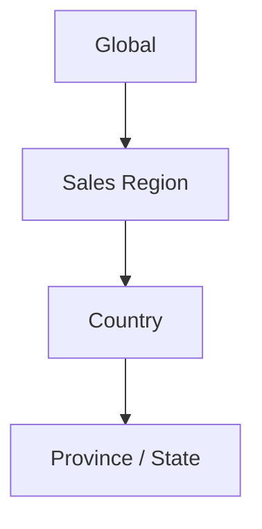

Partner and Customer geography is not a parent/child extension of this tree. It is represented by effective-dated coverage relationships:

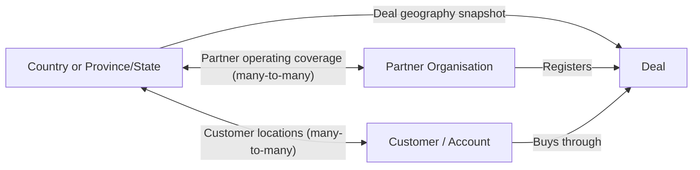

Rules:

- A Sales Region contains one or more countries.
- A country belongs to one primary active Sales Region at a time; historical mappings retain effective dates.
- A Province/State belongs to one country.
- A Partner may be approved for one or more countries and may operate across several regions.
- A Customer has a primary country and Province/State, with additional service locations where required.
- Geographic changes never rewrite historical deal context.
- Country and subdivision records use stable codes; users cannot create them from operational forms.
- Super Admin governs Sales Region membership and exceptional aliases.

### 5.2 Identity and assignment model

A user identity represents a person. It contains authentication and personal profile data but does not directly grant business access.

Access is granted through one or more assignments containing:

- user;
- team domain;
- functional role;
- geographic scope type;
- geographic scope ID;
- optional Partner scope;
- optional Customer/Account scope;
- manager assignment;
- start timestamp;
- optional end timestamp;
- scheduled, active, suspended, ended, or revoked state;
- assignment source;
- approving Super Admin or authorised scoped manager Assignment ID; and
- audit metadata.

An assignment is valid only when its dates and status are valid. Removing a role from the UI without ending the assignment is not sufficient.

Assignment status follows this exhaustive lifecycle:

| Current status | Allowed next status | Permitted actor, guard, and effect                                                                                                                              |
| -------------- | ------------------- | --------------------------------------------------------------------------------------------------------------------------------------------------------------- |
| Scheduled      | Active              | System reaches the effective start timestamp and revalidates identity, hierarchy, role, scope, manager, overlap, and Partner status                             |
| Scheduled      | Revoked             | Super Admin, or a Partner Admin acting only on a subordinate Partner User Assignment within its own ceiling, cancels the future grant with reason               |
| Active         | Suspended           | Super Admin, or that same constrained Partner Admin, temporarily removes access with reason; affected sessions and Context IDs are revoked                      |
| Active         | Ended               | System reaches the end timestamp, or a permitted actor completes ordinary reassignment/offboarding; sessions end and historical attribution remains             |
| Active         | Revoked             | Super Admin performs an immediate security/compliance revocation; Partner Admin may do so only for a subordinate Partner User Assignment within its own ceiling |
| Suspended      | Active              | The permitted suspending authority resolves the reason and every current identity/scope/overlap guard passes                                                    |
| Suspended      | Ended               | The scheduled end arrives or a permitted actor completes ordinary reassignment/offboarding                                                                      |
| Suspended      | Revoked             | Super Admin, or the constrained Partner Admin described above, makes the access removal permanent with reason                                                   |

Ended and Revoked are terminal. A future return, different role/scope, manager change, or rehire creates a new linked Assignment revision; it never reopens an ended/revoked Assignment or rewrites its interval. A currently effective Assignment may be Active only if `start_at <= now < end_at` (or `end_at` is null); a future approved grant is Scheduled. Suspended is temporarily invalid regardless of dates. Every command detects forbidden overlaps and privilege escalation before commit, records actor, reason, old/new status, effective time, predecessor/successor link, and session-revocation result, and rejects direct state writes, self-transitions, and every unlisted pair.

### 5.3 Active context

Active Context has two levels that are never silently unioned:

1. **Assignment Context** — exactly one active Assignment selected for the session. It establishes role, team domain, organisation, geographic ceiling, and portfolio constraints.
2. **Working Scope** — `null` for Full Assignment scope or one proper authorised geographic descendant/Partner/Account portfolio member that narrows the current view.

The server issues a Context ID containing the Assignment ID and Working Scope. The browser cannot construct or broaden it.

#### Login Assignment selection

After valid credentials and any mandatory security step:

1. The service resolves the user’s active assignments.
2. If exactly one Assignment is active, it is selected and visibly confirmed.
3. If several Assignments are active, the user chooses one card labelled with role, team domain, organisation, geographic ceiling, and any Partner/Account portfolio constraint.
4. Geographic ceiling labels may be Global, Sales Region, Country, or Province/State. A Global option appears only for an Assignment that grants Global scope.
5. A Partner or Account constraint is shown on the Assignment card; it is not mistaken for a broader geographic grant.
6. After Assignment selection, a hierarchical **Start in** selector appears whenever that Assignment contains more than one authorised geographic choice. It is always available to Partner Admin and Partner User identities with multi-country or multi-region scope and may also be used by LIVEY roles.
7. Start in offers only the Assignment ceiling and its authorised descendants, grouped as Global → Sales Region → Country → Province/State. It is a governed cascade selector, not a free-text search.
8. If only one geographic choice is possible, the interface visibly confirms it instead of showing a redundant choice.
9. The server validates both selections and issues the Active Context. Choosing the Assignment ceiling stores `working_scope = null`; choosing an authorised descendant stores that narrowing value.
10. The landing dashboard uses the resulting Assignment ∩ Working Scope intersection.

#### In-app switching

- The header control visibly separates **Switch Assignment** from **View Within**.
- Switch Assignment lists active Assignments only and performs the same server validation as login.
- View Within lists only authorised descendants of the selected Assignment: Region, Country, Province/State, Partner, or Account as applicable.
- View Within always begins with **Full Assignment scope**. Selecting it clears the Working Scope to `null` and returns to the Assignment ceiling without changing role, team domain, organisation, or portfolio ceiling.
- Choosing a Working Scope never changes role, team domain, organisation, or the Assignment ceiling.
- Switching either level clears incompatible selected records, refreshes all scoped queries, and records a context-switch audit event.
- Unsaved work prompts before switching.
- Deep links outside the Working Scope may offer an authorised descendant change; links outside the Assignment may offer Switch Assignment only when another active Assignment permits access. Otherwise they show Access Denied.
- Context is never trusted solely from a URL parameter or browser storage.

### 5.4 Roles

#### Super Admin / LIVEY Strategic Team

Global policy and governance authority. Super Admin can manage hierarchy, roles, assignments, partners, catalogues, approvals, integration configuration, audit, and global analytics. High-risk actions require re-authentication and are always audited.

#### Regional Manager (RM)

Owns commercial oversight for assigned Sales Regions or Countries. RM is automatically tagged on every deal created in assigned scope, can manage regional team assignments, tag a Distributor, review won deals, approve permitted discounts, and access regional dashboards and records.

#### Partner Account Manager (PAM)

Owns the LIVEY relationship with assigned Partner organisations. PAM is added to relevant deals on the successful `Testing → Qualified` transition, manages partner performance and escalations, may tag a Distributor, approves permitted discounts, and may review won deals when tagged.

#### Key Account Manager (KAM)

Owns assigned Customer/Accounts. KAM is added on the successful `Testing → Qualified` transition when the Deal’s Customer mapping identifies an assigned KAM. KAM manages account health, tasks, contacts, and commercial progression within scope.

#### Inside Sales Representative (ISR)

Owns sourcing, early qualification, demo, and testing activity. ISR is automatically tagged from Sourced and remains tagged through closure for attribution, visibility, collaboration, and notifications.

#### LIVEY Support

Operates ticket queues, SLA, product/serial validation, attachments, comments, closure, escalation, and approved reopen requests. Support receives only the customer, partner, product, shipment, and deal context required to resolve assigned tickets unless another assignment grants broader access.

#### Distributor

A restricted LIVEY-internal role. Distributor access is participant-based:

- the user sees only explicitly tagged Customers and Deals;
- RM or PAM adds or removes the Distributor tag;
- the user may monitor permitted activity and contribute only fulfillment-safe notes, Task updates, shared documents, and configured logistics fields;
- the user cannot create a Deal, move a Deal forward, edit pricing, request/approve a discount, mark Won/Lost, or perform a commercial approval;
- the universal tagged-participant backward-movement contract still applies: an actively tagged Distributor may move an accessible Deal to an earlier open stage only through the reasoned workflow in Section 9.10;
- the user cannot access internal hierarchy management, global analytics, broad partner lists, pricing-policy configuration, reward administration, strategic audit, or unrestricted exports; and
- removal ends future access while retaining historical attribution.

The Distributor safe view and command allowlist is exact:

| Surface         | Readable fields                                                                                                                                                                                                                                                                                                | Permitted Distributor commands                                                                                                                                               |
| --------------- | -------------------------------------------------------------------------------------------------------------------------------------------------------------------------------------------------------------------------------------------------------------------------------------------------------------- | ---------------------------------------------------------------------------------------------------------------------------------------------------------------------------- |
| Tagged Customer | Customer display name and ID; governed geography; permitted POC name, role, business email/phone and consent status; tagged-Deal summaries; shared Tasks, Tickets, shipments, documents, and public Activity                                                                                                   | `customer.addSharedNote`; `task.createForSelf`; `task.updateAssigned`; `task.completeAssigned`; `document.uploadSharedFulfillment`; `logistics.updateDistributorFulfillment` |
| Tagged Deal     | Deal display ID; Partner and Customer display names; permitted POC fields; stage and probability; Product/SKU/quantity; expected close date; assigned next Task; public participant names; registration/outcome label without internal rationale; shared fulfillment documents, shipments, and public Activity | The same shared-note, assigned-Task, fulfillment-document, and logistics commands plus `deal.moveBackward` under Section 9.10                                                |

`document.uploadSharedFulfillment` accepts only Dispatch Note, Packing List, Proof of Delivery, Warranty Delivery Evidence, and other Super Admin-governed non-commercial fulfillment categories. `logistics.updateDistributorFulfillment` can change only Distributor Reference, fulfillment state (`Awaiting Stock`, `Ready to Dispatch`, `Dispatched`, `Delivered`, or `Exception`), planned/actual dispatch date, carrier display name, tracking reference/URL, delivery date, and public exception note. Distributor notes and Activity are append-only; uploaded files can be superseded but not silently deleted. Assigned-Task commands can change only state, due date, checklist, and public completion evidence on Tasks assigned to that Distributor.

Distributor fulfillment state follows this exhaustive path:

| Current state     | Allowed next state                                          | Trigger and guard                                                                                                                                          |
| ----------------- | ----------------------------------------------------------- | ---------------------------------------------------------------------------------------------------------------------------------------------------------- |
| Awaiting Stock    | Ready to Dispatch                                           | Tagged Distributor records stock readiness and planned dispatch evidence                                                                                   |
| Awaiting Stock    | Exception                                                   | A public stock/supply exception and next action are recorded                                                                                               |
| Ready to Dispatch | Dispatched                                                  | Carrier/tracking reference and actual dispatch time pass validation                                                                                        |
| Ready to Dispatch | Exception                                                   | A public dispatch exception and next action are recorded                                                                                                   |
| Dispatched        | Delivered                                                   | Delivery time and permitted proof/reference are recorded                                                                                                   |
| Dispatched        | Exception                                                   | A verified transit/delivery exception and next action are recorded                                                                                         |
| Exception         | Awaiting Stock, Ready to Dispatch, Dispatched, or Delivered | Tagged Distributor or tagged RM/PAM records resolution evidence consistent with the last non-Exception state; the command cannot regress completed custody |

Delivered is terminal for that Distributor fulfillment record. A return or replacement creates a new linked fulfillment/Shipment record. Every change creates public Activity and rechecks the active Distributor participant period. Direct state writes, terminal reopen, backward movement, self-transitions, and every unlisted pair are rejected.

The allowlist excludes Customer core identity edits, POC edits, Product/quantity changes, forward stage movement, Won/Lost, probability override, MSRP/PTP/DTP/proposed price/margin, discounts, approval rationale, reward data, internal notes, participant administration, arbitrary file categories, Task reassignment to another user, and every delete command. UI controls and API policy use the same command allowlist.

#### Partner Admin role

Administers an approved Partner within assigned geographic scope. A Global Partner Admin has Global scope; a regional or country Partner Admin has the corresponding assignment. Partner Admin can invite and scope Partner team members, manage Company/Profile, view partner-scoped records, allocate eligible contributor splits, and use approved operational modules.

#### Partner User

Works on own or tagged partner records within assignment scope. Partner User cannot administer Partner-wide policy, team assignments, integrations, catalogues, approval thresholds, or governance exports.

### 5.5 Permission matrix

Legend:

- **G**: global authority;
- **S**: authorised assignment scope;
- **T**: explicitly tagged records only;
- **O**: own records or assigned work only;
- **A**: approval authority where policy permits;
- **—**: no access.

| Capability                  | Super Admin | RM                        | PAM                           | KAM                     | ISR           | Support                      | Distributor   | Partner Admin                      | Partner User      |
| --------------------------- | ----------- | ------------------------- | ----------------------------- | ----------------------- | ------------- | ---------------------------- | ------------- | ---------------------------------- | ----------------- |
| Global dashboard            | G           | —                         | —                             | —                       | —             | —                            | —             | —                                  | —                 |
| Regional dashboard          | G           | S                         | S when assigned               | S when assigned         | S summary     | S queue summary              | T summary     | S partner summary                  | O/T summary       |
| Manage geography            | G           | Request change            | —                             | —                       | —             | —                            | —             | —                                  | —                 |
| Manage LIVEY assignments    | G           | S subordinate assignments | —                             | —                       | —             | —                            | —             | —                                  | —                 |
| Manage Partner team         | G           | View S                    | View assigned Partner         | —                       | —             | —                            | —             | S                                  | —                 |
| Approve Partner             | G           | Recommend S               | Recommend assigned            | —                       | —             | —                            | —             | —                                  | —                 |
| View Partner                | G           | S                         | Assigned                      | Account-related         | Deal-related  | Ticket-related               | T             | S                                  | S limited         |
| Create/edit Partner         | G           | Recommend S               | Propose assigned changes      | —                       | —             | Ticket-safe fields only      | —             | S Company revision                 | Own Profile only  |
| View Customer               | G           | S                         | Assigned Partner/S            | Assigned                | T             | Ticket-related               | T             | S                                  | O/T               |
| Create/edit Customer/POC    | G           | S                         | Assigned Partner/S            | Assigned                | T             | Ticket-safe fields only      | T safe notes  | S                                  | O/T               |
| Create Deal                 | G           | S                         | S                             | S                       | S             | —                            | —             | S                                  | S                 |
| View Deal                   | G           | S                         | Assigned/T                    | Assigned/T              | T             | Ticket-related               | T             | S                                  | O/T               |
| Edit Deal fields/pricing    | G           | S/T                       | T                             | T non-pricing           | T non-pricing | Ticket-safe fields only      | T safe fields | S by workflow                      | O/T by workflow   |
| Advance Deal                | G           | T/S by policy             | T                             | T                       | T             | —                            | —             | T                                  | T                 |
| Move Deal backward          | T           | T                         | T                             | T                       | T             | T                            | T             | T                                  | T                 |
| Assign Deal participants    | G           | S/T                       | T                             | T permitted roles       | T watchers    | Ticket Support link only     | —             | Partner contributors in S          | —                 |
| Approve registration        | G           | A in scope                | A if policy delegates         | —                       | —             | —                            | —             | —                                  | —                 |
| Approve discount            | G           | A/T                       | A/T                           | —                       | —             | —                            | —             | —                                  | —                 |
| Review won Deal             | G           | A/T                       | A/T                           | —                       | —             | —                            | —             | —                                  | —                 |
| Manage tasks                | G/S         | S                         | S                             | S                       | S             | S                            | T             | S                                  | O/T               |
| Assign/reassign work        | G/S         | S                         | S                             | S                       | S             | S queue                      | T permitted   | S                                  | O/T if permitted  |
| Publish News                | G           | S if delegated            | Partner audience if delegated | —                       | —             | Service notices if delegated | —             | Partner-internal if delegated      | —                 |
| View Activity               | G           | S                         | S/T                           | S/T                     | T             | Ticket-related               | T             | S                                  | O/T               |
| Receive transaction alert   | T           | T                         | T                             | T                       | T             | T                            | T             | T                                  | T                 |
| Manage own digest prefs     | O           | O                         | O                             | O                       | O             | O                            | O             | O                                  | O                 |
| Create/reply to Ticket      | G/S         | S/T                       | S/T                           | S/T                     | T             | S                            | T shared      | S                                  | O/T               |
| Close Ticket                | G           | —                         | —                             | —                       | —             | S                            | —             | —                                  | —                 |
| Request Ticket reopen       | —           | —                         | —                             | —                       | —             | —                            | —             | S requester                        | O requester       |
| Decide Ticket reopen        | G           | —                         | —                             | —                       | —             | A/S                          | —             | —                                  | —                 |
| Manage courses              | G           | S assignment              | Recommend                     | Recommend               | —             | Support content if assigned  | —             | Assign partner learners if granted | —                 |
| View/complete courses       | G           | S                         | S                             | S                       | S             | S                            | Assigned      | S                                  | Assigned          |
| Manage reward catalogue     | G           | —                         | —                             | —                       | —             | —                            | —             | —                                  | —                 |
| Redeem rewards              | —           | —                         | —                             | —                       | —             | —                            | —             | S eligible points                  | O eligible points |
| View scoped analytics       | G           | S                         | Assigned/S                    | Assigned/S              | T             | S queue                      | T summary     | S                                  | O/T               |
| Import operational data     | G           | S if delegated            | Assigned if delegated         | —                       | —             | Ticket import if delegated   | —             | S                                  | O/T if delegated  |
| Export operational data     | G           | S                         | S/T                           | S/T                     | T             | Queue/T                      | T restricted  | S                                  | O/T               |
| Export governance/config    | G           | —                         | —                             | —                       | —             | —                            | —             | —                                  | —                 |
| Download attachments        | G           | S                         | S/T                           | S/T                     | T             | Ticket-related               | T safe        | S                                  | O/T               |
| Use portal Assistant        | G           | S                         | S/T                           | S/T                     | T             | Queue/T                      | T safe        | S                                  | O/T               |
| View record sync/shipment   | G           | S/T                       | S/T                           | S/T                     | T             | Queue/T                      | T safe        | S                                  | O/T               |
| Operate/config integrations | G           | —                         | —                             | —                       | —             | —                            | —             | —                                  | —                 |
| View audit                  | G           | S business audit          | Assigned business audit       | Assigned business audit | Own/T         | Ticket audit                 | T activity    | Partner audit                      | Own/T activity    |

Field-level policy may be stricter than page access. For example, a Partner User may see the final DTP applicable to their deal but never internal unit cost, other partners’ tier rules, provider credentials, or unrelated reward settings.

### 5.6 Record visibility evaluation

For every request, visibility is the intersection of:

1. authenticated identity;
2. active, effective assignment;
3. active context;
4. organisation and geography scope;
5. record classification;
6. participant/tag relationship for participant-gated record classes and commands;
7. field-level permission;
8. workflow-state permission; and
9. retention or legal restrictions.

If any required element fails, access is denied. The system does not return a record and then hide fields in the browser.

### 5.7 Automatic tagging

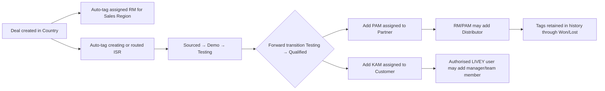

Rules:

- The assignment engine is deterministic and reports missing mappings.
- RM is tagged on all deals in the RM’s effective regional scope.
- ISR remains tagged after Testing.
- On the successful forward transition `Testing → Qualified`, the engine must add the effective PAM for the Partner and KAM for the Customer in the same transaction.
- Missing PAM or KAM coverage always blocks `Testing → Qualified`; it creates a Coverage Exception rather than a partially tagged Deal.
- RM and PAM can add a Distributor from authorised assignments to an individual Customer and/or Deal.
- A Customer tag grants the Distributor only the documented safe Customer view; it does not implicitly grant every Deal for that Customer. Each Deal requires its own Distributor tag.
- Authorised LIVEY users can add or replace managers and team members.
- Automatic tags identify their source as `automatic`; manual tags identify actor and reason.
- Removing a tag requires a reason, ends the effective relationship, and never deletes prior events.
- Tag changes immediately recalculate future notification recipients and access where participant-based access applies.

#### Coverage Exception

A Coverage Exception contains required role, coverage key, affected Deal/action, detected time, source Assignment/policy, responsible Assignment/role, status, SLA target, resolution, and audit.

States are:

- Open;
- In Remediation;
- Resolved; and
- Cancelled because the originating draft/action was abandoned.

Open and In Remediation block the protected Deal action. Waiver is not a valid way to bypass mandatory RM/ISR/PAM/KAM coverage. Super Admin Assignment Operations owns the queue; the relevant RM sees regional exceptions and the assigned PAM/KAM manager sees portfolio exceptions. The initial resolution target is one business day, configurable only as an operational SLA—not as permission to proceed without coverage. Resolution re-runs deterministic assignment/tag reconciliation before the originating action may be retried.

| Current state  | Allowed next state | Actor, guard, and side effect                                                                                                      |
| -------------- | ------------------ | ---------------------------------------------------------------------------------------------------------------------------------- |
| Open           | In Remediation     | Super Admin Assignment Operations or the responsible coverage manager accepts the work item; assignee and target time are recorded |
| Open           | Resolved           | System reconciliation finds one valid current Assignment and creates the required participant atomically                           |
| Open           | Cancelled          | The authorised actor abandons the originating Draft/action, or Super Admin cancels an orphaned request, with reason                |
| In Remediation | Resolved           | System reconciliation validates corrected effective dates/scope, creates the required participant, and records evidence            |
| In Remediation | Cancelled          | The originating Draft/action is explicitly abandoned with reason and any temporary work is disposed                                |

Resolved and Cancelled are terminal. A Resolved exception does not automatically replay the protected business command: the original actor must retry it against the current record version, and all guards run again. If coverage is missing again, the retry creates or links a new Open exception. A Cancelled exception can never be used as evidence of valid coverage. Self-transitions, manually setting Resolved without successful reconciliation, reopening a terminal exception, and every unlisted pair are rejected and audited.

### 5.8 Notifications versus access

- A user may be able to open a record through scope without receiving its notifications.
- Transactional notifications go to active typed participants only. “Tagged people” includes automatically created requester, assignee, approval-assignee, and escalation-owner participant records as well as role tags and explicit watchers.
- A user never receives a notification for a record they are no longer permitted to open.
- RM’s automatic deal tag means the assigned RM receives deal notifications unless the event type is disabled by policy or personal preference.
- Required security, approval, and SLA notifications cannot be disabled in-app, though external digest channels may be configured.

Recipient resolution is canonical across domains:

1. The accepted business command creates/ends all participant periods required by its new state.
2. The event selects active participant types eligible for that event.
3. Disabled, suspended, expired, offboarded, and unauthorised users are removed.
4. Multiple participant types for one User are deduplicated to one Notification.
5. Self-notification and optional category preferences may reduce recipients but never add an untagged User.
6. One recipient-specific in-app Notification is committed through the outbox.
7. Digest generation reauthorises the User and record again at send time.

A work queue may show approvable or escalated records to a scope-authorised role without making every person in that role a notification recipient. Assigning an approval or escalation to a named person creates the typed participant before notifying them.

### 5.9 Offboarding and reassignment

When a LIVEY or Partner user resigns, is suspended, or changes assignment:

1. Authentication sessions are revoked.
2. The user identity is deactivated or the relevant assignment is ended.
3. Historical creator, participant, approver, comment, and activity attribution remains.
4. Active owned records are placed in a reassignment queue.
5. Configured manager or named successor receives temporary operational ownership.
6. Super Admin or authorised manager confirms permanent reassignment.
7. Open tasks, approvals, tickets, notifications, and saved views are reassigned or closed under explicit rules.
8. Exports and assistant retrieval immediately respect the new state.
9. No deal, customer, task history, reward ledger entry, ticket, or audit event is cascade-deleted.

### 5.10 Authorisation administration

- Super Admin can simulate a role and context using non-mutating preview mode.
- Policy changes are versioned and effective-dated.
- High-risk changes show an impact preview: affected users, records, contexts, and pending work.
- Bulk assignment changes require a reason and downloadable result report.
- Permission-denied events are monitored without exposing sensitive target details to the requester.
- Emergency access is time-limited, requires strong re-authentication, records a reason, and produces a strategic audit alert.

---

## 6. Authentication, Onboarding, Profiles, and Teams

### 6.1 Authentication entry

The authentication experience contains:

- Sign in;
- Register a Partner Admin;
- Verify email;
- Forgot password;
- Reset password;
- Accept invitation;
- Mandatory password change;
- Multi-factor authentication challenge when enabled;
- Authorised context selection; and
- Account or access recovery guidance.

The page preserves the current split-screen LIVEY brand treatment on large screens and a focused single-column form on small screens.

#### Sign-in sequence

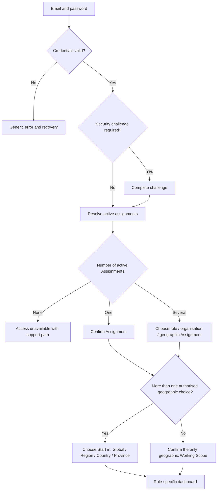

Security requirements:

- Sign-in errors do not reveal whether an email exists.
- Rate limits apply by account, IP risk, and device signal.
- New devices and suspicious sign-ins create security events.
- Assignment selection occurs only after authentication and Assignment resolution.
- The login geography selector is populated only after Assignment selection and can select only the Assignment ceiling or an authorised descendant.
- The Assignment and either `null` or one authorised narrowing Working Scope are validated and bound server-side as the Active Context.
- Passwords are never sent, displayed, exported, logged, or recoverable.
- Identities created by an authorised Super Admin or Partner Admin inviter receive an activation link or temporary credential that forces a password change.

### 6.2 Partner self-registration

Registration creates a prospective Partner Admin identity, not an approved Partner relationship.

Required registration fields:

- Full name;
- Work email;
- Phone with country code;
- Company name;
- Password and confirmation;
- Acceptance of privacy and Partner Programme terms; and
- Consent for required transactional communication.

Sequence:

1. User submits registration.
2. System sends email verification.
3. Unverified identities cannot enter Partner onboarding.
4. Verification opens the Complete Partner Profile experience.
5. Only onboarding, status/help, and Profile & Security are available until final approval.
6. Submitted partner information enters LIVEY review.
7. Agreement signing occurs through Zoho Sign where required.
8. Final approval activates authorised contexts and partner modules.

### 6.3 Partner lifecycle

| Status                | Meaning                                                          | Partner access                                                                |
| --------------------- | ---------------------------------------------------------------- | ----------------------------------------------------------------------------- |
| Email Unverified      | Registration exists but email ownership is not confirmed         | Verification and recovery only                                                |
| Profile Incomplete    | Verified user has not completed required company profile         | Onboarding, help, Profile & Security                                          |
| Draft                 | Onboarding data is saved but not submitted                       | Onboarding, help, Profile & Security                                          |
| Submitted             | Complete profile and documents sent to LIVEY                     | Read-only submission, status, help, security                                  |
| Under Review          | LIVEY is actively reviewing                                      | Read-only submission, status, help, security                                  |
| Changes Requested     | LIVEY requires identified corrections                            | Editable requested sections, status, help, security                           |
| Partial Approval      | Commercial review passed but agreement or final evidence remains | Limited dashboard, agreement, status, help, security                          |
| Agreement Pending     | Agreement is ready for signature                                 | Agreement, limited dashboard, status, help, security                          |
| Signed Pending Review | Signed agreement awaits final LIVEY validation                   | Read-only agreement/status, limited dashboard, help, security                 |
| Approved              | Partner relationship and assignments are active                  | Full scope-authorised Partner workspace                                       |
| Rejected              | Application is declined with controlled explanation              | Status, permitted appeal/reapplication path, security                         |
| Suspended             | Approved relationship is temporarily disabled                    | Status, support, security; no commercial data unless policy permits read-only |
| Offboarded            | Relationship has ended                                           | Retention-governed historical access only when expressly granted              |

Allowed lifecycle transitions:

| From                     | To                           | Actor and guard                                                              | Required side effects                                                         |
| ------------------------ | ---------------------------- | ---------------------------------------------------------------------------- | ----------------------------------------------------------------------------- |
| Email Unverified         | Profile Incomplete           | User presents valid single-use verification token                            | Mark email verified; open onboarding; audit                                   |
| Profile Incomplete       | Draft                        | Verified prospective Partner Admin saves valid onboarding data               | Create first application revision                                             |
| Draft                    | Submitted                    | Prospective Partner Admin completes required fields/documents/declarations   | Freeze submitted revision; create review queue item                           |
| Submitted                | Under Review                 | Assigned Super Admin reviewer accepts the queue item                         | Create reviewer participant and review SLA                                    |
| Submitted / Under Review | Changes Requested            | Assigned reviewer identifies exact fields/documents and reason               | Unlock only requested/dependent inputs; notify tagged applicant in-app/digest |
| Submitted / Under Review | Partial Approval             | Authorised reviewer completes commercial/document checks                     | Enable limited dashboard; prepare agreement path                              |
| Submitted / Under Review | Rejected                     | Authorised reviewer records reason and appeal/reapplication policy           | Revoke operational proposals; retain read-only decision                       |
| Changes Requested        | Submitted                    | Prospective Partner Admin submits a new complete revision                    | Lock prior revision; re-enter review queue                                    |
| Partial Approval         | Agreement Pending            | Super Admin issues a valid partner-specific agreement                        | Create/send Zoho Sign request                                                 |
| Partial Approval         | Changes Requested / Rejected | Authorised reviewer finds unresolved evidence or disqualifier                | Preserve partial decision history; apply target-state side effects            |
| Agreement Pending        | Signed Pending Review        | Verified Zoho Sign completion and signed artifact                            | Store signed artifact/evidence; no full access                                |
| Agreement Pending        | Changes Requested / Rejected | Agreement expires, is declined, or reviewer identifies issue                 | Preserve provider history; require new revision/request as applicable         |
| Signed Pending Review    | Approved                     | Super Admin passes final review and valid Assignments exist                  | Activate Partner relationship/contexts; revoke onboarding-only gates          |
| Signed Pending Review    | Changes Requested / Rejected | Super Admin records issue/decision                                           | No operational access; preserve signed evidence                               |
| Approved                 | Suspended                    | Super Admin records immediate/scheduled suspension reason                    | Revoke operational sessions/contexts; preserve data                           |
| Suspended                | Approved                     | Super Admin resolves suspension conditions and validates Assignments         | Restore only current authorised contexts                                      |
| Approved / Suspended     | Offboarded                   | Super Admin completes relationship termination controls                      | End Assignments/access; start retention/offboarding workflow                  |
| Rejected                 | Draft                        | Super Admin authorises a new application revision under reapplication policy | Preserve rejection; create a new Draft revision                               |

Offboarded is terminal for the ended Partner relationship. Re-engagement creates a new application/relationship revision under an explicit reactivation process; it does not erase Offboarded history. All unlisted transition pairs and direct status-field updates are rejected.

Every status change records actor, previous state, new state, reason, timestamp, affected assignments, communication result, and supporting note/document references.

### 6.4 Partner onboarding wizard

The wizard contains:

1. **Partner Admin identity**
   - verified Partner Admin identity;
   - role in company;
   - phone;
   - authorised signatory indicator.

2. **Company**
   - legal and trading names;
   - business address;
   - governed Country;
   - governed Province/State;
   - governed Business Type;
   - Years in Business band;
   - Annual Turnover band in USD;
   - Employee Count band;
   - website;
   - tax and registration identifiers relevant to country.

3. **Business Focus**
   - multi-select from governed focus areas;
   - product/brand interests;
   - intended countries of operation;
   - sales and technical capabilities.

4. **Documents**
   - country-configured required document checklist;
   - separate upload and status per document;
   - file type, size, virus scan, and expiry validation;
   - document preview and replacement history.

5. **Review and Submit**
   - complete read-only summary;
   - validation of required data;
   - consent and declaration;
   - visible consequence of submission;
   - final Submit for Review action.

The wizard autosaves. A progress indicator shows completed, current, incomplete, rejected, and approved sections. Changes Requested deep-links to affected fields and preserves reviewer notes.

### 6.5 Governed onboarding values

Section 23.3 is the sole machine-key, label, and boundary registry for Business Type, Years in Business, Annual Turnover in USD, Employee Count, and Business Focus. Onboarding controls read the effective version of those dictionaries; they never carry a second hard-coded list.

Operational users cannot create values from selectors. Super Admin may version the governed registry through the Section 23.1 change process. The form stores stable keys, displays the effective label, retains the historical label/version on submitted revisions, and rejects retired or unknown keys for new submissions. “Technology Distributor” is an organisation attribute and is never interpreted as the restricted LIVEY-internal Distributor user role. Selecting `other` requires explanatory text and classification review.

### 6.6 Partner review workspace

Partner Approvals provides:

- structured queue filters rather than free-text search;
- clickable status and SLA cards;
- application summary and full detail;
- document preview and download where authorised;
- verification status per document;
- internal notes and partner-visible requests kept separate;
- duplicate company, domain, tax ID, and LIVEY relationship-assignment warnings;
- country/region and PAM/RM assignment recommendations;
- approval, partial approval, changes request, rejection, suspension, and reactivation actions;
- agreement creation and Zoho Sign status;
- credential/activation status;
- immutable decision history; and
- scoped export of the visible approval queue and documents metadata.

Approvers cannot approve their own prospective Partner application without a second authorised reviewer.

### 6.7 Credentials for approved and invited users

- Self-registered Partner Admins retain their verified account.
- Partner identities created by an authorised inviter receive a one-time activation link or temporary password through a secure channel.
- Temporary credentials expire and force password creation/change.
- The product shows credential status—Invited, Delivered, Opened, Activated, Expired, Revoked—never the password itself.
- Resend invalidates earlier activation secrets.
- Approval does not silently create reusable passwords.

### 6.8 Profile and Company

Profile contains:

- Personal information;
- Company summary for Partner Admin;
- Assignments and authorised contexts;
- Security;
- Notification and digest preferences;
- Accessibility preferences;
- Language, locale, timezone, and local reference currency;
- Connected identity/security status;
- Active sessions and trusted devices; and
- Account deactivation or support pathway.

Password change and security controls appear in Profile, not in a disconnected export settings area.

The Company section is part of Partner Admin Profile and includes approved company fields, coverage, tier, status, agreement, documents, and LIVEY relationship contacts. News is not duplicated inside Company/Profile because News exists on dashboards and in its own feed.

Partners may propose changes to approval-sensitive company data, but the published value remains active until LIVEY approves the revision.

### 6.9 Team invitations and scoped roles

Partner Admin invitation requires:

- Full name;
- Work email;
- Phone;
- Partner role;
- Job title;
- Responsibility;
- Region/Country/Province assignment;
- start date;
- optional end date;
- manager;
- data and module permission preview; and
- invitation message.

Rules:

- A Partner Admin can grant only roles and scope at or below that Partner Admin’s own authority.
- A regional Partner Admin cannot invite a Global Partner Admin.
- Country assignment is mandatory unless the inviting Partner Admin has and intentionally grants Region or Global partner scope.
- Invitations to an existing email add a proposed assignment rather than create a duplicate identity.
- Assignment changes show an impact preview.
- Pausing or removing a team member ends or suspends the canonical assignment, revokes relevant sessions, reassigns work, and does not merely hide a roster row.
- Bulk invite supports validated CSV/XLSX import with row-level results and no partial silent failures.

### 6.10 Profile and authentication acceptance criteria

- An unverified registrant cannot access onboarding data.
- A user can select only contexts granted by active assignments.
- A user with one context does not face an unnecessary selection step.
- A Partner cannot access commercial modules until Approved.
- A Changes Requested user can edit only requested or dependent sections.
- Fixed onboarding controls cannot create arbitrary values.
- A Partner Admin cannot grant a role or scope greater than their own.
- Expired activation and password-reset links are unusable and safely recoverable.
- Deactivation revokes access while retaining business attribution.

---

## 7. Navigation and Role-Specific Dashboards

### 7.1 Navigation model

Navigation is assembled from authorised capabilities and active context. It is not a single global list with client-side hiding.

Primary groups:

1. **Home**
   - Dashboard
   - My Tasks
   - News
   - Activity

2. **Revenue**
   - Leads / Auto CRM
   - Deals
   - Pipeline
   - Customers
   - Deal Documents

3. **Partner**
   - Company Profile
   - Team
   - Agreement
   - Partner Performance

4. **Enablement**
   - Insight Hub
   - Certifications
   - Rewards

5. **Service**
   - Support
   - Shipments where authorised

6. **Administration**
   - Partner Approvals
   - Deal Approvals
   - Won Reviews
   - Users, Roles & Assignments
   - Geography & Reference Data
   - Product & Combo Catalogue
   - Pricing & Discount Policy
   - Reward Store Administration
   - News Publisher
   - Integration Centre
   - Audit & Security

7. **Account**
   - Notifications
   - Profile & Security
   - Help

The Distributor view excludes broad Administration, internal Partner lists, global analytics, pricing policy, strategic audit, and untagged records.

### 7.2 Dashboard common anatomy

Every dashboard includes:

- active-context heading and switcher;
- data-freshness indicator;
- four to six clickable primary KPI cards;
- primary work queue;
- independently scrollable News and Activity tabs;
- sticky Profile/Quick Actions rail on large screens;
- My Tasks and overdue/blocked work;
- relevant approvals or SLA alerts;
- structured drill-down filters;
- assistant suggestions grounded in visible data; and
- empty-state guidance based on role.

Clicking a KPI opens its underlying scoped records with visible filters applied.

### 7.3 Super Admin / LIVEY Strategic Team dashboard

Purpose: global governance and programme health.

Required cards and panels:

- approved, pending, and suspended Partners;
- global pipeline and won value in USD;
- registration and won-review queues;
- reward liability, pending redemptions, and fulfillment exceptions;
- open and breached support tickets;
- users/assignments requiring action;
- training completion and certification;
- Zoho Books, Zoho Sign, GyFTR, WhatsApp, email, and DHL integration health;
- regional comparison;
- security and audit alerts;
- Quick Actions for Partner approval, policy administration, user/assignment creation, catalogue import, News publishing, and reconciliation.

“Your Standing” and “My Redemptions” do not appear for Super Admin.

### 7.4 RM dashboard

Purpose: manage regional performance and ownership completeness.

Required cards and panels:

- regional pipeline, weighted pipeline, won/lost value;
- deals missing required PAM, KAM, ISR, or Distributor decision;
- Partner performance by country and tier;
- overdue commercial tasks;
- registration, discount, and won reviews in scope;
- customer health and stalled deals;
- regional News and Activity;
- team load and offboarding/reassignment queue.

### 7.5 PAM dashboard

Purpose: manage assigned Partner relationships.

Required cards and panels:

- assigned Partners and status;
- pipeline and win rate by Partner;
- deals reaching post-Testing handoff;
- discount and won reviews;
- Partner onboarding/agreement issues;
- partner-team and certification coverage;
- rewards and redemption exceptions;
- open escalations and support trends;
- Distributor tagging prompts.

### 7.6 KAM dashboard

Purpose: manage assigned Customers/Accounts.

Required cards and panels:

- account pipeline and weighted value;
- account health;
- upcoming close dates and renewals;
- deals added after Testing;
- open tasks and stakeholder gaps;
- customer Activity timeline;
- open support and shipment exceptions affecting accounts.

### 7.7 ISR dashboard

Purpose: move sourced opportunities through early stages.

Required cards and panels:

- own/tagged leads and deals in Sourced, Demo, and Testing;
- testing completion and handoff readiness;
- overdue follow-up tasks;
- leads awaiting claim, deduplication, or customer match;
- conversion rate;
- missing POC/customer budget/product data;
- Activity from tagged deals through closure.

### 7.8 LIVEY Support dashboard

Purpose: operate support queues and SLA.

Required cards and panels:

- new, in-progress, waiting, reopen-requested, and closed tickets;
- first-response and resolution SLA;
- tickets by product, serial, Partner, country, severity, and assignee;
- escalations and breached SLA;
- shipment-related tickets;
- attachment or serial-validation failures;
- recent customer replies;
- Quick Actions for assignment, response, escalation, closure, and reopen review.

### 7.9 Distributor dashboard

Purpose: monitor explicitly tagged Customers and Deals.

Required cards and panels:

- tagged Customers;
- tagged Deals by stage;
- tasks assigned to Distributor;
- permitted customer/deal Activity;
- open support or shipment items explicitly shared;
- Quick Actions limited to permitted notes, tasks, updates, and monitoring.

The dashboard never reveals totals or counts from untagged records.

### 7.10 Partner Admin dashboard

Purpose: administer and grow the Partner within assigned context.

Required cards and panels:

- partner pipeline and won value;
- deals awaiting Partner action;
- team members and invitation status;
- training/certification completion;
- reward points, pending redemptions, and catalogue actions;
- company/agreement/document status;
- support status;
- News and Activity targeted to the Partner and context;
- Quick Actions for Deal, Customer, Team invitation, Task, Ticket, and training assignment.

### 7.11 Partner User dashboard

Purpose: complete own and tagged revenue, learning, and support work.

Required cards and panels:

- own/tagged deals;
- My Tasks;
- upcoming close dates;
- required learning;
- eligible points and redemption status;
- open tickets;
- News and Activity;
- Quick Actions for Deal, Task, Ticket, and lesson continuation.

### 7.12 Dashboard acceptance criteria

- Every metric is scoped to active context and role.
- KPI cards are actionable and preserve filter state.
- News and Activity are separate and independently scrollable.
- Quick Actions never expose unavailable operations.
- Changing context refreshes every panel as one consistent state.
- Mobile presents the same actions through touch-safe patterns.
- Local-currency reference is labelled and never replaces USD totals.

---

## 8. Partners, Customers, Contacts, and LIVEY Assignments

### 8.1 Partner record

A Partner record contains:

- legal and trading identity;
- governed geography and approved operating coverage;
- business classifications and capabilities;
- tier and tier history;
- onboarding and agreement status;
- Partner Admins and users;
- assigned PAM and RM;
- products, certifications, and authorisations;
- documents and expiry;
- deals, customers, tasks, tickets, rewards, and Activity;
- risk, suspension, and offboarding state;
- external accounting/reward identifiers; and
- immutable history.

The Partner detail page uses summary, Company, Team, Coverage, Agreements & Documents, Deals, Customers, Learning, Rewards, Support, Activity, and Audit tabs. Tabs appear only when authorised.

### 8.2 Partner list and administration

- Super Admin has Add Partner and import actions.
- Operational lists use status, tier, region, country, coverage, PAM, RM, certification, and date filters.
- Statistics cards are clickable.
- Bulk actions require scope, impact preview, and result report.
- Partner documents can be previewed or downloaded only under explicit document permission.
- External users never see internal review notes.

### 8.3 Customer / Account

A Customer is the end-customer organisation. Required concepts:

- legal/display name;
- primary country and Province/State;
- optional service locations;
- industry and segment;
- account status and health;
- assigned KAM and RM;
- originating Partner;
- contacts and POCs;
- leads, deals, tasks, tickets, shipments, documents, and Activity;
- duplicate/merge history;
- Zoho Books contact/customer identity;
- data-source and consent metadata.

Customer access follows role and context. Distributor requires an explicit Customer tag.

### 8.4 Contact and POC

A Contact contains:

- full name;
- company association;
- title/role;
- work email;
- phone and WhatsApp eligibility;
- country/timezone;
- communication consent;
- preferred channel;
- active/inactive status; and
- Activity.

Records link to a Contact ID rather than copy a free-form POC name. Snapshotted display data may be retained for historical documents.

The standard field set is:

- Point of Contact (POC) Name;
- POC Job Title;
- POC Email;
- POC Phone;
- POC Preferred Channel.

### 8.5 Customer Activity and next steps

Customer Activity is append-only. Each entry contains timestamp, actor, event type, summary, related record, next step, optional due date, and visibility.

Saving a next step:

- timestamps the Activity;
- optionally creates a Task;
- identifies an assignee;
- records due date/time and timezone;
- notifies the event’s eligible typed participants through the Section 5.8 recipient algorithm; and
- remains visible in the customer timeline after completion.

### 8.6 Duplicate management

Auto CRM and manual creation run duplicate detection using governed normalisation:

- legal/display name;
- company domain;
- email domain;
- phone;
- tax or registration identifier;
- Zoho Books identifier;
- country and address similarity.

Potential duplicates are held for review. Merge:

- requires permission;
- selects a surviving canonical record;
- moves relationships without losing source attribution;
- stores before/after values and actor;
- preserves external IDs and redirects old links; and
- cannot merge Partners or Customers across prohibited scopes.

### 8.7 LIVEY relationship assignments

- PAM assignment belongs to Partner and scope.
- KAM assignment belongs to Customer/Account and scope.
- RM assignment belongs to Sales Region or Country.
- ISR may be routed by geography, product, Partner, campaign, or workload.
- Support assignment belongs to queue, product, region, or ticket.
- Distributor assignment grants no record visibility until a Customer or Deal tag exists.
- Only an authorised RM in geography scope or PAM in Partner scope may create or end a Distributor-to-Customer tag; a reason and effective period are required.
- Distributor Customer access exposes the safe identity, permitted Contacts, shared Tasks, explicitly shared support/shipment context, and explicitly tagged Deals. It excludes unrelated Deals, pricing policy, Partner-wide analytics, and internal notes.

The Customer participant panel exposes two named commands:

1. **Add Distributor to Customer** — select an active Distributor Assignment, preview the safe field set, enter reason/effective dates, create the participant period and Activity, then notify the newly tagged Distributor in-app.
2. **Remove Distributor from Customer** — enter reason, preview open shared Tasks/shipments, transfer or close required work, end the participant period, cancel queued future notifications, and preserve history.

Customer tagging never propagates Deal access. The RM/PAM must use the separate Deal participant command for each Deal. Both commands use optimistic concurrency, reauthorise the resulting Customer, and are available through UI/API only via the same domain service.

The Deal participant panel exposes two corresponding named commands:

1. **Add Distributor to Deal** / `dealParticipant.addDistributor` — an authorised RM in the Deal geography or PAM in the Deal Partner portfolio selects one active Distributor Assignment, enters reason and effective dates, previews the Section 5.4 Deal field/command allowlist, and creates the participant period, Activity, and in-app notification atomically.
2. **Remove Distributor from Deal** / `dealParticipant.removeDistributor` — the same authorities enter a reason, preview open assigned Tasks, shared documents, and fulfillment/shipment responsibility, transfer or close required work, end the participant period, cancel queued future notifications, and revoke Deal access immediately while preserving history.

Customer and Deal participant periods are independent. Ending one never ends, creates, or broadens the other. A Distributor cannot invoke either participant command, alter its own effective dates, transfer its Tasks to another user, or retain access merely because a cached card or notification exists.

Assignment conflicts are resolved by an explicit precedence policy and surfaced to Super Admin; the system never chooses an arbitrary person silently.

### 8.8 Partner/customer acceptance criteria

- Global and regional Partner Admins see only their assigned coverage.
- Customer country/subdivision uses governed IDs.
- Contact POC labels follow the canonical convention.
- Customer next steps create durable, timestamped Activity and optional Tasks.
- Duplicate merges preserve every relationship and audit event.
- Distributor cannot discover an untagged Customer.
- Resignation or reassignment preserves historical ownership.

---

## 9. Deals, Pricing, Approvals, and Pipeline

### 9.1 Deal purpose and authority

A Deal is the canonical commercial opportunity shared by an authorised Partner and LIVEY participants. It has three related but separate state dimensions:

1. **Registration status** — whether LIVEY permits the opportunity to proceed.
2. **Pipeline stage** — where the opportunity is in the selling process.
3. **Outcome review status** — whether a claimed win and purchase order have been validated.

These dimensions must not be collapsed into one ambiguous `status` or `stage` field.

### 9.2 Canonical deal states

Section 23.4 is the sole machine-key and display-label registry for all Deal states. This section owns behaviour and transitions, not a second state dictionary.

| Independent dimension | Canonical field         | Behavioural authority                                                        |
| --------------------- | ----------------------- | ---------------------------------------------------------------------------- |
| Registration          | `registration_status`   | Registration lifecycle and revision/decision rules in Sections 9.5 and 9.7   |
| Pipeline              | `pipeline_stage`        | Ordered progression, probability, and backward movement in Sections 9.8–9.10 |
| Outcome review        | `outcome_review_status` | Won/PO review and recovery in Section 9.15                                   |

There is no Approved Pipeline column. “Superseded” and “Review Required” are not registration status keys. Each submitted Pricing Revision has an immutable Registration Decision; a changed registration basis makes the prior decision non-current and links it to its successor without rewriting history.

### 9.3 Deal creation

The Create Deal experience is a structured wizard or progressive form.

#### Section 1: Context and customer

- Active context, read-only;
- Partner, inferred when unambiguous and selectable only within authority;
- Customer;
- Point of Contact (POC);
- Customer country;
- Province/State;
- Deal source;
- creating user and assignment.

The user can create a Customer or Contact inline only when permitted. Inline creation uses the canonical form and duplicate detection.

#### Section 2: Products and quantity

Product selection appears before Quantity.

Each line includes:

- Product or Combo;
- SKU;
- description;
- quantity;
- unit of measure;
- catalogue price version;
- MSRP / List Price;
- Base Partner Transfer Price;
- Partner tier adjustment;
- Partner Transfer Price;
- discount, locked before Proposal;
- Discounted Transfer Price;
- proposed selling price;
- line totals;
- optional local-currency reference; and
- availability or fulfillment warning.

Users may add, remove, duplicate, and reorder lines. A Deal must contain at least one valid line.

Quantity rules:

- each Product defines unit of measure, whether fractional quantity is permitted, decimal scale, minimum, and optional maximum;
- default Product policy is a positive integer quantity with minimum `1`;
- a fractional quantity is accepted only when the Product explicitly permits it and the value fits the configured decimal scale;
- zero, negative, non-numeric, excessive-scale, and above-product-maximum quantities are rejected in UI, import, API, and Assistant;
- changing unit of measure invalidates an incompatible quantity and requires review;
- the same SKU under identical commercial terms consolidates quantity, while genuinely different term/effective-period lines remain separate; and
- quantities and prices use fixed-point decimal arithmetic.

#### Section 3: Opportunity details

- Customer budget in USD and optional local reference;
- expected close date;
- probability;
- competitor, optional until required by Lost policy;
- use case;
- technical requirements;
- deal notes;
- privacy/classification;
- initial tasks and next step.

#### Section 4: Participants

- assigned RM, automatic;
- ISR, automatic or routed;
- PAM, shown when Partner mapping exists;
- KAM, shown when Customer mapping exists;
- Partner contributors;
- optional manager/team members;
- Distributor, selectable only by RM/PAM;
- watchers;
- reward-eligible Partner contributors and proposed split.

#### Section 5: Review and submit

The review shows:

- Customer and POC;
- Partner and active context;
- every product and quantity;
- USD commercial summary;
- local reference and rate timestamp when enabled;
- registration threshold result;
- tags and missing assignments;
- expected registration outcome;
- notifications that will be created;
- data requiring future stage completion.

The user saves Draft or submits. A Draft produces no external notifications except optional reminder tasks.

### 9.4 Product catalogue and price books

Each Product and Combo supports:

- stable SKU;
- name;
- product family/series;
- brand;
- category;
- description;
- image and documents;
- unit of measure;
- active/inactive state;
- availability;
- inventory reference where applicable;
- effective-dated MSRP in USD;
- effective-dated Base Partner Transfer Price in USD;
- tier adjustments;
- discount policy;
- tax classification;
- reward eligibility;
- Zoho Books item ID; and
- shipment attributes.

Prices are numeric decimal values, not currency-formatted strings.

#### Partner tiers

Default tiers are Registered, Silver, Gold, and Platinum. A tier policy may add an extra percentage adjustment to Base PTP. Tier changes are effective-dated and do not rewrite an existing Deal snapshot.

### 9.5 Pricing formulas

For each Deal line \(i\):

```text
MSRP total(i) = quantity(i) × MSRP unit(i)

Partner Transfer Price unit(i)
  = Base Partner Transfer Price unit(i)
    × (1 − tier adjustment percent(i) / 100)

Discounted Transfer Price unit(i)
  = Partner Transfer Price unit(i)
    × (1 − approved deal discount percent(i) / 100)

Eligible LIVEY value(i)
  = quantity(i) × Discounted Transfer Price unit(i)

Proposed customer total(i)
  = quantity(i) × Proposed Selling Price unit(i)

Partner gross margin(i)
  = Proposed customer total(i) − Eligible LIVEY value(i)
```

Deal totals are the sum of line totals, rounded using currency-safe decimal arithmetic. Intermediate calculations retain sufficient precision; monetary outputs round to two decimal places using half-up rounding.

Before Proposal, the effective Deal discount is `0%`, so DTP equals PTP. At and after Proposal, DTP uses only the current approved discount.

The default commercial floor is:

`Proposed Selling Price unit ≥ Discounted Transfer Price unit`

A proposed price below DTP is rejected and blocks Proposal/Negotiation progression. It is not an ordinary warning and has no ad hoc approver under the current policy. A future below-floor exception would require a versioned Product Policy change with explicit authority, migration, and tests.

#### Pipeline-value metrics

The authoritative open-pipeline value is:

```text
pipeline_value_usd
  = sum(quantity × current effective DTP unit)

weighted_pipeline_usd
  = round_half_up(pipeline_value_usd × stored probability / 100, 2)
```

Because pre-Proposal discount is zero, pre-Proposal pipeline value equals the current PTP total. From Proposal onward it reflects the approved DTP of the current Pricing Revision.

Metric rules:

- **Open pipeline** contains Sourced through Negotiation only.
- Won and Lost are excluded from open and weighted pipeline.
- **Won value** is the final approved DTP total for Approved Won Deals in the selected outcome-date period.
- **Lost value** is the last current DTP total at loss and is reported separately.
- **Proposed customer value** and MSRP are separate metrics and never carry the unqualified label “pipeline.”
- one Deal is counted once while line values are summed;
- current open metrics use the current Pricing Revision; historical/as-of metrics use the revision effective at the event time; and
- dashboards, cards, analytics, exports, and Assistant answers use these same definitions.

#### Registration threshold value

The initial registration threshold uses the sum of `quantity × Partner Transfer Price` before deal-specific discount, because deal discount does not unlock until Proposal.

If lines, quantities, catalogue price version, tier, or PTP change so that an auto-approved Deal rises above USD 5,000 before Won:

- a new Pricing Revision and Registration Decision are created;
- `Deal.registration_status` becomes Submitted for Review;
- the prior Registration Decision points to the successor revision and is no longer current;
- progression pauses at the next controlled transition;
- tagged participants are notified; and
- an approval request records the price change.

The same revision rule applies even when the new value remains in the same threshold band. A change only to Proposal-stage discount, DTP, proposed selling price, local reference rate, note, Task, document, or participant does not re-run registration unless Product, quantity, catalogue price version, tier, or PTP also changes.

### 9.6 USD and local-currency reference

- USD is the canonical stored, calculated, approved, reported, rewarded, exported, and synchronised value.
- Users may select an authorised local reference currency for display.
- Local values show currency code, rate, provider, and rate timestamp.
- Local values are labelled “Reference only.”
- Users cannot edit a converted reference independently of USD.
- Historical Deal snapshots retain the displayed rate used at the time.
- Approval thresholds and rewards never use the local display amount.
- Legacy non-USD amounts migrate with original currency, original amount, migration rate, migration timestamp, and resulting USD amount.

### 9.7 Registration approval

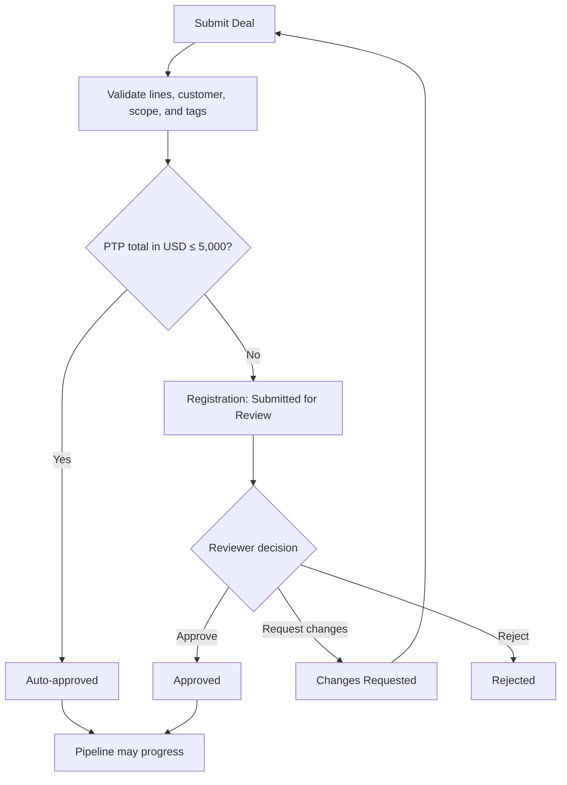

Boundary rule:

- USD 4,999.99: auto-approved;
- USD 5,000.00: auto-approved;
- USD 5,000.01: LIVEY review required.

Reviewers see the complete pricing snapshot, threshold calculation, duplicate/conflict warnings, Customer lock or collision signals, participant mappings, and prior decisions. Every decision requires a reason code; rejection and Changes Requested require explanatory text.

#### Registration lifecycle contract

| Current status                                                                       | Command                   | Allowed next status                                                          | Actor and guard                                                                                                                                                    | Required effects                                                                                                                                                                                                                                        |
| ------------------------------------------------------------------------------------ | ------------------------- | ---------------------------------------------------------------------------- | ------------------------------------------------------------------------------------------------------------------------------------------------------------------ | ------------------------------------------------------------------------------------------------------------------------------------------------------------------------------------------------------------------------------------------------------- |
| No registration                                                                      | Create Deal               | Draft                                                                        | Role with Create Deal permission; authorised Partner/Customer context                                                                                              | Create Deal, Working Pricing Draft, creator/RM/ISR participants, and Activity atomically                                                                                                                                                                |
| Draft                                                                                | Submit registration       | Auto-approved when PTP total ≤ USD 5,000; otherwise Submitted for Review     | Active tagged Deal editor; complete fields, current coverage, current record version                                                                               | Freeze the Working Pricing Draft as a submitted Pricing Revision; create current Registration Decision; notify typed participants and approval assignee when applicable                                                                                 |
| Submitted for Review                                                                 | Approve                   | Approved                                                                     | Authorised LIVEY registration reviewer; not prohibited by maker/checker policy                                                                                     | Record immutable approval against exact revision; unblock eligible forward movement                                                                                                                                                                     |
| Submitted for Review                                                                 | Request changes           | Changes Requested                                                            | Authorised reviewer; reason code and explanatory text                                                                                                              | Record immutable decision; seed a successor Working Pricing Draft from the reviewed revision; create remediation Task/participant; keep forward movement blocked                                                                                        |
| Submitted for Review                                                                 | Reject                    | Rejected                                                                     | Authorised reviewer; reason code and explanatory text                                                                                                              | Record immutable rejection; dispose approval Task; keep forward movement blocked                                                                                                                                                                        |
| Submitted for Review, Auto-approved, or Approved                                     | Begin commercial revision | Draft                                                                        | Active tagged commercial editor; Deal is not Approved Won                                                                                                          | Seed a successor Working Pricing Draft; mark prior Registration Decision non-current; pause forward progression                                                                                                                                         |
| Changes Requested                                                                    | Submit corrected revision | Auto-approved when new PTP total ≤ USD 5,000; otherwise Submitted for Review | Active tagged commercial editor; requested corrections complete in the Working Pricing Draft                                                                       | Freeze the Working Pricing Draft as a successor Pricing Revision; link/supersede prior decision; create one new current decision/request                                                                                                                |
| Rejected                                                                             | Reopen registration       | Draft                                                                        | Super Admin; mandatory reconsideration reason and current-scope validation                                                                                         | Seed a successor Working Pricing Draft; preserve rejection; create Activity; do not auto-submit                                                                                                                                                         |
| Draft, Submitted for Review, Changes Requested, Rejected, Auto-approved, or Approved | Cancel registration       | Cancelled                                                                    | Deal creator, tagged Partner Admin/User, tagged PAM/RM, or Super Admin; Deal must still be at Sourced and must not have Approved Won/accounting/reward fulfillment | Require cancellation reason and open-Task disposition; end active RM/ISR/optional participant periods at cancellation time while retaining all attribution in history; probability becomes 0; remove from active Pipeline; cancel current approval work |

Cancelled is terminal. Continuing the opportunity requires a new linked Deal; the cancelled Deal is never reactivated or deleted. Rejected can recover only through Reopen registration. To cancel a Deal that has progressed beyond Sourced, an active tagged participant first uses the normal reasoned backward workflow to return it to Sourced. Approved Won corrections use Section 9.15 compensating controls, not registration cancellation.

Submitted Pricing Revisions are immutable. A **Working Pricing Draft** is the editable, version-checked precursor that becomes an immutable Pricing Revision only when submitted. For Draft, **Reprice and submit** validates and submits the existing Working Pricing Draft. For Changes Requested, it invokes Submit corrected revision on the draft created by Request changes. For Submitted for Review, Auto-approved, or Approved, it atomically invokes Begin commercial revision and Submit registration. Its exhaustive result matrix is:

| Status before material reprice | New PTP total ≤ USD 5,000                    | New PTP total > USD 5,000                                                                      |
| ------------------------------ | -------------------------------------------- | ---------------------------------------------------------------------------------------------- |
| Draft                          | Auto-approved                                | Submitted for Review                                                                           |
| Submitted for Review           | Auto-approved with a new current decision    | Submitted for Review with a replacement request; no status self-transition event is fabricated |
| Auto-approved                  | Auto-approved with a successor decision      | Submitted for Review                                                                           |
| Approved                       | Auto-approved with a successor decision      | Submitted for Review; prior manual approval is non-current                                     |
| Changes Requested              | Auto-approved                                | Submitted for Review                                                                           |
| Rejected                       | Forbidden until Super Admin reopens to Draft | Forbidden until Super Admin reopens to Draft                                                   |
| Cancelled                      | Forbidden                                    | Forbidden                                                                                      |

Every submitted material reprice freezes a successor Pricing Revision when a submitted predecessor exists, makes the prior Registration Decision non-current, links it through `superseded_by_revision_id`, and evaluates the rounded USD PTP total. The first Draft submission freezes the first Pricing Revision. Same-band repricing never reuses the old decision. All unlisted status commands, direct status-field updates, and revision replacement after Approved Won are rejected.

### 9.8 Stage model and default probability

| Stage       | Default probability | Intent                                                      | Minimum forward requirements                                                                   |
| ----------- | ------------------: | ----------------------------------------------------------- | ---------------------------------------------------------------------------------------------- |
| Sourced     |                  0% | Opportunity recorded and ownership established              | Approved/auto-approved registration; Customer; POC; at least one product line; RM and ISR tags |
| Demo        |                 25% | Product/value demonstration planned or completed            | Demo task, date/outcome, next step                                                             |
| Testing     |                 25% | Technical validation in progress                            | Technical contact, test plan, assigned ISR, due date                                           |
| Qualified   |                 50% | Need, authority, timing, and commercial potential validated | Testing result; Customer budget; expected close date; required PAM/KAM added                   |
| Proposal    |                 50% | Formal commercial proposal being prepared or issued         | Price snapshot; proposed selling price; discounts submitted/approved; proposal task/document   |
| Negotiation |                 50% | Commercial terms actively negotiated                        | Proposal sent; required discount approvals; negotiation Task assignee and next Task            |
| Won         |                100% | Customer has selected the offer                             | Won decision; PO now or PO Pending choice                                                      |
| Lost        |                  0% | Opportunity closed unsuccessfully                           | Lost reason; optional competitor and lesson learned                                            |

Tagged participants with stage-edit permission may override probability using only 0%, 25%, 50%, or 100%. The override requires a reason and appears in Activity. Won always becomes 100%; Lost always becomes 0%.

### 9.9 Forward movement

Forward movement:

- is available only on approved or auto-approved active Deals;
- validates the current stage’s exit criteria and next stage’s entry criteria;
- shows tasks/documents/approvals that will be created;
- applies automatic participant additions;
- creates a transition event with previous/next stage;
- updates default probability unless an authorised user explicitly retains or changes a permitted override;
- notifies tagged recipients; and
- deep-links the next required action.

Users cannot create a normal Deal directly in a late stage. Super Admin may import legacy stage state through a controlled migration/import mode that records the source.

### 9.10 Backward movement

Any active tagged participant may request and perform a permitted backward movement.

The movement dialog requires:

- destination stage;
- mandatory reason category;
- explanation;
- treatment of completed stage-generated tasks;
- treatment of approved discount/proposal snapshots;
- notification preview.

Backward movement:

- never deletes prior stage history;
- does not silently revoke an approved registration;
- marks invalidated proposals or approvals as superseded, not deleted;
- may reopen stage tasks according to template policy;
- recalculates stage-default probability unless an authorised override is confirmed;
- records actor, assignment, timestamp, previous and new stage; and
- sends in-app notifications to current tagged participants.

### 9.11 Post-Testing handoff

When a Deal moves forward from Testing to Qualified:

1. Testing completion is validated.
2. ISR remains tagged.
3. PAM assigned to the Partner is added.
4. KAM assigned to the Customer is added.
5. RM remains tagged.
6. Missing PAM or KAM mapping creates a Coverage Exception and the transition does not commit.
7. Handoff Activity summarises technical result, open risks, Customer budget, next task, and close date.
8. Newly tagged people receive access-consistent in-app notifications.

### 9.12 Proposal and discount workflow

Deal-specific discount fields are hidden or read-only before Proposal.

At Proposal:

- authorised Partner users can request a discount;
- the system displays PTP, requested percentage, proposed DTP, margin effect, and reward effect;
- tier adjustment is distinct from deal-specific discount;
- tagged PAM/RM or Super Admin approves, changes, or rejects the request;
- approval snapshots approver, policy version, percentage, DTP, and reason;
- revised requests supersede, rather than modify, the prior decision;
- Proposal cannot move to Negotiation while a required discount decision is unresolved.

Super Admin defines:

- role-specific maximum request;
- auto-approval bands if enabled;
- minimum price/margin floor;
- products or partners requiring manual approval;
- approval escalation;
- effective date.

No discount can equal or exceed 100%, produce a zero/negative DTP, or bypass the configured floor.

### 9.13 Pipeline board

#### Columns

The board shows Sourced, Demo, Testing, Qualified, Proposal, Negotiation, Won, and Lost. Won is green; Lost is red. Intermediate stages use an accessible progression palette.

#### Cards

Every card always shows:

- Partner name;
- Customer;
- Point of Contact (POC);
- product summary, line count, and quantity summary with unit of measure;
- a stage-specific authoritative value label from the table below;
- local reference when enabled;
- probability;
- next task and due state;
- next Task assignee;
- typed participant chips for RM, ISR, PAM, and KAM as applicable;
- registration/outcome review indicator;
- participant avatars/count;
- stale or blocked indicator.

| Card stage/outcome                                                              | Card value label                               | Value and metric treatment                                                                     |
| ------------------------------------------------------------------------------- | ---------------------------------------------- | ---------------------------------------------------------------------------------------------- |
| Sourced through Negotiation                                                     | Pipeline value (USD)                           | Current effective DTP total; included in open Pipeline and weighted Pipeline under Section 9.5 |
| Won with PO Pending, Under LIVEY Review, Changes Requested, or Rejected Outcome | Claimed won value (USD) — pending LIVEY review | Frozen/current claimed final DTP total; excluded from open Pipeline and from approved Won KPI  |
| Won with Approved Won                                                           | Won value (USD)                                | Final approved DTP total; included only in Won metrics for the approved outcome-date period    |
| Lost                                                                            | Lost value (USD)                               | Last current DTP total at loss; included only in Lost metrics                                  |

MSRP and Proposed customer value may appear in the expanded detail sheet with explicit labels; neither replaces the stage-specific card value.

Card actions are available by mouse, keyboard, and touch:

- Open detail;
- Move forward;
- Move backward;
- Add note;
- View Activity through an eye/timeline action;
- Add Task;
- Manage participants if permitted.

#### Board controls

- Active context;
- Country;
- Province/State;
- Partner;
- Partner User;
- Customer;
- Product;
- Stage;
- registration status;
- outcome review status;
- participant role/user;
- task state;
- close-date range;
- USD value range;
- probability;
- saved views;
- visible queue export.

There is no free-text search box.

### 9.14 Deal detail

Deal detail uses:

- Overview;
- Products & Pricing;
- Participants;
- Tasks;
- Documents;
- Activity;
- Approvals;
- Rewards;
- Accounting;
- Shipment, when applicable.

The header shows Deal ID, Customer, Partner, stage, registration status, outcome review status, USD total, context, and primary action.

An eye icon beside Notes/Activity opens the complete timeline with filters for stage movement, notes, prices, participants, approvals, tasks, documents, notifications, syncs, and outcome.

### 9.15 Won and Lost flow

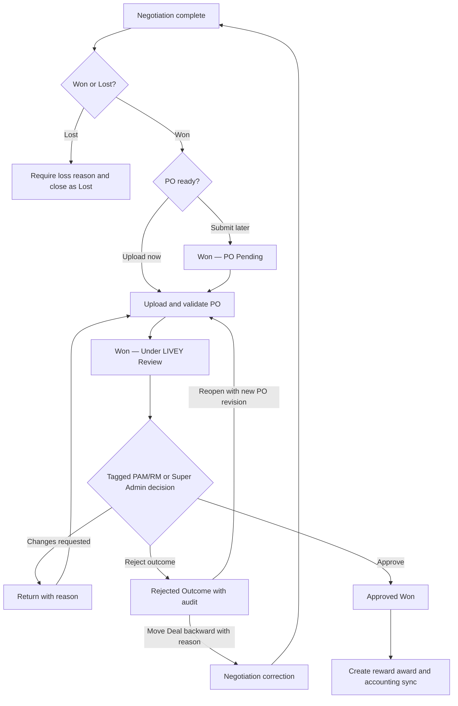

#### Lost

Ordinary Lost is available only from Negotiation, matching the canonical pipeline. Earlier opportunities remain in their current stage until progressed, or an authorised data-correction/migration command records why the canonical history could not be followed.

Lost requires:

- loss reason;
- optional competitor;
- notes/lesson learned;
- treatment of open tasks;
- confirmation of notifications.

Lost can be reopened only through a reasoned, authorised backward movement.

#### Won

Selecting Won requires:

- outcome date;
- PO Upload Now or Submit Later;
- confirmed final lines, quantities, DTP, and contributor split;
- final Customer and POC;
- fulfilled stage requirements.

“Submit Later” results in Won with PO Pending. It does not release rewards or accounting fulfillment.

#### LIVEY won review

Tagged PAM, tagged RM, or Super Admin can review.

Review checks:

- valid PO document;
- Customer/Partner match;
- line items and quantities;
- final DTP;
- currency;
- approval trail;
- duplicate reward/outcome;
- reward-eligible contributors and split;
- Zoho Books readiness;
- shipment requirement.

Outcome review is also the canonical Purchase Order Review state machine:

| Current state      | Allowed next state | Trigger and authority                                                                              |
| ------------------ | ------------------ | -------------------------------------------------------------------------------------------------- |
| Not Applicable     | PO Pending         | Negotiation → Won with Submit Later                                                                |
| Not Applicable     | Under LIVEY Review | Negotiation → Won with valid PO Upload Now                                                         |
| PO Pending         | Under LIVEY Review | Tagged participant uploads a valid PO revision                                                     |
| PO Pending         | Not Applicable     | Tagged participant moves Deal backward to Negotiation with reason                                  |
| Under LIVEY Review | Changes Requested  | Tagged PAM/RM or Super Admin requests specified correction                                         |
| Under LIVEY Review | Approved Won       | Tagged PAM/RM or Super Admin approves the PO and outcome                                           |
| Under LIVEY Review | Rejected Outcome   | Tagged PAM/RM or Super Admin rejects with reason and recovery choice                               |
| Changes Requested  | Under LIVEY Review | Tagged participant submits a corrected PO/evidence revision                                        |
| Changes Requested  | PO Pending         | Existing PO is withdrawn and a replacement is still required                                       |
| Rejected Outcome   | Under LIVEY Review | Tagged PAM/RM or Super Admin reopens review with reason and a new valid PO revision                |
| Rejected Outcome   | Not Applicable     | Active tagged participant moves the Deal back to Negotiation with reason for commercial correction |

`Approved Won` is terminal for ordinary users. A Super Admin correction requires strong re-authentication, reason, financial/provider impact preview, compensating reward/accounting events, and a new review revision; it never deletes the original approval.

“PO approved” is not a second independent status. It is the successful review event that moves `outcome_review_status` to `approved_won`.

Approved Won is immutable as an event. Corrections use reversal/adjustment workflows.

### 9.16 Deal documents

Deal Documents supports:

- PO;
- proposal;
- quotation;
- test report;
- commercial approval;
- customer confirmation;
- shipment document;
- other governed type.

Each document stores version, type, record link, uploader, visibility, scan result, size, MIME type, hash, created timestamp, expiry if applicable, and approval status.

Only authorised users can preview or download. Signed URLs expire. Replacement preserves all versions. PO upload is available only for a Deal in Won or an explicitly authorised review state.

### 9.17 Deal Activity and audit

The Deal Activity timeline includes:

- creation and registration decisions;
- every forward/backward movement;
- probability changes;
- notes;
- participant additions/removals;
- task changes;
- product/quantity/price changes;
- discount requests/decisions;
- document upload/version/approval;
- Won/Lost decision;
- PO review;
- reward calculation/issuance/reversal;
- Zoho Books sync;
- shipment updates;
- notification generation and critical delivery failure.

Operational Activity presents safe human-readable content. Security audit retains structured before/after data and is restricted by role.

### 9.18 Imports and exports

Deal import accepts CSV and XLSX using a downloadable template.

Import processing:

- stages the file;
- validates headers and types;
- resolves governed values and canonical IDs;
- reports duplicates and missing mappings;
- previews registration outcomes;
- prohibits unauthorised scope;
- imports only confirmed valid rows or uses explicit all-or-nothing mode;
- returns row-level results;
- creates audit and notifications.

Normal imports cannot bypass registration, stage, pricing, tagging, or approval rules.

Exports:

- use the active saved view and visible filters;
- contain only authorised rows and fields;
- support CSV and XLSX for operational data;
- include USD and labelled local reference where selected;
- exclude secrets and sensitive internal fields;
- are audited;
- run asynchronously for large datasets.

### 9.19 Deal acceptance criteria

- Product precedes Quantity in every creation path.
- One Deal supports several line items and Combos.
- Deal price calculations use decimal arithmetic and snapshot every policy input.
- USD 5,000.00 auto-approves and USD 5,000.01 requires review.
- Local reference currency cannot alter approval, analytics, accounting, or rewards.
- `Approved` never appears as a pipeline stage.
- ISR remains tagged after Testing; PAM/KAM are added on post-Testing handoff.
- RM is tagged on every in-scope regional Deal.
- Distributor sees only explicitly tagged Deals.
- Any tagged participant can move backward only with a reason.
- Every movement is available through the Deal timeline.
- Proposal discount cannot become effective without policy-compliant approval.
- Won with PO Pending produces no reward.
- Only Approved Won creates the reward and accounting sync.
- Notifications target current tagged participants/watchers, not the entire Partner organisation. Required approval work also appears in its scoped queue; an approver receives a record notification only when tagged or explicitly watching.
- Pipeline cards expose Partner, POC, Product, and value without hover.

---

## 10. Tasks and Work Management

### 10.1 Task model

Task is a first-class module, not a text note embedded in a Deal.

A Task may relate to:

- Deal;
- Customer;
- Partner;
- Contact;
- Ticket;
- Course or learning assignment;
- Shipment;
- Lead; or
- no parent record for standalone work.

Every Task contains:

- human-readable Task ID;
- title and structured type;
- description;
- status;
- priority;
- assignee;
- creator;
- watchers;
- active context and scope;
- related records;
- due date/time and timezone;
- optional start date;
- recurrence rule;
- dependencies;
- checklist;
- blocking-stage indicator;
- completion evidence;
- created, updated, and completed timestamps;
- automation source/template; and
- Activity history.

### 10.2 Task states

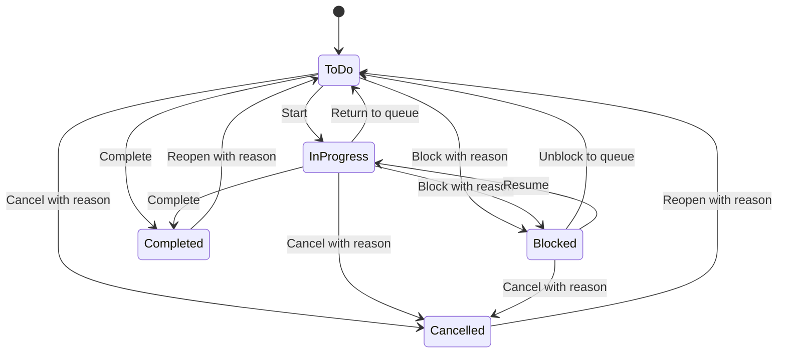

| Transition                            | Required information and effect                                                                                                          |
| ------------------------------------- | ---------------------------------------------------------------------------------------------------------------------------------------- |
| To Do → In Progress                   | Start actor/time; active reminders remain                                                                                                |
| To Do/In Progress → Blocked           | Mandatory blocker reason; optional blocking Task/external dependency; blocking-stage effect remains                                      |
| Blocked → To Do                       | Resolution note; returns to queue and recomputes reminders                                                                               |
| Blocked → In Progress                 | Resolution note; resumes work and reminders                                                                                              |
| In Progress → To Do                   | Reason when reassignment/queue return changes ownership                                                                                  |
| To Do/In Progress → Completed         | Completion actor/time; evidence when template requires it; future reminders stop                                                         |
| To Do/In Progress/Blocked → Cancelled | Mandatory cancellation reason and actor/time; future reminders stop; blocking-stage policy is recalculated                               |
| Completed/Cancelled → To Do           | Authorised Reopen with mandatory reason; new Activity event; completion/cancellation evidence remains; reminders and due-state recompute |

Direct `Completed ↔ Cancelled`, `Blocked → Completed`, and self-transitions are rejected. A user must resume/unblock before completion so the chronology remains explicit. A workflow may propose the next valid transition but cannot update Task status by direct field write.

Completed captures actor, timestamp, completion note/evidence, and resulting automation. Reopen never edits or deletes the prior Completed/Cancelled event.

### 10.3 Task workspace

My Tasks provides:

- Today;
- Upcoming;
- Overdue;
- Blocked;
- Assigned by Me;
- Completed;
- saved views;
- structured filters for type, status, priority, context, record type, assignee, due range, and automation source;
- list, grouped, calendar, and compact board presentations where accessible.

There is no free-text search field. The assistant may translate a request into filters.

### 10.4 Pipeline integration

Stage templates can:

- create required and optional Tasks;
- assign by participant role;
- calculate due date from stage entry;
- require evidence;
- block transition while incomplete;
- cancel, retain, or reopen Tasks on backward movement; and
- create escalation notifications.

Default examples:

| Stage/event         | Generated work                                                   |
| ------------------- | ---------------------------------------------------------------- |
| Sourced             | Validate Customer and POC; schedule first contact                |
| Demo                | Schedule demo; capture outcome and next step                     |
| Testing             | Create test plan; assign technical Task assignee; capture result |
| Testing → Qualified | Review handoff; acknowledge PAM/KAM assignment                   |
| Qualified           | Confirm budget, timing, decision process                         |
| Proposal            | Prepare proposal; request/approve discount; attach proposal      |
| Negotiation         | Set negotiation next step and decision date                      |
| Won — PO Pending    | Obtain and upload PO                                             |
| Won — Under Review  | Validate PO and final commercial snapshot                        |
| Lost                | Capture lesson learned; close/cancel open work                   |

Templates are versioned. Existing Tasks retain the template version from which they were created.

### 10.5 Assignment and permissions

- Task assignee must have access to every required related record.
- Assignment outside a user’s scope is rejected.
- When a record participant changes, Task reassignment rules are previewed.
- Partner users cannot assign work to unrestricted LIVEY users unless a workflow exposes that role.
- A Task may be visible to authorised record participants without exposing private internal notes.
- Internal and partner-visible descriptions are separate where necessary.

### 10.6 Reminders and escalation

- In-app reminders may be immediate.
- Email and WhatsApp reminders appear in the user’s digest.
- Required SLA or approval escalations can produce non-dismissible in-app alerts.
- Overdue work escalates by configurable role path.
- Deduplication prevents repeated identical reminders.
- Offboarding places incomplete Tasks into reassignment.

### 10.7 Task acceptance criteria

- A Task can relate to several records without duplicating the Task.
- A generated Task records its template and automation source.
- Blocking Tasks prevent configured transitions and explain why.
- Backward movement applies the documented Task treatment.
- Assignees cannot be selected outside scope.
- Completed and Cancelled Tasks remain in history.
- Partner-visible users never see internal-only content.

---

## 11. News, Activity, Notifications, and Delivery

### 11.1 Separation of concerns

The product maintains four distinct concepts:

1. **News** — authored editorial content.
2. **Activity** — append-only business events.
3. **Notification** — recipient-specific in-app attention.
4. **Delivery** — email or WhatsApp digest transmission and status.

News and Activity never share a storage model merely because they appear beside each other on a dashboard.

### 11.2 News

A News post contains:

- title;
- summary;
- body;
- image or attachment;
- author;
- publisher role;
- publication status;
- publication and expiry timestamps;
- pinned/priority state;
- audience expression;
- digest behaviour;
- acknowledgement requirement where used;
- revisions; and
- analytics.

#### Audience dimensions

Publishers can combine:

- Global;
- Sales Region;
- Country;
- Province/State;
- Partner;
- Customer/Account when appropriate;
- team domain;
- role;
- individual user;
- Partner tier;
- product/certification cohort.

The publisher sees an audience estimate and sample before publication. Recipient expansion occurs server-side. A user must still satisfy active assignment and context policy when opening the post.

#### News publisher

The publisher provides:

- Draft, Scheduled, Published, Expired, and Archived states;
- previews for desktop/mobile/digest;
- target summary;
- approval workflow for high-priority global posts;
- version history;
- attachment controls;
- publication result and failed-recipient report.

#### News lifecycle contract

| Current state | Allowed next state | Actor, guard, and effect                                                                                                    |
| ------------- | ------------------ | --------------------------------------------------------------------------------------------------------------------------- |
| Draft         | Scheduled          | Authorised publisher selects a future time, valid audience, digest behavior, and any required global approval               |
| Draft         | Published          | Authorised publisher chooses Publish now and all audience/content/approval checks pass                                      |
| Draft         | Archived           | Author or authorised publisher abandons the draft with reason                                                               |
| Scheduled     | Draft              | Authorised publisher unschedules before publication; schedule is retained in Activity                                       |
| Scheduled     | Published          | Scheduler reaches the publication time or authorised publisher chooses Publish now; audience is revalidated                 |
| Scheduled     | Archived           | Authorised publisher cancels publication with reason                                                                        |
| Published     | Expired            | Scheduler reaches `expires_at`, or authorised publisher expires the post early with reason                                  |
| Expired       | Archived           | Scheduler or authorised publisher removes the expired post from ordinary history views while retaining publication evidence |

Archived is terminal. Editing a Published post creates a new content revision while it remains Published; it does not fabricate a state self-transition. Republishing Archived content requires a new linked Draft. Direct field updates, Published → Draft/Scheduled, Archived reopen, self-transitions, and every unlisted pair are rejected.

### 11.3 Activity

Activity is generated by accepted domain events such as:

- Partner submitted, approved, changes requested, suspended;
- assignment added, ended, or reassigned;
- Deal created, approved, moved, repriced, tagged, won, lost;
- Task created, blocked, completed, overdue;
- document uploaded, approved, rejected, superseded;
- Ticket created, replied, escalated, closed, reopen requested;
- lesson completed, assessment passed, certificate issued;
- points awarded, adjusted, reserved, redeemed;
- shipment created or status changed;
- integration sync succeeded, failed, or reconciled.

Activity contains:

- event ID and idempotency key;
- domain event type;
- actor or system source;
- subject record and related records;
- active context;
- safe display summary;
- structured before/after or metadata;
- visibility classification;
- occurred and recorded timestamps.

Users cannot edit or delete Activity. Corrections create a corrective event.

### 11.4 Dashboard feed

Dashboard feed contains separate tabs:

- **News** — targeted editorial posts;
- **Activity** — authorised business events.

Each tab:

- scrolls independently;
- has structured event/category/date filters;
- preserves position;
- supports deep links;
- shows unread state;
- never leaks a count or preview from an unauthorised record.

### 11.5 Notification recipient rules

For transactional events:

1. Determine subject record and event type.
2. Reconcile the event's typed participants, including requester/creator, assignee, required role tags, named approval/escalation owner, and explicit watchers.
3. Expand active participant Users.
4. Remove actor where self-notification is unnecessary.
5. Revalidate each recipient’s current access.
6. Apply mandatory and user-configurable preference policy.
7. Create one recipient-specific in-app notification.
8. Queue digest-eligible external delivery.

Notifications do not target all members of a Partner merely because `partner_id` matches.

#### Required tagged notifications

Examples:

- Deal registration decision;
- pipeline stage movement;
- backward movement;
- participant/tag change;
- discount request/decision;
- Won/Lost decision;
- PO needed, uploaded, changes requested, or approved;
- Task assignment, blocking, overdue, completion where watched;
- Ticket reply, assignment, SLA escalation, closure, reopen decision;
- reward award, adjustment, redemption decision;
- critical integration action affecting the record.

### 11.6 In-app notification centre

The notification centre supports:

- unread count;
- category and status filters;
- Mark Read and Mark All Visible Read;
- deep links;
- context labels;
- mandatory/critical indicator;
- notification preferences link;
- export of authorised notification metadata for Super Admin and operational audit only.

Mark All applies to the visible authorised scope, not unseen contexts.

### 11.7 Email and WhatsApp digest

External channels use digest-only delivery.

Users may configure:

- email enabled/disabled where optional;
- WhatsApp enabled/disabled where optional and consented;
- daily or weekly schedule;
- timezone;
- permitted categories;
- quiet days;
- language.

Mandatory legal/security messages may use an approved immediate channel outside the routine digest policy.

Digest content:

- contains only records still authorised at send time;
- groups by context and category;
- uses concise summaries and deep links;
- avoids sensitive commercial detail when the channel is not approved for it;
- records provider message IDs and delivery status;
- includes unsubscribe/preferences where legally required.

### 11.8 Delivery status and recovery

Delivery states:

- Pending;
- Sent;
- Delivered;
- Read where provider supplies it;
- Failed Retryable;
- Failed Permanent;
- Suppressed by Preference;
- Suppressed by Access;
- Cancelled.

Retries use backoff and idempotency. Permanent failures create an operational exception, not repeated spam. Provider callbacks are signature-validated and deduplicated.

| Current state    | Allowed next state       | Trigger and effect                                                                                         |
| ---------------- | ------------------------ | ---------------------------------------------------------------------------------------------------------- |
| Pending          | Sent                     | Provider accepts the idempotent delivery command and returns a message/reference ID                        |
| Pending          | Failed Retryable         | Timeout, throttle, or transient provider error records attempt/backoff                                     |
| Pending          | Failed Permanent         | Definitive validation, invalid destination, or prohibited template error                                   |
| Pending          | Suppressed by Preference | Current consent/preference disallows the optional digest item                                              |
| Pending          | Suppressed by Access     | Send-time authorisation no longer permits the content                                                      |
| Pending          | Cancelled                | Source digest is cancelled before provider acceptance                                                      |
| Failed Retryable | Pending                  | Scheduler or authorised operator retries within attempt/backoff policy using the same logical delivery key |
| Sent             | Delivered                | Verified provider receipt reports delivery                                                                 |
| Sent             | Read                     | Verified provider receipt reports read where the provider may omit Delivered                               |
| Sent             | Failed Permanent         | Verified bounce/complaint/definitive failure arrives after provider acceptance                             |
| Delivered        | Read                     | Verified provider receipt reports read                                                                     |

Read, Failed Permanent, Suppressed by Preference, Suppressed by Access, and Cancelled are terminal. Sent or Delivered may remain the final observable state when the channel provides no later receipt. Duplicate callbacks update receipt evidence idempotently without creating a self-transition. Retries never return a terminal state to Pending. Every unlisted pair and direct state-field update is rejected.

### 11.9 Feed acceptance criteria

- News and Activity have separate models and tabs.
- News target preview matches actual authorised recipients.
- Transactional notifications reach current tagged people/watchers only.
- Removing a tag changes future recipients without rewriting history.
- A user never receives a digest item they cannot open at send time.
- Email and WhatsApp routine communication is digest-only.
- Duplicate provider callbacks do not duplicate notifications or Activity.

---

## 12. Assistant, Website and WhatsApp Workflows, and Auto CRM

### 12.1 Assistant purpose

The Assistant replaces free-text search and provides context-aware discovery, explanation, navigation, summarisation, and guided creation.

It is available from every authorised portal screen as:

- a header launcher;
- a desktop side panel;
- a mobile full-height sheet;
- contextual suggestions based on the current page; and
- optional speech input/read-aloud.

Text interaction is the release requirement. Voice is an accessibility enhancement and must be independently disabled.

### 12.2 Portal capabilities

The Assistant may:

- explain the current screen, field, role, status, or next step;
- answer product, pricing-policy, training, process, and support questions;
- retrieve authorised Deals, Customers, Partners, Tasks, Tickets, courses, rewards, shipments, News, and Activity;
- compare authorised metrics across permitted contexts;
- convert requests into visible structured filters;
- summarise a record or timeline;
- draft a Deal, Lead, Customer, Contact, Task, Ticket, note, or News post where role permits;
- suggest missing data or next actions;
- navigate to a record or filtered view;
- explain why access or an action is unavailable without revealing hidden data.

### 12.3 Consequential action safety

The Assistant never silently performs a consequential write.

Action pattern:

1. Understand intent.
2. Retrieve only authorised context.
3. Ask for missing required information.
4. Generate a structured draft.
5. Display the same validations, monetary effects, recipients, approvals, and resulting status as the standard form.
6. Require explicit confirmation.
7. Execute through the same authorised domain service used by the UI.
8. Return durable record link and Activity result.

High-risk approvals, role changes, exports, deletions/deactivations, integration configuration, and reward adjustments may require re-authentication and cannot be bypassed by conversation.

### 12.4 Assistant data boundaries

- Retrieval is server-side and assignment-aware.
- Active context is included in every request and revalidated.
- The model receives the minimum fields needed.
- Secrets, credentials, password data, raw tokens, restricted documents, and unapproved internal notes never enter prompts.
- Prompt injection in documents or user content cannot grant tools or scope.
- Answers cite record title/ID and last-updated time where useful.
- If evidence is insufficient, the Assistant states the limitation.
- Conversation retention, deletion, and training-use policy are visible and configurable under governance.
- Assistant logs separate user text, retrieved sources, proposed action, confirmation, execution result, and policy decision.

### 12.5 Website business assistant

The public website experience supports:

- LIVEY and product FAQs from approved public content;
- product discovery;
- Partner programme information;
- lead qualification;
- contact capture and consent;
- meeting/callback request;
- ticket guidance for identified customers;
- transition to human agent.

It cannot retrieve portal records or create a live Deal for an unauthenticated visitor.

### 12.6 WhatsApp business workflow

WhatsApp supports business-specific flows only:

- approved product FAQs;
- lead capture and qualification;
- Deal draft capture for identified Partner users;
- Ticket status/update flows after verification;
- digest delivery;
- human handoff.

The channel uses the official WhatsApp Business Platform, approved templates where required, inbound webhooks, consent, session rules, and provider policy. It does not offer an unrestricted general-purpose AI assistant.

Identity matching may use:

- verified phone-to-Contact/User mapping;
- one-time verification;
- secure portal deep link;
- human confirmation.

Sensitive commercial values and documents remain in the portal unless the channel policy explicitly permits them.

### 12.7 Auto CRM lead lifecycle

Lead states:

- New;
- Needs Verification;
- Duplicate Review;
- Qualified;
- Nurturing;
- Assigned;
- Claimed;
- Converted;
- Disqualified;
- Closed.

Allowed transitions:

| From               | To                                   | Guard, actor, and side effects                                                                   |
| ------------------ | ------------------------------------ | ------------------------------------------------------------------------------------------------ |
| New                | Needs Verification                   | System/human cannot verify required identity or consent; create verification Task/SLA            |
| New                | Duplicate Review                     | Deterministic/fuzzy evidence finds a possible existing Lead/Contact/Customer/Deal; assign review |
| New                | Qualified                            | Required identity, consent, geography, product/use case, and threshold evidence pass             |
| New                | Nurturing                            | Valid but not yet qualification-ready; create next-touch policy                                  |
| New                | Disqualified                         | Human or explainable policy records disqualification reason                                      |
| Needs Verification | New                                  | Required evidence is verified; rerun deduplication/qualification                                 |
| Needs Verification | Duplicate Review                     | Verification reveals a possible canonical match                                                  |
| Needs Verification | Nurturing / Disqualified             | Verification cannot complete under the recorded outcome                                          |
| Duplicate Review   | New                                  | Reviewer confirms distinct and requests normal evaluation                                        |
| Duplicate Review   | Qualified / Nurturing / Disqualified | Reviewer links/merges/confirms distinct, then records the evaluated outcome                      |
| Qualified          | Assigned                             | Routing resolves an eligible Lead assignee and creates follow-up Task/SLA                        |
| Qualified          | Nurturing / Disqualified             | New evidence changes readiness; reason required                                                  |
| Nurturing          | Qualified                            | New evidence crosses qualification threshold                                                     |
| Nurturing          | Disqualified / Closed                | Human/policy records reason; Closed ends inactive nurture history                                |
| Assigned           | Claimed                              | Eligible assignee accepts within SLA                                                             |
| Assigned           | Qualified                            | Assignment expires, is rejected, or times out; reroute without losing history                    |
| Assigned           | Nurturing / Disqualified             | Assignee records new evidence and reason                                                         |
| Claimed            | Converted                            | Authorised user confirms structured Customer/Contact/Deal Draft conversion preview               |
| Claimed            | Assigned                             | Authorised reroute with reason and new Lead assignee                                             |
| Claimed            | Nurturing / Disqualified             | Lead assignee records outcome and next-touch/closure effects                                     |
| Disqualified       | New / Qualified                      | Authorised user reopens with new evidence and reason                                             |
| Disqualified       | Closed                               | Retention closure after policy window                                                            |
| Closed             | New                                  | Privileged reopen with new evidence, reason, and consent revalidation                            |

Converted is terminal: corrections use Customer/Contact/Deal merge or conversion-link correction, not Lead status reversal. All unlisted pairs, self-transitions, and direct state-field updates are rejected. Every transition records actor/system policy, evidence, prior/new Lead assignee, reason where the transition table requires it, timestamps, and idempotency key.

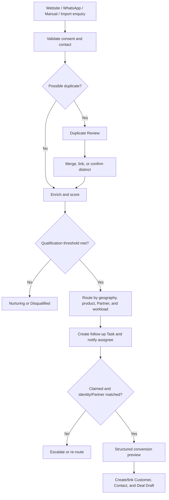

### 12.8 Lead capture fields

- source and campaign;
- name;
- company;
- work email;
- phone/WhatsApp number;
- country and Province/State;
- product interest;
- use case;
- estimated quantity/budget if volunteered;
- desired timing;
- Partner relationship if known;
- consent and privacy timestamp;
- conversation transcript reference;
- qualification answers;
- enrichment and scoring evidence.

### 12.9 Deduplication, enrichment, and scoring

Deduplication uses Contact, company, domain, phone, Partner, Customer, and open Deal signals.

Enrichment:

- uses approved data sources;
- records source and confidence;
- never overwrites verified data without review;
- respects regional privacy constraints.

Scoring is configurable and explainable. It may consider:

- verified business identity;
- product/use-case fit;
- geography;
- budget band;
- timing;
- existing Partner/Customer relationship;
- duplicate/open opportunity;
- engagement;
- strategic product or account policy.

The score recommends routing; it does not override access or approval rules.

### 12.10 Routing and conversion

Routing order:

1. governed geography;
2. known Partner;
3. assigned ISR;
4. product expertise;
5. account/KAM mapping;
6. workload and SLA;
7. fallback queue.

Unauthenticated content becomes a Lead or Deal Draft only. Conversion requires identity/Partner matching or human confirmation. Conversion links or creates the canonical Customer and Contact, creates a Deal in Draft/Sourced workflow, applies normal tagging and registration rules, and preserves the original conversation and consent trail.

### 12.11 Human handoff

- The user can request a person at any time.
- Policy triggers handoff for uncertainty, complaints, legal/privacy issues, unsupported language, pricing exceptions, or repeated failure.
- The human receives a concise summary, verified identity, consent, and relevant transcript.
- Handoff creates a Task or Ticket with an explicit assignee and SLA.
- The Assistant does not continue autonomous action after handoff unless the human returns control.

### 12.12 Assistant acceptance criteria

- The Assistant cannot retrieve records outside active scope.
- The Assistant’s answer count does not leak hidden records.
- Every write shows a structured preview and confirmation.
- Assistant-created Deals follow the standard form, tagging, threshold, and approvals.
- Website/WhatsApp users create Leads or drafts until verified.
- Conversational filters are visible as ordinary structured filters.
- Prompt injection cannot grant access or tool authority.
- Human handoff preserves context and creates owned work.

---

## 13. Support and Ticketing

### 13.1 Ticket identity

Every Ticket has:

- internal immutable UUID;
- human-readable number in format `LIV-SUP-YYYY-######`;
- requester;
- Partner;
- Customer;
- active context;
- subject;
- category;
- description;
- priority and severity;
- status;
- assigned Support user/team;
- products and serial numbers;
- attachments;
- SLA policy and timestamps;
- related Deals, Tasks, Shipments, or certificates;
- threaded communication;
- closure and reopen history.

Human-readable numbers are generated atomically, are unique, and are never reused.

### 13.2 Ticket creation

Ticket creation supports:

- category;
- subject;
- detailed description;
- Customer and Contact;
- one or more product rows;
- zero or more serial numbers per product;
- purchase/installation date where useful;
- severity/impact questions;
- multiple images and documents;
- related Deal or Shipment;
- preferred contact channel;
- review and submit.

Images support preview, accessible description, removal before submit, size/type validation, malware scan, and secure storage.

Ticket creation automatically creates an effective requester participant. Assignment creates/ends the Support-assignee participant; explicit watchers are participants; SLA escalation first creates a named escalation-owner participant. These typed tags are committed before notification recipient resolution and never broadcast to an entire queue.

### 13.3 Product and serial model

Each Ticket product row contains:

- Product/SKU;
- serial number(s);
- quantity affected;
- warranty/entitlement status where available;
- symptom;
- installation/site information;
- related shipment/order;
- evidence attachments.

A serial may be validated against shipment, order, product, and existing open Tickets. A warning does not silently prevent creation when Support policy allows an exception.

### 13.4 Ticket states

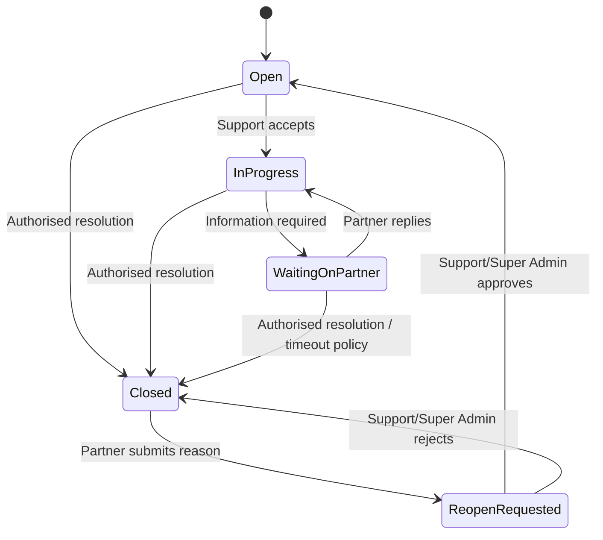

Canonical labels:

- Open;
- In Progress;
- Waiting on Partner;
- Reopen Requested;
- Closed.

“Reopened” is an Activity event; an approved reopen returns the Ticket to Open.

### 13.5 Authority

- LIVEY Support and Super Admin can close a Ticket.
- Other LIVEY roles may contribute or escalate only when tagged/permitted.
- Partner requester cannot directly reopen.
- Partner requester submits a reopen request with mandatory reason and new evidence where relevant.
- LIVEY Support or Super Admin approves or rejects the request with reason.
- Closed Tickets are read-only except for reopen request and authorised internal correction metadata.

### 13.6 Threaded communication

Messages support:

- author and role;
- timestamp;
- partner-visible or internal note classification;
- attachments;
- quoted/reference message;
- delivery/read state where relevant;
- edited indicator only for a short correction window, retaining original audit.

Internal notes are never exposed through Partner view, export, digest, assistant, or notification.

### 13.7 SLA and escalation

SLA policy may vary by:

- severity;
- Partner tier;
- product;
- country/timezone;
- support entitlement;
- business hours.

Tracked timestamps:

- created;
- first assigned;
- first response;
- waiting start/end;
- resolution;
- closure;
- reopen request;
- reopen decision.

The system shows time remaining, paused conditions, breach risk, breach status, and escalation owner. SLA changes are effective-dated and snapshotted on the Ticket.

### 13.8 Ticket workspace

Support workspace uses:

- clickable statistics;
- structured filters for status, severity, priority, SLA, Partner, Customer, country, product, assignee, and date;
- queue and saved views;
- two-pane list/detail on large screens;
- card/detail sheet on mobile;
- threaded reply composer;
- product/serial panel;
- Activity and SLA timeline;
- close and reopen-review dialogs.

There is no free-text search bar.

### 13.9 Ticket notifications

Notify the current requester plus assigned/tagged Support participants, explicit watchers, and named or automatically tagged escalation participants for:

- creation;
- assignment;
- public reply;
- Waiting on Partner;
- SLA risk/breach;
- closure;
- reopen request;
- reopen decision.

Routine external messages appear in digest; in-app assignment and SLA alerts remain timely.

### 13.10 Ticket acceptance criteria

- Ticket number is visible and unique.
- One Ticket supports several products, serials, images, and documents.
- Closed Tickets reject ordinary replies.
- Partner can request, but cannot directly perform, reopen.
- Reopen approval returns to Open and retains closure history.
- Internal notes never leak to Partner users.
- Only LIVEY Support and Super Admin close or decide reopen.
- SLA is measurable and auditable.

---

## 14. Insight Hub, Assessments, and Certification

### 14.1 Purpose

Insight Hub is the product and solution knowledge system for LIVEY and Partner teams. It combines video, text, downloadable resources, assessments, progress, and verifiable certification.

It is not a folder of tutorial videos. Content has governed structure, audience, version, prerequisites, completion criteria, and reporting.

### 14.2 Learning hierarchy

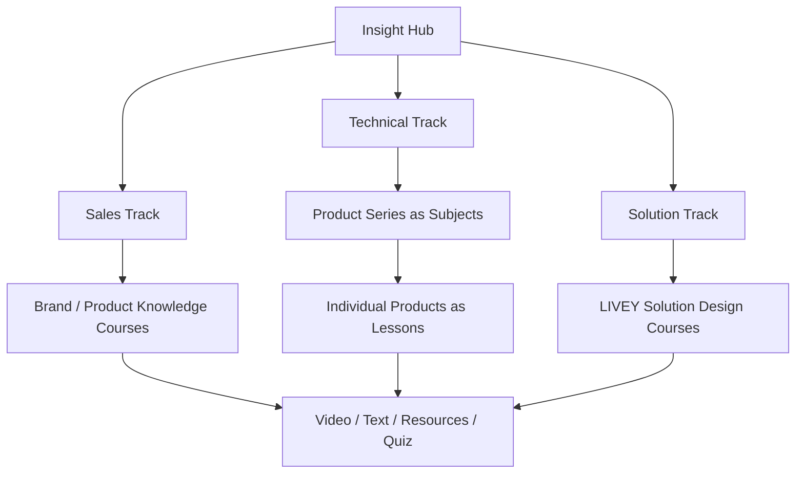

Structural rules:

- Track is the top-level audience/purpose grouping.
- Technical uses `Track → Subject → Lesson`, where Subject is the product series and Lesson is the individual Product.
- Sales and Solution use `Track → Course → optional Module → Lesson`.
- A Course may be associated with a Subject for cross-track discovery, but that association does not duplicate the Lesson.
- Assessment and Certificate Rule attach to the certifying Course or Subject.
- Resources attach to a Lesson; a Lesson may contain video, text, files, quiz, or practical evidence without adding another hidden hierarchy level.

#### Sales track

Sales learning includes:

- LIVEY and brand positioning;
- Audixa, Realsight, Aurix, Savvi, and governed future brands;
- product value propositions;
- qualification and discovery;
- competitive positioning;
- proposal and commercial guidance;
- Partner programme and reward processes.

#### Technical track

- Each product series is a Subject.
- Each product is a Lesson within its Subject.
- Lessons cover installation, configuration, architecture, troubleshooting, testing, interoperability, and technical resources.
- A Subject may contain a final technical assessment and practical evidence requirement.

#### Solution track

Solution learning includes:

- LIVEY Solution Design;
- use-case architecture;
- multi-product design;
- sizing and validation;
- proposal documentation;
- implementation and support handoff.

### 14.3 Content model

Learning entities:

- Track;
- Subject;
- Course;
- Module;
- Lesson;
- Resource;
- Assessment;
- Question bank;
- Attempt;
- Learning assignment;
- Progress;
- Certificate;
- content version.

`Subject`, `Course`, and `Module` follow the structural rules in Section 14.2; they are not three mandatory nested levels for every track.

Each Lesson contains:

- title and objective;
- content type;
- video and transcript where applicable;
- text content;
- downloadable resources;
- estimated duration;
- prerequisites;
- required/optional state;
- completion rule;
- product/series mapping;
- audience and scope;
- version and effective dates.

### 14.4 Audience and assignment

Content may target:

- Global;
- Sales Region;
- Country;
- Partner;
- role;
- product authorisation;
- learning cohort;
- named user.

Super Admin governs content. Authorised LIVEY learning managers may create and assign in scope. Partner Admin may assign approved Partner-facing courses to users within Partner scope when granted.

Assignments include due date, required/optional state, assigned version, prerequisite policy, and reminder policy.

### 14.5 Progress

Progress states:

- Not Started;
- In Progress;
- Content Complete;
- Assessment Required;
- Passed;
- Failed — Retry Available;
- Failed — Attempts Exhausted;
- Certified;
- Expired;
- Superseded.

Video completion cannot rely only on opening a page. The policy may require a minimum watched percentage and acknowledgement; text requires completion action after required content is rendered.

Progress is stored per content version. A major revision may require reassignment or recertification without erasing earlier history.

| Current state            | Allowed next state          | Trigger, guard, and effect                                                            |
| ------------------------ | --------------------------- | ------------------------------------------------------------------------------------- |
| Not Started              | In Progress                 | Learner begins a required content action on the assigned version                      |
| Not Started              | Superseded                  | Assignment migrates to a replacement version before work begins                       |
| In Progress              | Content Complete            | Every required content completion rule passes                                         |
| In Progress              | Superseded                  | Authorised version migration records prior partial progress                           |
| Content Complete         | Assessment Required         | The certifying Course/Subject has a required final assessment                         |
| Content Complete         | Superseded                  | Authorised version migration retains completion evidence                              |
| Assessment Required      | Passed                      | Submitted final assessment score is at least 80% and attempt is valid                 |
| Assessment Required      | Failed — Retry Available    | Score is below 80% and another governed attempt is available                          |
| Assessment Required      | Failed — Attempts Exhausted | Score is below 80% and the snapshotted attempt policy permits no further attempt      |
| Assessment Required      | Superseded                  | Authorised version migration ends the old assessment path                             |
| Failed — Retry Available | Assessment Required         | Attempt/cooldown policy permits the next attempt                                      |
| Failed — Retry Available | Superseded                  | Authorised version migration ends the old retry path                                  |
| Passed                   | Certified                   | System verifies all required Lessons/prerequisites and issues exactly one Certificate |
| Passed                   | Superseded                  | Version changes before certificate issuance; prior pass evidence remains              |
| Certified                | Expired                     | Certificate reaches its snapshotted expiry time or an authorised expiry event occurs  |
| Certified                | Superseded                  | New version requires recertification; issued Certificate history remains              |

Failed — Attempts Exhausted, Expired, and Superseded are terminal for that Enrollment/version. Remediation or recertification creates a new Enrollment/Progress record linked to the prior one. Standalone non-certifying learning may remain Content Complete as its terminal completion result; it never becomes Certified. Direct state updates, terminal reopen, certification without the required Lesson/80% guards, self-transitions, and every unlisted pair are rejected.

### 14.6 Assessment

Certification requires:

1. all required Lessons complete;
2. all prerequisites satisfied;
3. final assessment submitted;
4. score of at least 80%.

Assessment rules:

- question pools and randomisation may be configured;
- pass boundary is inclusive: 80% passes, 79% fails;
- default policy permits three attempts per certifying assessment version: attempt 2 is available immediately and attempt 3 after a 24-hour cooldown;
- a versioned Course/Subject policy may set 1–10 attempts and a 0–168-hour cooldown; the Enrollment snapshots that policy so later changes do not rewrite an attempt path;
- feedback can be immediate, delayed, or limited by question policy;
- every attempt stores content version, selected questions, score, pass/fail, and timestamp;
- accessibility alternatives exist for timed or media-based questions.

### 14.7 Certificate

A Certificate contains:

- human-readable certificate number;
- learner identity;
- Partner/LIVEY affiliation snapshot;
- course/subject and version;
- issue date;
- expiry date when applicable;
- score where policy permits;
- issuer;
- QR code or verification URL;
- verification hash/status;
- PDF/downloadable presentation.

Public verification reveals only the minimum permitted certificate facts and never opens the learner’s portal profile.

Certificate status values are Active, Expired, Revoked, and Superseded. A Certificate is created directly in Active only after the Section 14.6 issuance guards pass.

| Current status | Allowed next status | Trigger, guard, and effect                                                                                                                                                        |
| -------------- | ------------------- | --------------------------------------------------------------------------------------------------------------------------------------------------------------------------------- |
| Active         | Expired             | System reaches the snapshotted expiry timestamp or processes a governed expiry event; public verification immediately reports Expired                                             |
| Active         | Revoked             | Super Admin or an authorised LIVEY learning manager in scope records a mandatory reason and evidence; the learner is notified and public verification immediately reports Revoked |
| Active         | Superseded          | A valid replacement Certificate is issued under a governed correction or recertification path; the old and replacement Certificate IDs are linked                                 |

Expired, Revoked, and Superseded are terminal for that Certificate. Reinstatement, correction, or recertification issues a new linked Active Certificate after the current issuance guards pass; it never mutates the prior credential back to Active. Learning Progress `Certified` records that the learner completed the governed learning path, while Certificate status is the authority for whether that issued credential is currently valid. Every status change records actor/system trigger, reason, evidence, previous/new status, and timestamp. Direct status writes, terminal reopen, self-transitions, and every unlisted pair are rejected.

Revocation or supersession never deletes the issuance record.

### 14.8 Learner experience

Insight Hub home shows:

- Continue Learning;
- Required and overdue assignments;
- Tracks;
- product/series Subjects;
- certification progress;
- earned certificates;
- recommended content;
- News for learning updates.

There is no free-text search bar. Filters include Track, Subject, Product, Role, Required, Progress, Certificate status, and duration. The Assistant can answer from authorised learning content and open the relevant Lesson.

### 14.9 Administration and analytics

Administration supports:

- create, preview, version, publish, retire;
- content audience and prerequisite configuration;
- video/text/resource upload;
- transcript and caption validation;
- question-bank and assessment authoring;
- assignment and bulk assignment;
- certificate template and verification;
- content import/export metadata;
- completion, score, attempt, overdue, and certification analytics;
- Partner/Region/Role/Product drill-down;
- immutable publication and certificate audit.

### 14.10 Insight Hub acceptance criteria

- Technical series are Subjects and products are Lessons.
- Sales, Technical, and Solution tracks exist.
- Required video has captions/transcript.
- All required Lessons plus 80% assessment are required for certification.
- 79% fails and 80% passes.
- Retry history is retained.
- Certificate verification does not expose private profile data.
- Content targeting and analytics obey active scope.

---

## 15. Rewards, Points, Catalogue, and Fulfillment

### 15.1 Reward principles

- Rewards are earned only from Approved Won Deals.
- LIVEY internal roles and Distributor never receive Partner reward points.
- Eligible tagged Partner Admin/User contributors receive the frozen allocation.
- The points ledger is immutable and auditable.
- Pending redemptions reserve points.
- Reward approval and inventory/balance effects are transactional.
- Super Admin experiences are operational, not personal storefront experiences.

### 15.2 Reward calculation

For an Approved Won Deal:

```text
Eligible reward basis
  = sum(quantity × final approved DTP unit) for reward-eligible lines

Reward value in USD
  = round_half_up(eligible reward basis × 5%, 2 decimals)

Points pool
  = round_half_up(reward value in USD × effective points-per-reward-dollar rate, 0 decimals)
```

The rate is selected at Won approval time from a non-overlapping effective-dated global points policy. No reward is issued when an active rate cannot be resolved; the Deal enters a reward exception queue.

Each award snapshots:

- Deal and final pricing revision;
- eligible lines and DTP totals;
- 5% reward percentage;
- reward USD value;
- points rate and policy version;
- total points;
- contributor IDs, names, eligibility, and split;
- rounding result;
- approver and timestamp.

### 15.3 Contributor allocation

- One or more tagged Partner contributors may be reward-eligible; this blueprint does not impose a fixed contributor-count cap.
- Contributors belong to the Deal’s Partner.
- Splits use two decimal places and total exactly 100.00%.
- Default is 100% to the creating/claiming eligible Partner user.
- If Auto CRM or a LIVEY user created the Deal and no eligible Partner contributor exists, Won approval is blocked until an eligible contributor is assigned.
- LIVEY and Distributor participants are excluded from the selector.

Integer points use largest-remainder allocation:

1. Calculate each raw share.
2. Allocate the floor of each share.
3. Distribute remaining points by descending fractional remainder.
4. Break ties by configured contributor order and stable ID.

Allocated points always equal the points pool.

### 15.4 Points ledger

Ledger event types:

- Deal Award;
- Deal Award Reversal;
- Manual Credit;
- Manual Debit;
- Redemption Reservation;
- Reservation Release;
- Redemption Fulfillment Debit;
- Refund/Credit;
- Expiry, if programme policy enables it;
- Migration Adjustment.

Each event contains idempotency key, user, Partner, Deal/Redemption reference, points, effective balance impact, actor/system source, reason, created timestamp, and reversal relationship.

Balances are derived from posted ledger events and reservations. They are not edited directly.

### 15.5 Partner tier

Partner tier may be influenced by governed commercial performance and remains separate from reward points.

Tier policy defines:

- Registered, Silver, Gold, Platinum;
- qualification measures;
- evaluation period;
- effective date;
- review/exception process;
- associated catalogue PTP adjustment;
- benefits.

Tier changes create Activity and do not retroactively reprice Deals or recalculate rewards.

### 15.6 Partner Reward Store

Partner-facing Reward Store contains:

- available points;
- reserved points;
- catalogue;
- categories and brands;
- points price;
- stock/availability;
- eligibility;
- delivery type;
- Terms;
- My Redemptions;
- points history;
- tier/benefits where appropriate.

Catalogue uses structured Brand, Category, Delivery Type, Points Range, Eligibility, and Availability filters. There is no free-text search.

### 15.7 Redemption flow

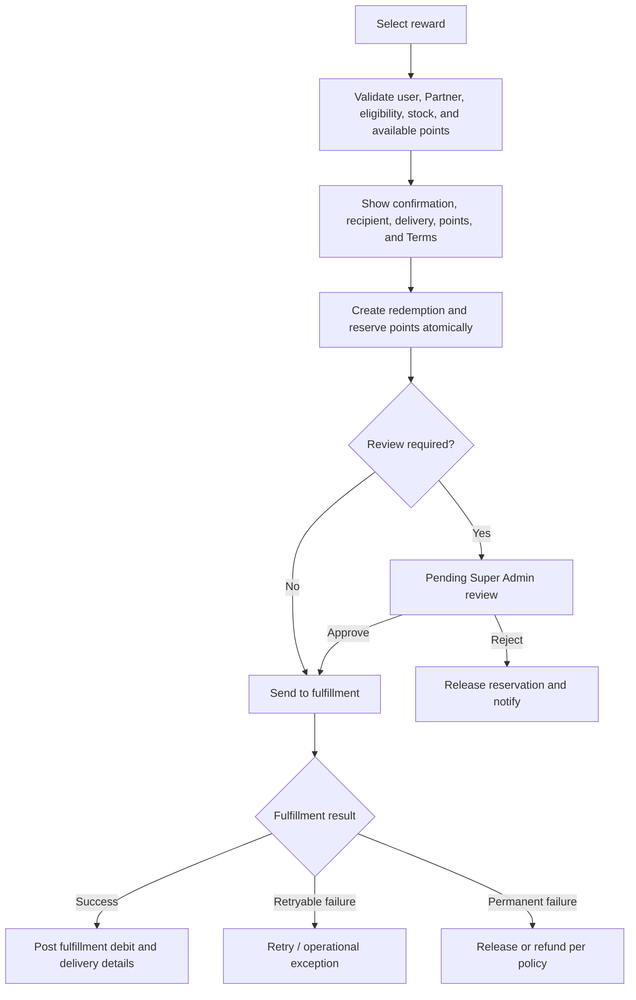

The system revalidates balance, eligibility, provider availability, and duplicate request at approval/fulfillment time.

| Current state   | Allowed next state | Guard and points/inventory effect                                                               |
| --------------- | ------------------ | ----------------------------------------------------------------------------------------------- |
| Requested       | Points Reserved    | Eligibility, balance, stock, velocity, and idempotency pass; reserve points/stock atomically    |
| Requested       | Cancelled          | Requester cancels or validation definitively fails before reservation; no balance effect        |
| Points Reserved | Pending Review     | Item/policy requires named Super Admin review; reservation remains                              |
| Points Reserved | Processing         | No review is required and fulfillment command is durably queued                                 |
| Points Reserved | Cancelled          | Entitled requester withdraws before processing; release reservation/stock                       |
| Pending Review  | Processing         | Super Admin approves after revalidating eligibility/balance/stock; queue fulfillment once       |
| Pending Review  | Cancelled          | Super Admin rejects or requester withdraws; release reservation/stock with reason               |
| Processing      | Fulfilled          | Provider/manual evidence is authoritative; post fulfillment debit and settle stock exactly once |
| Processing      | Failed             | Definitive/unknown failure records provider truth and blocks duplicate fulfillment              |
| Failed          | Processing         | Retry/reconciliation proves the fulfillment can safely resume with the same logical order key   |
| Failed          | Refunded           | Reconciliation proves non-fulfillment; release reservation or post compensating credit/stock    |
| Fulfilled       | Refunded           | Authorised refund/reversal is confirmed; append compensating ledger/inventory events            |

Cancelled and Refunded are terminal. Fulfilled can move only to Refunded; it cannot return to Processing. Provider timeout remains Processing or moves to Failed according to explicit adapter truth—it never creates a second order. Direct state edits, terminal reopen, negative balance/stock, self-transitions, and every unlisted pair are rejected.

### 15.8 GyFTR / QuickSilver

GyFTR/QuickSilver is the primary digital-voucher provider, subject to commercial onboarding.

The integration supports, where contracted:

- catalogue/brand synchronisation;
- denominations;
- availability;
- voucher order;
- recipient delivery through approved channel;
- provider transaction ID;
- fulfillment and redemption status;
- reconciliation;
- refund/failure handling.

Provider vouchers and codes are treated as sensitive secrets. Codes are shown only to the entitled recipient through protected delivery and are not written to general logs or exports.

### 15.9 Gadget catalogue and manual fallback

Super Admin can manage physical or manually fulfilled gadgets:

- product/brand;
- image;
- description;
- points price;
- inventory;
- country eligibility;
- shipping requirement;
- active dates;
- fulfillment Task assignee and accountable LIVEY role.

Manual fulfillment requires status, evidence, actor, and tracking where shipped.

### 15.10 Super Admin Rewards Manager

Super Admin sees:

- clickable catalogue, redemption, liability, fulfillment, and exception statistics;
- Manage Catalogue;
- CSV/XLSX import with preview;
- redemption queue;
- points-rate policy;
- manual adjustment with reason and approval policy;
- provider health/reconciliation;
- inventory;
- exports.

“Your Standing” and “My Redemptions” do not appear in Super Admin.

### 15.11 Reward acceptance criteria

- Points are not created when Deal is merely marked Won.
- `outcome_review_status = Approved Won` is required; that state is the canonical evidence that the PO/outcome review succeeded.
- Reward basis is final approved DTP, not proposed selling price, MSRP, tax, or freight.
- An effective rate and exactly 100% eligible split are required.
- Retry cannot duplicate points.
- Pending redemption reserves points.
- Rejection/failure releases or refunds points transactionally.
- Super Admin catalogue import reports row-level results.
- Statistics cards open their underlying filtered data.
- GyFTR secrets never appear in logs or general exports.

---

## 16. Analytics, Imports, Exports, Settings, and Administration

### 16.1 Analytics

Analytics uses canonical metric definitions and scoped aggregates.

Required report groups:

- Partner growth and approval funnel;
- pipeline and weighted pipeline;
- stage conversion and time in stage;
- win/loss and reasons;
- product/series mix;
- pricing waterfall and discount;
- regional/country performance;
- Partner/User contribution;
- task productivity and overdue work;
- News reach and acknowledgement;
- support SLA and product/serial trends;
- learning completion/certification;
- points liability, awards, reversals, redemptions;
- Auto CRM source, qualification, routing, and conversion;
- integration and shipment performance.

Analytics supports date basis, Region, Country, Province/State, Partner, Customer, user, role, product, tier, stage, status, and other governed filters.

All statistics cards and chart segments that represent records are clickable and open the underlying scoped view.

### 16.2 Export formats

| Content              | Formats                               |
| -------------------- | ------------------------------------- |
| Operational lists    | CSV, XLSX                             |
| Analytics datasets   | XLSX                                  |
| Presentation reports | PDF where layout is governed          |
| Certificates         | PDF                                   |
| Documents            | Original file or governed PDF preview |
| Large/bulk data      | Asynchronous CSV/XLSX archive         |

Exports use active filters and saved view unless the user explicitly selects another permitted scope.

Exports:

- apply row- and field-level authorisation;
- exclude secrets and sensitive system fields;
- include generated timestamp, actor, scope, filters, and data freshness;
- are audited;
- expire when delivered by link;
- provide progress and durable result for large jobs.

### 16.3 Imports

Imports support CSV/XLSX where specified for:

- Partners;
- Users/assignments;
- Partner team;
- Customers/Contacts;
- Deals and line items;
- Product/Combo catalogue and price books;
- Reward catalogue;
- learning enrolments/content metadata where governed.

Every import provides:

1. template download;
2. schema/header validation;
3. row parsing;
4. governed-value and permission validation;
5. duplicate resolution;
6. dry-run preview;
7. confirm;
8. row-level result;
9. audit and rollback/compensation strategy.

Imports use canonical IDs/external keys and cannot bypass domain services.

### 16.4 Settings information architecture

#### All users

- Personal Profile;
- Security and password;
- active sessions;
- accessibility;
- locale/timezone/local reference currency;
- in-app notification preferences;
- email/WhatsApp digest preferences and consent;
- authorised contexts and assignments, read-only where appropriate.

#### Partner Admin settings

- Company;
- Partner team defaults;
- allowed context preferences;
- approved communication settings.

#### Super Admin

- hierarchy and governed values;
- roles, policy, and assignments;
- approval thresholds;
- stages and task templates, within canonical constraints;
- product/price books;
- point rate and reward policy;
- support SLA;
- News governance;
- integrations;
- security/retention;
- export governance.

Partner-facing Settings do not include:

- Partner Documents export;
- Governance exports;
- Configuration exports;
- unrestricted system data;
- integration secrets.

Module exports remain on their relevant module pages.

### 16.5 Administration safeguards

- High-impact policy changes are effective-dated and versioned.
- Impact preview identifies affected users and workflows.
- Dual approval may be required for security, points, or price-policy changes.
- Administration lists use structured filters and Assistant discovery, not free-text search bars.
- Bulk actions produce durable reports.
- Configuration cannot delete a value referenced by history; it is retired.

### 16.6 Analytics and administration acceptance criteria

- Dashboard and analytics metrics reconcile to the same canonical definitions.
- Statistics cards are clickable.
- Export respects visible scope and sensitive-field policy.
- Partner users cannot export governance/configuration or Partner documents from Settings.
- Imports show row-level errors and cannot grant excessive scope.
- Retired reference values remain readable on historical records.

---

## 17. External Integrations

### 17.1 Integration principles

External providers extend the product; they do not become alternate authorisation systems or hidden sources of product truth. Every integration follows these rules:

1. **Server-side only.** Provider credentials, refresh tokens, signing secrets, and privileged APIs never run in the browser.
2. **Adapter boundary.** Product workflows call a LIVEY-owned provider interface. Provider-specific payloads do not leak into core deal, reward, ticket, or accounting entities.
3. **Explicit source of truth.** Each object and shared field has one authoritative system. Conflicts are surfaced; last-write-wins synchronisation is prohibited.
4. **Durable delivery.** Outbound work starts from a transactional outbox. Inbound events first enter a durable inbox before domain processing.
5. **Idempotency.** Every provider command, webhook, retry, replay, import, and scheduled reconciliation uses a stable idempotency key.
6. **Verified inbound events.** Webhook signatures, timestamps, provider account, content type, and replay windows are validated before processing.
7. **Asynchronous resilience.** Provider slowness does not hold a user-facing database transaction open. The UI shows a pending state and later success or failure.
8. **Reconciliation.** Webhooks provide timeliness; scheduled reconciliation provides completeness.
9. **Least privilege.** Provider scopes and service accounts contain only required permissions and are separated between sandbox and production.
10. **Human recovery.** Authorised operators can inspect, map, retry, replay, skip with reason, or resolve a conflict without editing business tables directly.
11. **Safe observability.** Logs contain correlation IDs, status, latency, and provider references, but never raw secrets, voucher codes, unnecessary message bodies, or unrestricted PII.
12. **Degraded operation.** A provider outage disables only the dependent capability. Core CRM records remain usable and queued work remains visible.

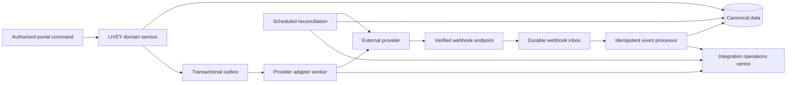

### 17.2 Shared integration records

Every provider connection uses the following canonical records.

| Record              | Required data                                                                                                                                                                                   |
| ------------------- | ----------------------------------------------------------------------------------------------------------------------------------------------------------------------------------------------- |
| Provider connection | Provider, environment, LIVEY legal entity, provider account/organisation ID, enabled capabilities, status, credential reference, token expiry, last successful verification, created/changed by |
| External link       | Provider, provider account, local entity type and ID, external entity type and ID, link status, provider version/hash, last successful sync, authoritative direction                            |
| Outbox command      | Correlation ID, command type, subject, idempotency key, safe payload reference, attempt count, next attempt, status, created/processed timestamps                                               |
| Webhook receipt     | Provider event/message ID, provider account, received timestamp, signature result, payload checksum, event time, processing status, attempt count, correlation ID                               |
| Sync job            | Job type, scope, cursor/window, start/end, counts, success/failure, checkpoint, initiated by                                                                                                    |
| Sync conflict       | Object, fields, portal value/version, provider value/version, ownership rule, assignee, resolution, reason, resolved by/at                                                                      |
| Delivery attempt    | Channel/provider, recipient reference, template/version, provider message ID, consent reference, status, error class, retry eligibility, timestamps                                             |
| Dead-letter item    | Original work reference, final error, redacted diagnostics, attempts, next permitted operator actions, resolution history                                                                       |

The uniqueness rule for an external link is:

`provider + provider_account_id + external_entity_type + external_entity_id`

The uniqueness rule for an outbound provider operation is:

`provider + operation_type + idempotency_key`

An operator replay reuses the original idempotency key unless the operator deliberately creates a new business revision. A replay button is not a “send again as new” button.

### 17.3 Integration Operations Centre

Super Admin sees one Integration Operations Centre with cards for Zoho Books, Zoho Sign, WhatsApp, email, GyFTR/QuickSilver, and DHL. A provider card shows:

- configured environment and LIVEY entity;
- connection state: Connected, Attention Needed, Paused, or Disconnected;
- last successful outbound call;
- last verified inbound event;
- queue depth and age of oldest queued item;
- retrying and dead-letter counts;
- conflicts requiring review;
- current provider rate-limit state;
- webhook endpoint health;
- last reconciliation and next scheduled reconciliation; and
- a link to provider-specific mappings, history, and runbooks.

| Current connection state | Allowed next state | Trigger and guard                                                                                              |
| ------------------------ | ------------------ | -------------------------------------------------------------------------------------------------------------- |
| Disconnected             | Connected          | Super Admin completes credential/capability verification and the provider test succeeds                        |
| Connected                | Attention Needed   | Health, credential, webhook, reconciliation, or sustained failure policy detects operator action is required   |
| Connected                | Paused             | Super Admin pauses outbound work after impact/queue preview; inbound receipt policy remains active             |
| Connected                | Disconnected       | Super Admin confirms disconnect with re-authentication, queue/conflict disposition, and secret revocation plan |
| Attention Needed         | Connected          | Reconnect/repair and verification tests succeed; unresolved conflicts remain separately visible                |
| Attention Needed         | Paused             | Super Admin contains outbound impact while diagnosis continues                                                 |
| Attention Needed         | Disconnected       | Super Admin confirms provider removal and work disposition                                                     |
| Paused                   | Connected          | Super Admin resumes and current credential/capability/queue checks pass                                        |
| Paused                   | Attention Needed   | Resume validation fails or new operator-required health issue is detected                                      |
| Paused                   | Disconnected       | Super Admin confirms disconnect and work disposition                                                           |

Disconnected is terminal for the current connection revision; reconnecting creates a new linked Provider Connection revision even though the card returns to Connected. Duplicate health signals do not create state self-transitions. Direct state writes, Connected resume, Paused re-pause, and every unlisted pair are rejected and audited.

Permitted operator actions are capability-scoped:

- test connection without exposing secrets;
- pause new outbound work while retaining inbound receipts;
- resume processing;
- rotate or reconnect credentials;
- reprocess an inbox receipt;
- retry a failed outbox command;
- run scoped reconciliation;
- link or unlink an external record with a reason;
- resolve a field conflict;
- download a redacted diagnostic report; and
- acknowledge an incident.

Bulk replay requires a dry-run count, a bounded scope, typed confirmation, an idempotency impact preview, and an audit event. The interface never offers an unrestricted “retry everything” action.

### 17.4 Zoho Sign: partner agreement execution

Zoho Sign is the agreement-signing provider for partner onboarding. It does not control portal authorisation.

#### 17.4.1 Agreement lifecycle

1. Super Admin selects an approved agreement template or uploads the final partner-specific agreement.
2. The system validates document type, malware scan, signer identity, partner revision, and authorisation.
3. A new immutable Agreement record and send command are created.
4. Zoho Sign returns a request ID; the portal shows Sent.
5. Verified provider events update Delivered, Viewed, Signed, Declined, Expired, or Cancelled.
6. Signed completion retrieves and stores the signed artifact and completion evidence.
7. The Partner application moves to Signed Pending Review.
8. Super Admin performs the separate final approval. Signing alone never activates operational modules.

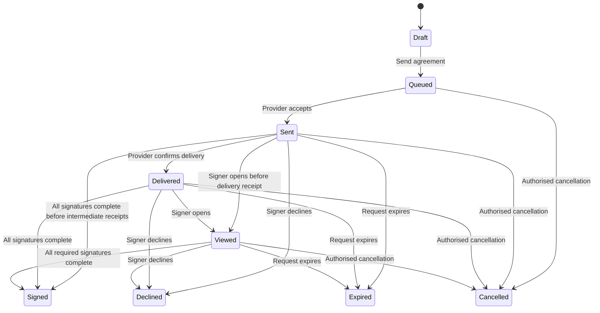

#### 17.4.2 Agreement controls

- One active signing request may exist for a partner application revision.
- Resend preserves the same request when the provider supports it; replacement creates a new version and cancels or expires the prior request.
- The signer email is taken from a verified Partner Admin identity.
- The portal stores source document checksum, signer, request ID, state history, signed document checksum, completion certificate, and timestamps.
- A delayed webhook can be recovered with a provider-status resync.
- A duplicate completion webhook cannot produce duplicate approval events.
- Signed documents are private and downloaded through short-lived, authorisation-checked links.
- Partner users cannot upload a manually signed substitute into the provider completion slot.
- Signed, Declined, Expired, and Cancelled are terminal for that Agreement request. A verified Signed event separately invokes the Partner Application command `Agreement Pending → Signed Pending Review` in Section 6.3; Super Admin approval, Changes Requested, rejection, and reapplication remain Partner Application transitions rather than Agreement states. Every unlisted Agreement pair, terminal reopen, and direct state-field update is rejected; resend or replacement creates a linked new Agreement revision under the controls above.

### 17.5 Zoho Books: controlled two-way accounting synchronisation

The accounting integration is based on the official Zoho Books APIs for [Contacts](https://www.zoho.com/books/api/v3/contacts/), [Sales Orders](https://www.zoho.com/books/api/v3/sales-order/), [Invoices](https://www.zoho.com/books/api/v3/invoices/), and [Webhooks](https://www.zoho.com/books/api/v3/webhooks/).

Zoho Books is the accounting system of record. LIVEY PAM CRM is the partner, relationship, pipeline, participant, and approval system of record. “Two-way” means controlled synchronisation of specifically owned fields and events; it does not mean every field can be edited in either system.

#### 17.5.1 Source-of-truth contract

| Object or field family                    | Portal → Zoho Books                                                       | Zoho Books → portal                                               | Authority                                                                    |
| ----------------------------------------- | ------------------------------------------------------------------------- | ----------------------------------------------------------------- | ---------------------------------------------------------------------------- |
| Partner/customer CRM identity             | Create or update an explicitly linked accounting contact after validation | Accounting ID and approved shared-field corrections               | Portal for CRM identity; conflicts for shared legal fields                   |
| Contact persons                           | Send authorised billing/procurement contact data with consent and purpose | Accounting contact-person ID and status                           | Portal for relationship data                                                 |
| Product item reference                    | Send mapped item ID on order creation                                     | Accounting item ID, tax configuration, active state               | Zoho Books for accounting attributes; LIVEY catalogue for sales presentation |
| Deal                                      | Never overwritten by accounting status                                    | Financial references are linked to the deal                       | Portal                                                                       |
| Sales order                               | Create from an Approved Won deal/PO using the frozen pricing revision     | Sales-order number, dates, status, totals, fulfillment status     | Zoho Books after creation                                                    |
| Invoice                                   | Creation only through an explicit authorised workflow if enabled          | Invoice number, subtotal, tax, credit, due date, balance, status  | Zoho Books                                                                   |
| Payment                                   | No portal mutation                                                        | Payment reference, amount, date, method summary, applied invoices | Zoho Books                                                                   |
| Credit note                               | No portal mutation                                                        | Credit-note number, amount, reason summary, status                | Zoho Books                                                                   |
| CRM assignee, tags, notes, consent, tasks | Not synchronised unless a named mapping exists                            | Never overwrite                                                   | Portal                                                                       |
| Tax, ledger, outstanding balance          | No portal mutation                                                        | Display and analytics copy                                        | Zoho Books                                                                   |

#### 17.5.2 Prerequisites for outbound financial creation

A financial document may be created only when:

- the user has explicit integration action permission;
- the active context contains the deal;
- the deal is Approved Won;
- `outcome_review_status` is Approved Won;
- the final pricing revision is immutable;
- the Customer has a resolved, non-conflicted Books contact link;
- every product line has an active item mapping;
- tax jurisdiction and required billing/shipping addresses are present;
- no existing external link or pending idempotent command already represents the same business revision; and
- a structured preview shows the exact customer, line items, quantities, USD values, taxes controlled by Books, dates, and references.

The user confirms the preview. The portal records a queued command and immediately returns a non-blocking pending status.

#### 17.5.3 Contact synchronisation

- A Customer is not sent merely because it exists; policy selects approved or financially relevant customers.
- Duplicate matching prefers an existing External Link, then verified tax identifier, then exact validated email/domain evidence. Fuzzy similarity creates a mapping-review item rather than an automatic merge.
- Address, legal name, tax identifier, and contact-person changes use field-ownership rules and version checks.
- A Books contact created outside the portal enters either a review candidate or an existing linked record update; it does not automatically become a Partner Customer visible to everyone.
- Deleted or inactive Books contacts never hard-delete portal records. They produce an archive/unlink decision.
- Contact sync records the Books organisation ID because IDs are not assumed to be globally unique across Books organisations.

#### 17.5.4 Sales-order and invoice mapping

Each outbound line uses:

- external item ID;
- SKU snapshot;
- quantity;
- unit amount from the approved final pricing revision;
- discount representation supported by the mapping;
- description safe for the accounting document;
- tax classification resolved in Books;
- deal ID and PO reference;
- partner/customer billing and shipping link; and
- local reference only if the accounting organisation and approved workflow require it.

The portal never silently recalculates the frozen DTP from current catalogue prices during sync. A Books validation failure creates an actionable error; it does not mutate the deal.

#### 17.5.5 Inbound financial timeline

Books webhooks and reconciliation update a read-only Financial panel on the deal:

- sales-order reference and state;
- invoice references and state;
- invoice/credit totals;
- due and paid amounts;
- payment dates and references;
- fulfillment event summary;
- last synchronised time;
- conflicts and warnings; and
- link to the authorised Books record when available.

Financial updates create deal Activity, but ordinary payment events do not immediately message tagged users over email or WhatsApp. They appear in-app and can enter the recipient's configured digest.

#### 17.5.6 Conflict and reconciliation rules

- Webhook receipt is acknowledged only after durable storage.
- Duplicate webhook IDs or equivalent payload checksums are processed once.
- Events that arrive out of order are retained and applied only when their version/state progression is valid.
- Scheduled incremental sync closes webhook gaps.
- A periodic full reconciliation compares active external links and financial totals.
- Conflicted shared fields remain at their current authoritative values until an operator resolves them.
- Conflict resolution shows both values, timestamps, source systems, downstream impact, and the selected authority.
- A mismatch affecting invoices, tax, credit notes, payments, or outstanding balance is never “fixed” by writing a portal value back to Books.
- Reconciliation produces counts for matched, updated, unchanged, conflicted, missing, failed, and ignored records.

### 17.6 WhatsApp Business Platform

The WhatsApp adapter follows Meta's official [WhatsApp Cloud API documentation](https://www.postman.com/meta/whatsapp-business-platform/documentation/wlk6lh4/whatsapp-cloud-api).

WhatsApp supports bounded LIVEY business workflows:

- product and programme FAQs from approved content;
- lead qualification;
- draft deal intake;
- support ticket creation and ticket replies;
- human handoff;
- opt-in/opt-out management; and
- scheduled digests.

It is not an unrestricted general-purpose assistant and does not expose arbitrary portal records.

#### 17.6.1 Inbound processing

Every inbound webhook:

1. verifies Meta signature, account, timestamp, and replay protection;
2. persists a receipt before returning success;
3. normalises the E.164 phone number and provider IDs;
4. resolves channel consent and suppression;
5. matches a business flow by number, campaign, locale, and intent;
6. deduplicates the message;
7. scans and quarantines media before use;
8. appends the message to the authorised Conversation;
9. invokes the limited workflow; and
10. records routing, outcome, and human handoff.

Ambiguous identity does not unlock portal data. The workflow asks only for the minimum fields needed to qualify the business request.

#### 17.6.2 Outbound policy

- Marketing or business-initiated messages use approved templates and documented opt-in.
- Portal business events do not send immediate WhatsApp alerts. Eligible items enter the configured daily or weekly digest.
- A reply inside an open support or lead conversation may be sent within the provider's permitted session rules; this is a conversation reply, not a notification broadcast.
- Each send stores template name/version, language, consent record, provider message ID, status receipts, and business subject.
- STOP, unsubscribe, and equivalent intent suppress future non-essential messaging immediately.
- Failed delivery produces a retryable record when the failure is transient; policy, consent, or invalid-recipient failures are not blindly retried.
- Message bodies and media remain subject to retention, consent, redaction, and RBAC.

#### 17.6.3 Human handoff

Handoff preserves:

- conversation and message IDs;
- language and channel;
- detected intent and qualification fields;
- consent evidence;
- matched or candidate customer/contact;
- created Lead, draft Deal, Ticket, and Task references;
- automation confidence;
- reason for handoff; and
- SLA start time.

The customer sees a clear statement that a human will continue. The automation stops sending open-ended responses after handoff until an authorised human returns control.

### 17.7 Email delivery

Email supports:

- authentication and security messages;
- invitation and onboarding actions;
- agreement signing;
- scheduled News, Activity, Deal, Task, Ticket, learning, reward, redemption, and shipment digests;
- approved support or business-conversation replies;
- scheduled integration-operations digests for authorised operators.

Authentication, password reset, verification, invitation, agreement signing, and account-security messages are essential transactional exceptions to the digest-only business-notification rule. Deal, pipeline, feed, Task, Ticket, learning, certificate, reward, redemption, and shipment alerts remain timely in-app and enter email digests. A human reply inside an active support/business Conversation is a conversation message rather than a notification broadcast.

Every email uses:

- an approved versioned template;
- a locale;
- an authorised subject and field allowlist;
- a stable message/delivery ID;
- a deep link that reauthorises at open time;
- unsubscribe or preference treatment appropriate to its purpose; and
- provider delivery, bounce, complaint, suppression, and failure tracking.

Inbound reply routing uses address tokens and RFC message identifiers to attach a reply to an existing authorised Conversation or Ticket. An unmatched inbound message enters a controlled Auto CRM queue; it never performs an unrestricted record search.

### 17.8 GyFTR / QuickSilver digital reward fulfillment

GyFTR is the preferred digital-voucher provider, subject to commercial onboarding and final API access. The provider's [corporate gifting offering](https://www.gyftr.com/corporategifting) establishes the intended catalogue/API and digital-delivery model. QuickSilver is the commercial/provider identity associated with this fulfillment route and is not a separate points balance.

#### 17.8.1 Catalogue synchronisation

- Super Admin maps LIVEY Reward Items to provider product and denomination IDs.
- Provider availability and terms are captured in versioned snapshots.
- Display-name matching is prohibited.
- Imported rows are validated for currency, denomination, validity, stock semantics, delivery method, terms, image, and provider ID.
- Provider changes do not rewrite an already requested Redemption snapshot.
- Unavailable provider items are hidden from new redemption but remain visible in history.

#### 17.8.2 Voucher order

1. Redemption validation reserves the exact points in one transaction.
2. An idempotent provider order is queued.
3. Provider acceptance stores an external order ID.
4. Confirmed fulfillment settles the reserved points.
5. A definitive failure releases the reservation through a compensating ledger entry.
6. An unknown/timeout state remains Processing and is reconciled before retry.
7. A refund or cancellation uses a provider-confirmed reversal and one compensating point entry.

Voucher codes and PINs are:

- encrypted separately from ordinary application data;
- masked until the entitled recipient deliberately reveals them;
- excluded from logs, exports, analytics, notifications, and assistant context;
- protected by rate limit and step-up authentication where risk requires it; and
- reveal-audited without recording the secret itself.

If provider fulfillment is unavailable, the redemption stays pending or an operator offers an explicitly approved alternative. The system never fabricates or manually types a voucher code into an ordinary Super Admin field.

### 17.9 DHL India logistics adapter

DHL shipment creation and tracking use an adapter based on the official [DHL Express — MyDHL API](https://developer.dhl.com/api-reference/dhl-express-mydhl-api). The first supported operational scope is India, and the adapter design permits a future carrier to implement the same LIVEY contract.

#### 17.9.1 Supported workflows

- physical Reward Store fulfillment;
- approved support pickup;
- return merchandise authorisation (RMA);
- replacement shipment;
- diagnostic equipment movement; and
- other authorised ticket-linked logistics.

#### 17.9.2 Shipment creation prerequisites

The source Redemption or Ticket must be authorised and in a state that permits shipment. The system validates:

- origin and Indian destination address;
- postcode and serviceability;
- recipient name, phone, email, and channel consent;
- package count, dimensions, weight, contents, and declared value;
- prohibited/restricted goods rules;
- invoice, GST/tax, or customs data required by the route;
- pickup location and time window;
- service type;
- billing account;
- source record and external-reference uniqueness; and
- whether an active Shipment already exists for the same fulfillment revision.

The preview shows the address snapshot, packages, declared goods, estimated service, and source record before confirmation.

#### 17.9.3 Shipment data and lifecycle

| Shipment state   | Meaning                                                                      |
| ---------------- | ---------------------------------------------------------------------------- |
| Draft            | Validating data; nothing has been sent to DHL                                |
| Queued           | Authorised command is awaiting provider processing                           |
| Created          | DHL accepted the shipment and returned a provider shipment ID/AWB            |
| Pickup Scheduled | Pickup is confirmed                                                          |
| Picked Up        | Custody event confirms collection                                            |
| In Transit       | Shipment is progressing through the network                                  |
| Out for Delivery | Final-mile delivery is active                                                |
| Delivered        | Provider reports delivery                                                    |
| Exception        | Provider reports a delay, address issue, damage, hold, or other intervention |
| Returned         | Shipment is being or has been returned                                       |
| Cancelled        | Shipment was cancelled before completion                                     |

The Shipment stores source type/ID, provider, provider account, AWB, service, package snapshot, origin/destination snapshot, charge summary, label/manifest artifact, pickup, estimated delivery, normalised state, and timestamps. Provider tracking events are immutable children containing code, description, location, provider timestamp, receipt timestamp, and checksum.

Duplicate events are ignored. Out-of-order events remain in history but do not regress the normalised state. Missed events are recovered by polling/reconciliation.

| Current state    | Allowed next state                                                                           | Trigger and guard                                                                                                      |
| ---------------- | -------------------------------------------------------------------------------------------- | ---------------------------------------------------------------------------------------------------------------------- |
| Draft            | Queued                                                                                       | Authorised source command passes address/package/service/policy validation                                             |
| Draft            | Cancelled                                                                                    | Authorised actor abandons the unsubmitted shipment with reason                                                         |
| Queued           | Created                                                                                      | Provider accepts and returns the unique shipment ID/AWB                                                                |
| Queued           | Exception                                                                                    | Definitive provider validation/processing failure requires intervention                                                |
| Queued           | Cancelled                                                                                    | Command is cancelled before provider acceptance and reconciliation confirms no shipment exists                         |
| Created          | Pickup Scheduled                                                                             | Provider confirms pickup request                                                                                       |
| Created          | Picked Up                                                                                    | Verified custody event arrives without a separate schedule event                                                       |
| Created          | Exception                                                                                    | Verified provider exception                                                                                            |
| Created          | Cancelled                                                                                    | Provider confirms cancellation before custody                                                                          |
| Pickup Scheduled | Picked Up                                                                                    | Verified custody event                                                                                                 |
| Pickup Scheduled | Exception                                                                                    | Verified provider exception                                                                                            |
| Pickup Scheduled | Cancelled                                                                                    | Provider confirms permitted cancellation                                                                               |
| Picked Up        | In Transit                                                                                   | Verified network movement event                                                                                        |
| Picked Up        | Exception                                                                                    | Verified provider exception                                                                                            |
| Picked Up        | Returned                                                                                     | Verified return-to-origin path begins                                                                                  |
| In Transit       | Out for Delivery                                                                             | Verified final-mile event                                                                                              |
| In Transit       | Delivered                                                                                    | Verified delivery event where provider omits Out for Delivery                                                          |
| In Transit       | Exception                                                                                    | Verified provider exception                                                                                            |
| In Transit       | Returned                                                                                     | Verified return-to-origin event                                                                                        |
| Out for Delivery | Delivered                                                                                    | Verified delivery event                                                                                                |
| Out for Delivery | Exception                                                                                    | Verified delivery exception                                                                                            |
| Out for Delivery | Returned                                                                                     | Verified return-to-origin event                                                                                        |
| Exception        | Pickup Scheduled, Picked Up, In Transit, Out for Delivery, Delivered, Returned, or Cancelled | Verified recovery/terminal provider event is consistent with the last non-Exception state and does not regress custody |

Delivered, Returned, and Cancelled are terminal for that Shipment. A later customer return after Delivered creates a new linked return Shipment. Every provider event remains immutable even when it cannot advance normalised state. Direct state writes, terminal reopen, backward normalised movement, fabricated provider events, and every unlisted pair are rejected.

#### 17.9.4 Labels, pickup, tracking, and delivery

- Labels and manifests are protected attachments with role-specific download permission.
- A pickup request is separately idempotent from shipment creation.
- Cancellation is permitted only when the provider and business workflow allow it.
- Tracking appears as a chronological timeline on the linked Ticket or Redemption.
- Exception events create an in-app alert and Task for the tagged fulfillment Task assignee.
- Shipment updates can enter email/WhatsApp digests for eligible recipients.
- Delivery confirmation closes the fulfillment step only when the source workflow's completion rules also pass.
- Proof-of-delivery artifacts follow attachment policy and do not expose unrestricted recipient PII.

### 17.10 Integration acceptance criteria

- A duplicate outbound request never creates a second contact, signing request, sales order, invoice, voucher, or shipment.
- A duplicate or replayed webhook changes a business record at most once.
- An invalid signature produces no domain action and is observable without logging a secret.
- Timeout, provider rate limit, temporary outage, permanent validation error, and revoked credential produce distinguishable operator states.
- Provider failures do not roll back an already committed deal, reward, ticket, or onboarding business event.
- Every provider record can be traced to a local source and every local external link identifies its provider account.
- Zoho Books financial ownership is enforced field by field.
- A Zoho Books conflict cannot be resolved by a user lacking integration administration permission.
- Zoho Sign completion cannot grant final partner access.
- WhatsApp cannot reveal portal data before identity and RBAC permit it.
- Email and WhatsApp deal notifications are digest-only; essential authentication/security messages and active conversation replies follow their dedicated policies.
- GyFTR timeout reconciliation cannot issue two vouchers or settle points twice.
- DHL timeout reconciliation cannot create two shipments or duplicate a pickup.
- Operator replay, mapping, conflict resolution, credential rotation, and manual recovery are audited.

---

## 18. Canonical Data Model and System Architecture

### 18.1 Architectural intent

The product uses one canonical data model and one set of domain commands across web UI, assistant, imports, APIs, background jobs, and integrations. No channel receives a privileged shortcut around lifecycle validation.

The target architecture has five logical layers:

1. **Experience layer** — responsive portal, public website workflow, WhatsApp/email conversations, and authorised external API clients.
2. **Identity and policy layer** — authentication, active context, assignment evaluation, record policy, field policy, and attachment authorisation.
3. **Domain layer** — Partner, CRM, Deals, Tasks, Communications, Support, Learning, Rewards, Logistics, and Integration services.
4. **Data and event layer** — canonical relational records, protected object storage, immutable audit/activity/ledger data, transactional outbox, durable inbox, cache, and analytical read models.
5. **Provider layer** — Zoho Sign, Zoho Books, WhatsApp, email, GyFTR/QuickSilver, DHL, and future adapters.

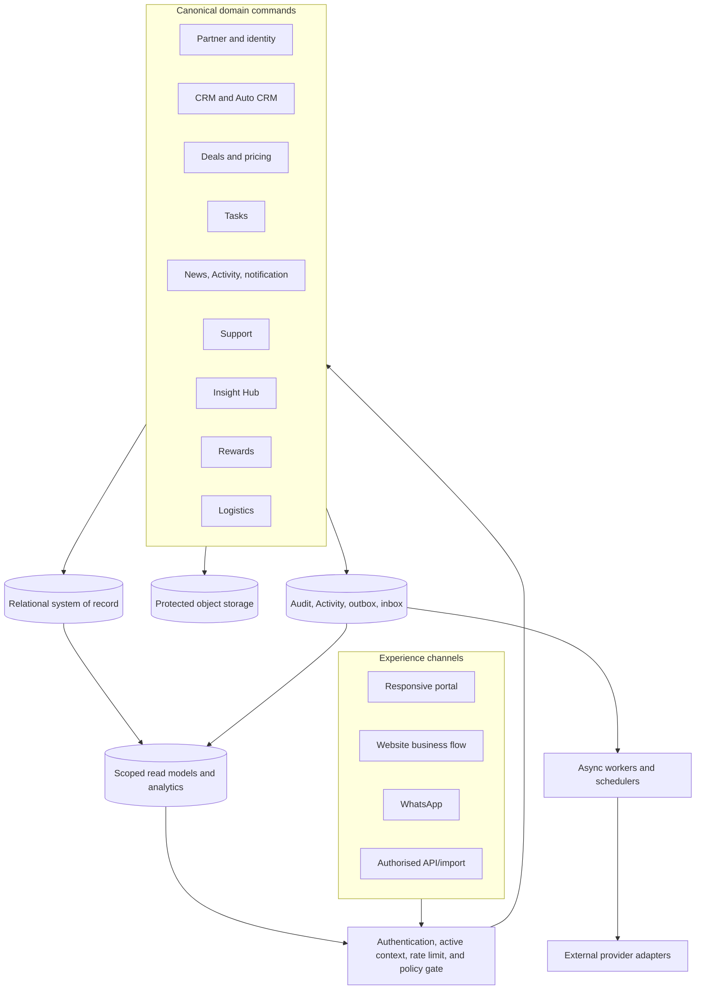

### 18.2 Canonical entity glossary

| Domain         | Entity                                         | Purpose and critical relationships                                                                                                                                                                    |
| -------------- | ---------------------------------------------- | ----------------------------------------------------------------------------------------------------------------------------------------------------------------------------------------------------- |
| Geography      | Geography Node                                 | Immutable node for Global, Sales Region, Country, or Province/State; effective-dated parent path                                                                                                      |
| Identity       | User                                           | Human identity, status, verified channels, locale, timezone; receives no business access by itself                                                                                                    |
| Identity       | Assignment                                     | Effective-dated User + Role + team domain + organisation + geography + optional portfolio/account/queue + manager                                                                                     |
| Identity       | Active Context                                 | Server-issued intersection of exactly one authorised Assignment and zero or one nullable narrowing Working Scope; `null` means Full Assignment scope                                                  |
| Identity       | Session / MFA Factor                           | Revocable authentication state and verified additional factor                                                                                                                                         |
| Partner        | Partner Organisation                           | External legal/business organisation, tier, status, company profile, locations                                                                                                                        |
| Partner        | Partner Application / Revision                 | Resumable onboarding application with immutable review revisions                                                                                                                                      |
| Partner        | Review Decision                                | Reviewer outcome, reason, field/document requests, timestamp                                                                                                                                          |
| Partner        | Agreement / Agreement Event                    | Zoho Sign request, source artifact, status history, signed artifact                                                                                                                                   |
| CRM            | Lead                                           | Unqualified inbound opportunity with source, score, consent, route, Lead assignee, and conversion links                                                                                               |
| CRM            | Customer / Account                             | End-customer organisation owned or served within authorised partner/LIVEY scope                                                                                                                       |
| CRM            | Master Account / Partner-Customer Relationship | LIVEY-only deduplication identity for a real-world customer and the tenant-safe relationship through which each Partner sees its own Customer record; Partners never see another Partner relationship |
| CRM            | Contact                                        | Person associated with Partner or Customer                                                                                                                                                            |
| CRM            | Consent                                        | Person + channel + purpose + wording/version + status + evidence                                                                                                                                      |
| CRM            | Portfolio Assignment                           | Effective-dated PAM-to-Partner or KAM-to-Customer coverage                                                                                                                                            |
| CRM            | Customer Participant                           | Effective-dated typed Customer tag, including restricted Distributor access and provenance                                                                                                            |
| Conversation   | Conversation / Message                         | Channel thread and provider-attributed messages linked to Lead, Contact, Ticket, or Deal                                                                                                              |
| Product        | Product / Product Variant                      | Governed catalogue identity, SKU, brand/series, commercial/support/learning metadata                                                                                                                  |
| Product        | Price Book / Price Row                         | Effective-dated MSRP and partner-tier transfer prices                                                                                                                                                 |
| Product        | Product Instance                               | Installed/owned item with serial number, Customer, entitlement, and source                                                                                                                            |
| Deals          | Deal                                           | Opportunity header, customer/partner, geography, stage, probability, approvals, current pricing revision                                                                                              |
| Deals          | Deal Line Item                                 | Product, quantity, price snapshots, discount, proposed price, margin, and totals                                                                                                                      |
| Deals          | Pricing Revision                               | Immutable commercial snapshot across all line items                                                                                                                                                   |
| Deals          | Deal Participant                               | Effective-dated typed tag with assignment and provenance                                                                                                                                              |
| Deals          | Deal Transition                                | Immutable stage/probability movement with actor, reason, and revision                                                                                                                                 |
| Deals          | Registration Decision                          | Threshold/reviewer outcome linked to a pricing revision                                                                                                                                               |
| Deals          | Discount Request / Decision                    | Requested additional discount, approver, reason, outcome, revision                                                                                                                                    |
| Deals          | Purchase Order / Review                        | Versioned PO artifact/metadata and LIVEY review state                                                                                                                                                 |
| Work           | Task                                           | First-class work item with state, assignee, due time, priority, and typed links                                                                                                                       |
| Work           | Task Link / Checklist / Comment                | Associations and collaboration children of a Task                                                                                                                                                     |
| Work           | Coverage Exception                             | Blocking required-role resolution item with Deal/action, coverage key, responsible Assignment/role, SLA, and reconciliation result                                                                    |
| Communications | News Post / Audience                           | Editorial content and explicit targeted audience expression                                                                                                                                           |
| Communications | Activity Event                                 | Immutable fact tied to a subject and authorised visibility                                                                                                                                            |
| Communications | Notification                                   | Recipient-specific in-app attention record                                                                                                                                                            |
| Communications | Digest / Delivery Attempt                      | Scheduled aggregation and per-channel delivery result                                                                                                                                                 |
| Support        | Ticket                                         | Human-readable support record, requester, queue, state, severity, SLA                                                                                                                                 |
| Support        | Ticket Product / Serial                        | Many-to-many affected products and zero-to-many serial values                                                                                                                                         |
| Support        | Ticket Message                                 | Public reply or internal note with visibility                                                                                                                                                         |
| Support        | Ticket Reopen Request                          | Partner request and internal approve/reject decision                                                                                                                                                  |
| Support        | SLA Instance                                   | Versioned response/resolution clocks, pauses, breaches, attainment                                                                                                                                    |
| Learning       | Track / Subject / Lesson                       | Sales/Technical/Solution hierarchy; Technical series as Subject and product as Lesson                                                                                                                 |
| Learning       | Course Version / Resource                      | Published version and its video, text, document, or live resources                                                                                                                                    |
| Learning       | Enrollment / Lesson Progress                   | Learner assignment and completion evidence pinned to a version                                                                                                                                        |
| Learning       | Assessment / Attempt                           | Versioned questions, answers, score, retry/cooldown evidence                                                                                                                                          |
| Learning       | Certificate                                    | Verifiable issued credential tied to a passing Attempt                                                                                                                                                |
| Rewards        | Points Rate                                    | Effective-dated points-per-reward-USD conversion                                                                                                                                                      |
| Rewards        | Reward Allocation                              | Deal reward pool and exact contributor split snapshot                                                                                                                                                 |
| Rewards        | Point Ledger Entry                             | Append-only pending/available/reserved/redeemed/reversed/expired movement                                                                                                                             |
| Rewards        | Reward Item / Catalogue Snapshot               | Redeemable item and internal/provider mapping                                                                                                                                                         |
| Rewards        | Redemption                                     | Reservation, approval, fulfillment, refund, and delivery state                                                                                                                                        |
| Rewards        | Voucher Fulfillment                            | Encrypted GyFTR order result and reveal controls                                                                                                                                                      |
| Logistics      | Shipment / Shipment Event                      | DHL or future-carrier shipment and immutable tracking timeline                                                                                                                                        |
| Integration    | Provider Connection                            | Environment/account/capability configuration with secret reference                                                                                                                                    |
| Integration    | External Link                                  | Local-to-provider identity map                                                                                                                                                                        |
| Integration    | Webhook Receipt / Outbox Command               | Durable inbound/outbound integration work                                                                                                                                                             |
| Integration    | Sync Job / Conflict                            | Reconciliation run and field/object mismatch                                                                                                                                                          |
| Governance     | Controlled Value / Policy Version              | Governed enumerations and effective-dated rules                                                                                                                                                       |
| Governance     | File Object / Document Link                    | Scanned binary metadata and purpose/visibility link                                                                                                                                                   |
| Governance     | Audit Event                                    | Immutable security/business administration evidence                                                                                                                                                   |
| Governance     | Feature Flag                                   | Scoped release control with accountable role, expiry, and audit                                                                                                                                       |

### 18.3 Relationship map

```mermaid
erDiagram
    USER ||--o{ ASSIGNMENT : receives
    GEOGRAPHY_NODE ||--o{ ASSIGNMENT : scopes
    PARTNER o|--o{ ASSIGNMENT : optionally_scopes_partner
    CUSTOMER o|--o{ ASSIGNMENT : optionally_scopes_account
    ASSIGNMENT ||--o{ ACTIVE_CONTEXT : selected_as
    ASSIGNMENT ||--o{ PARTNER_PORTFOLIO_MEMBER : covers
    PARTNER ||--o{ PARTNER_PORTFOLIO_MEMBER : included_in
    ASSIGNMENT ||--o{ CUSTOMER_PORTFOLIO_MEMBER : covers
    CUSTOMER ||--o{ CUSTOMER_PORTFOLIO_MEMBER : included_in

    GEOGRAPHY_NODE ||--o{ PARTNER_GEOGRAPHY_COVERAGE : permits
    PARTNER ||--o{ PARTNER_GEOGRAPHY_COVERAGE : operates_in
    GEOGRAPHY_NODE ||--o{ CUSTOMER_LOCATION : contains
    CUSTOMER ||--o{ CUSTOMER_LOCATION : located_at
    GEOGRAPHY_NODE ||--o{ DEAL_GEOGRAPHY_SNAPSHOT : identifies
    DEAL ||--|| DEAL_GEOGRAPHY_SNAPSHOT : freezes

    PARTNER ||--o{ PARTNER_APPLICATION : applies_through
    PARTNER_APPLICATION ||--o{ APPLICATION_REVISION : versions
    PARTNER ||--o{ AGREEMENT : signs
    MASTER_ACCOUNT ||--o{ PARTNER_CUSTOMER_RELATIONSHIP : links_safely
    PARTNER ||--o{ PARTNER_CUSTOMER_RELATIONSHIP : owns_view
    CUSTOMER ||--|| PARTNER_CUSTOMER_RELATIONSHIP : represented_by
    CUSTOMER ||--o{ CONTACT : has
    CONTACT ||--o{ CONSENT : grants
    CUSTOMER ||--o{ CUSTOMER_PARTICIPANT : tags
    USER ||--o{ CUSTOMER_PARTICIPANT : participates

    PARTNER ||--o{ DEAL : registers
    CUSTOMER ||--o{ DEAL : buys_through
    DEAL ||--|{ DEAL_LINE_ITEM : includes
    PRODUCT ||--o{ DEAL_LINE_ITEM : selected_as
    DEAL ||--o{ PRICING_REVISION : repriced_as
    PRICING_REVISION ||--|{ LINE_PRICE_SNAPSHOT : contains
    DEAL ||--o{ DEAL_PARTICIPANT : tags
    USER ||--o{ DEAL_PARTICIPANT : participates
    DEAL ||--o{ DEAL_TRANSITION : moves_through
    DEAL ||--o{ PURCHASE_ORDER : evidenced_by
    DEAL ||--o| REWARD_ALLOCATION : rewards

    TASK ||--o{ TASK_LINK : relates
    CUSTOMER ||--o{ TICKET : requests
    TICKET ||--o{ TICKET_PRODUCT : affects
    TICKET_PRODUCT ||--o{ TICKET_SERIAL : identifies
    TICKET ||--o{ TICKET_MESSAGE : contains
    TICKET ||--o{ TICKET_REOPEN_REQUEST : may_request
    TICKET ||--o{ SLA_INSTANCE : measured_by

    SUBJECT ||--o{ LESSON : contains
    PRODUCT ||--o{ LESSON : taught_as
    LESSON ||--o{ LESSON_PROGRESS : completed_as
    ENROLLMENT ||--o{ LESSON_PROGRESS : tracks
    ENROLLMENT ||--o{ ASSESSMENT_ATTEMPT : attempts
    ASSESSMENT_ATTEMPT ||--o| CERTIFICATE : qualifies

    REWARD_ALLOCATION ||--|{ POINT_LEDGER_ENTRY : posts
    REWARD_ITEM ||--o{ REDEMPTION : selected_as
    REDEMPTION ||--o{ POINT_LEDGER_ENTRY : reserves
    REDEMPTION ||--o| VOUCHER_FULFILLMENT : fulfilled_digitally
    REDEMPTION ||--o| SHIPMENT : fulfilled_physically
    TICKET ||--o{ SHIPMENT : may_require
    SHIPMENT ||--o{ SHIPMENT_EVENT : records

    NEWS_POST ||--o{ NEWS_AUDIENCE : targets
    ACTIVITY_EVENT ||--o{ NOTIFICATION : may_create
    NOTIFICATION ||--o{ DIGEST_ITEM : may_group
    DIGEST ||--o{ DIGEST_ITEM : contains
```

### 18.4 Common data invariants

1. Internal primary keys are immutable UUIDs or equivalently non-guessable identifiers.
2. Human-readable numbers are separately unique within their documented namespace.
3. Every scope-sensitive row carries a non-null `tenant_id`: the Partner ID for Partner-owned data or the LIVEY organisation ID for LIVEY-internal data. Provider account, geography, and Active Context never substitute for `tenant_id`.
4. Geography uses IDs and effective-dated hierarchy paths, never display strings as authority.
5. All mutable records include created/updated actor and UTC timestamps plus an optimistic concurrency version.
6. Archival records include archived timestamp, actor, and reason. Referenced commercial records are not hard-deleted.
7. Workflow state changes occur only through named domain commands.
8. Many-to-many facts use association records; comma-separated ID fields are prohibited.
9. Money uses fixed-point decimal values and an explicit ISO currency code.
10. USD authoritative values and optional local-reference values are stored separately with their rate snapshot.
11. Assignment, participant, price, points-rate, audience, policy, course, and SLA versions are effective-dated or immutable.
12. Audit, Activity, deal transition, point ledger, webhook receipt, shipment event, certificate issue/revoke, and provider order history are append-only.
13. A correction to append-only data uses a linked compensating event.
14. Files live outside public paths. A Document Link carries subject, purpose, visibility, retention, and current version.
15. Personal channel consent is recorded by person, purpose, channel, source, wording/version, timestamp, and withdrawal.
16. Provider identifiers are never the primary identifier for a LIVEY business record.
17. External links are unique within provider account and entity type.
18. Every retryable command has an idempotency key and explicit terminal/unknown status handling.
19. Denormalised dashboards and analytics are read models; they cannot authorise access or overwrite canonical state.
20. Historical names, roles, partner tier, price, geography path, and actor context are snapshotted where later change would distort evidence.

Tenant rules:

- Partner users can operate only in their Assignment's Partner tenant.
- LIVEY internal users operate in the LIVEY tenant and gain access to Partner-owned records only through explicit geography/portfolio/participant policy.
- A Deal is Partner-owned and stores its Partner tenant plus LIVEY collaboration relationships; tagging never changes its tenant.
- A Partner-scoped Customer belongs to one Partner tenant. When two Partners serve the same real-world organisation, LIVEY may link both to a LIVEY-only Master Account through separate Partner-Customer Relationships; neither Partner can discover the other relationship.
- Shared News uses audience relationships rather than a fake “global tenant.”
- Provider accounts and external organisation IDs are integration dimensions and cannot be used for tenant isolation.
- Cross-tenant references require an allowlisted association type and server policy; arbitrary foreign keys across Partner tenants are rejected.
- Exports, analytics, Assistant retrieval, caches, files, queues, notifications, and background jobs carry and revalidate `tenant_id`.

### 18.5 Domain command contract

Each consequential command includes:

- authenticated User ID;
- Active Context and Assignment ID;
- command name;
- subject ID and expected record version;
- validated input DTO containing only command-specific fields;
- reason when required;
- idempotency key for externally replayable entry points;
- client/channel/source;
- correlation ID; and
- current time supplied by the trusted server clock.

The command handler must:

1. reload the canonical record under policy;
2. validate active assignment and context;
3. validate lifecycle and field permission;
4. resolve governed dependencies such as geography, price, tags, or approvers;
5. calculate changes with fixed-point and versioned policy;
6. commit state, Activity, audit, and outbox data atomically;
7. return the new record version and next authorised actions; and
8. never accept a client assertion that an approval, tag, price, role, or recipient is valid.

The assistant, drag-and-drop pipeline, imports, bulk actions, and integration jobs call these same commands.

### 18.6 Read models and structured discovery

Lists, dashboards, KPI cards, boards, assistant retrieval, and exports may use optimised read models, provided:

- every row contains the canonical scope keys needed for policy;
- read models are updated from canonical events;
- stale data is visibly timestamped where material;
- counts use the same row policy as detail;
- structured filters map to governed IDs/enums/ranges;
- a deep link reauthorises the canonical record at open time;
- no generic free-text record-search index is exposed in the UI; and
- the assistant retrieval index is partitioned and filtered before retrieval by current User, Assignment, Active Context, and record policy.

### 18.7 File and attachment model

Upload is a two-step authorised workflow:

1. request an upload slot for a named subject, purpose, file type, and expected size;
2. upload to a quarantined object location;
3. verify checksum, detected MIME, extension, dimensions/page count where relevant, and malware result;
4. create a Document Link only after validation;
5. record uploader, visibility, version, and retention; and
6. publish Activity only when the file becomes usable.

Downloads:

- verify the user and current context at request time;
- verify subject and document-field permission;
- create a short-lived signed URL or streamed response;
- use a safe content disposition;
- watermark or log high-risk documents where policy requires;
- never reuse a URL across users; and
- record sensitive downloads in audit.

Partner-visible, LIVEY-internal, Support-internal, accounting-only, certificate-public-verification, and provider-secret are distinct visibility classes.

### 18.8 Audit versus Activity

Audit and Activity may originate from the same command but serve different purposes:

| Dimension        | Audit Event                                                                                 | Activity Event                                             |
| ---------------- | ------------------------------------------------------------------------------------------- | ---------------------------------------------------------- |
| Purpose          | Security, governance, accountability, investigation                                         | Human-readable business chronology                         |
| Audience         | Privileged and scope-authorised auditors                                                    | Users authorised to see the subject                        |
| Content          | Actor/effective role, action, before/after summary, reason, outcome, IP/device where lawful | Safe actor label, event label, business summary, deep link |
| Mutability       | Append-only                                                                                 | Append-only                                                |
| Notification     | Never directly; policy may consume the business event                                       | May produce a recipient notification                       |
| Retention        | Security/legal policy                                                                       | Subject/business policy                                    |
| Sensitive values | Redacted, tokenised, or classified                                                          | Excluded unless safe for all subject viewers               |

### 18.9 Time, versioning, and history

- All timestamps persist in UTC with user-local display.
- Effective intervals use inclusive `valid_from` and exclusive `valid_to`.
- Current records do not overwrite the meaning of a prior event.
- A hierarchy reorganisation stores an effective-dated parent link.
- A user transfer closes one Assignment and opens another.
- A deal reprice creates a Pricing Revision.
- A ticket reopen creates a new SLA segment while retaining the prior closure.
- A course change creates a Course Version.
- A point-rate change creates a non-overlapping effective interval.
- A provider mapping change creates mapping history and does not reinterpret an earlier order.
- Optimistic concurrency rejects two incompatible writes; the UI shows what changed and permits a reviewed retry.

### 18.10 Data ownership and service boundaries

| Data                                                        | Authoritative domain                      |
| ----------------------------------------------------------- | ----------------------------------------- |
| User authentication, sessions, factors                      | Identity                                  |
| Roles, assignments, active context                          | Identity and Policy                       |
| Geography and reference values                              | Governance                                |
| Partner application, status, tier, company                  | Partner                                   |
| Lead, Customer, Contact, consent, conversation              | CRM                                       |
| Product commercial definition and price books               | Catalogue/Pricing                         |
| Deal, line items, stage, participants, commercial approvals | Deals                                     |
| Task state and assignment                                   | Work                                      |
| News, Activity, notifications, digests                      | Communications                            |
| Ticket, SLA, reopen review                                  | Support                                   |
| Lesson, progress, attempts, certificate                     | Learning                                  |
| Point liability, catalogue, redemption                      | Rewards                                   |
| Shipment normalised state                                   | Logistics                                 |
| External identity, receipts, commands, conflicts            | Integrations                              |
| Financial document authority                                | Zoho Books, mirrored through Integrations |

Cross-domain references use canonical IDs and named commands/events. A domain does not update another domain's tables directly.

### 18.11 Architecture acceptance criteria

- The same transition validation runs for UI drag-and-drop, detail actions, assistant commands, imports, and APIs.
- No page, export, assistant answer, notification, attachment, or background job trusts a client-supplied scope.
- Every tenant-owned or scope-sensitive entity has sufficient canonical keys to enforce policy.
- Historical records remain interpretable after geography, role, name, price, tier, or provider mapping changes.
- A failed notification or provider call does not partially roll back a completed domain command.
- A duplicate command or webhook produces one logical result.
- Protected file URLs expire and cannot be reused by an unauthorised user.
- An Activity summary cannot disclose a field unavailable on the subject record.
- Audit and Activity are independently queryable and retain their distinct visibility.
- Optimistic concurrency prevents silent overwrite of stage, price, task, ticket, approval, or points state.
- Analytical read models reconcile to canonical totals and cannot serve as an authorisation authority.

---

## 19. Security, Privacy, Reliability, Performance, and Accessibility

### 19.1 Non-functional quality bar

The requirements in this section are release criteria, not post-launch enhancements. A feature that works only with ideal data, a healthy provider, a desktop pointer, or a privileged account is incomplete.

| Area                              | Canonical target                                                       |
| --------------------------------- | ---------------------------------------------------------------------- |
| Core portal/API availability      | 99.9% monthly, excluding announced maintenance                         |
| Recovery point objective          | 15 minutes for canonical production data                               |
| Recovery time objective           | 4 hours for core portal service                                        |
| Ordinary cached/read API latency  | p95 at or below 500 ms under contracted peak load                      |
| Ordinary write API latency        | p95 at or below 800 ms, excluding asynchronous provider completion     |
| Structured list/filter response   | p95 at or below 1 second at the Section 19.13.3 qualification profile  |
| Largest Contentful Paint          | p75 at or below 2.5 seconds on supported mobile/broadband profiles     |
| Cumulative Layout Shift           | p75 at or below 0.1                                                    |
| Interaction to Next Paint         | p75 at or below 200 ms for ordinary local interactions                 |
| Durable webhook acknowledgement   | Within 2 seconds after validation and durable receipt                  |
| Healthy-provider async completion | 95% within 5 minutes unless the workflow defines a longer provider SLA |
| Accessibility                     | WCAG 2.2 AA for every user-facing priority workflow                    |
| Supported browsers                | Current and previous major Chrome, Edge, Firefox, and Safari           |
| Responsive width                  | Full operation from 360 CSS pixels upward                              |

These targets are measured by environment, geography, role, route, device class, and release version. Provider time is separately identified so an external outage cannot hide portal latency.

### 19.2 Authentication and session security

- Passwords use a current adaptive password-hashing algorithm with centrally governed work factors.
- Password policy blocks known breached passwords and common weak patterns without imposing arbitrary complexity that encourages reuse.
- Password reset and invitation tokens are random, single-use, short-lived, and stored only as hashes.
- Authentication errors do not reveal whether an email exists.
- Email verification is required before an onboarding application can be submitted.
- MFA is mandatory for Super Admin and all LIVEY internal roles. Partner Admin MFA is mandatory at full activation. Partner User MFA may be required by Partner policy and is always available.
- High-risk actions can require recent authentication or an additional MFA challenge.
- Default idle/absolute session lifetimes are 30 minutes/12 hours for Super Admin, Partner Admin, and every LIVEY-internal role, and 60 minutes/24 hours for Partner User. Partner or Security policy may shorten these values but cannot lengthen them in blueprint version 1.0. High-risk approval, role/integration, voucher, export, and correction actions require authentication no older than 15 minutes.
- Refresh tokens rotate and detect reuse.
- Password reset, MFA reset, role/scope change, suspension, offboarding, and suspected compromise revoke affected sessions.
- Users can view their active sessions and revoke one or all.
- Authentication, reset, verification, invitation, MFA, lockout, context selection, session revocation, and recovery events are audited.
- Credential stuffing, enumeration, automated signup, and token abuse are rate-limited using account, IP, device, and behaviour signals.
- Recovery does not allow a Support or ordinary Super Admin action to expose the current password or MFA secret.

### 19.3 Authorisation and tenant isolation

Authorisation is deny-by-default and applies at:

1. session and Active Context;
2. role/capability;
3. team domain;
4. organisation/Partner;
5. geography;
6. portfolio, Customer/account, product, or support queue;
7. record participation/tag where required;
8. workflow state;
9. field and attachment visibility; and
10. action-specific prerequisites.

The server and database enforce the policy. Required controls include:

- row-level policy or an equivalent central data-access guard for every scope-sensitive table;
- field allowlists for reads, writes, exports, assistant tools, imports, and integration payloads;
- no generic “update any column” endpoint for governed records;
- no trusted role, Partner ID, organisation ID, geography, participant/assignee, approver, price, or status supplied by the client;
- non-enumerating responses for inaccessible direct IDs;
- authorised counts and aggregates that reveal no out-of-scope existence;
- cache keys containing User, Assignment, Active Context, policy version, and relevant record scope;
- immediate cache/session invalidation after scope changes;
- per-row authorisation for bulk imports and actions;
- scoped signed URLs for attachments;
- post-retrieval permission check before a notification deep link or assistant citation opens;
- service identities with purpose-specific permissions, not blanket Super Admin access; and
- automated isolation tests using two Partners with deliberately similar names, contacts, products, serials, and documents.

### 19.4 Assistant and AI security

The assistant is treated as a user-facing orchestration channel, not as a security principal.

- Every request executes as the authenticated User under the selected Active Context.
- Retrieval is pre-filtered by tenant and record policy. Retrieving across tenants and filtering after generation is prohibited.
- Embeddings, caches, conversation summaries, and evaluation logs preserve the same scope.
- Untrusted ticket text, uploads, website submissions, emails, WhatsApp messages, provider content, and learning content are data, never system instructions.
- Tool schemas expose only named domain commands and allowlisted fields.
- Consequential actions show exact changes and require immediate explicit confirmation.
- The assistant cannot approve a Partner, approve a discount, approve a PO, release rewards, change roles, approve a ticket reopen, issue/revoke certificates, reveal voucher codes, rotate credentials, or export bulk sensitive data. It may explain the workflow and navigate an authorised human to the structured action.
- Retrieved record claims cite an authorised record or content source.
- Missing, conflicting, stale, or low-confidence evidence produces a transparent limitation or human handoff.
- Secrets, password hashes, reset tokens, signing keys, provider tokens, voucher codes, unrestricted attachment URLs, and unnecessary sensitive PII never enter model context.
- Conversation logs record model/version, user/context, retrieved record IDs, tool calls, confirmation, outcome, latency, and correlation ID, but not hidden reasoning.
- Long-term memory is opt-in, scoped, revocable, and removed when underlying permission or retention ends.
- Prompt-injection, cross-tenant extraction, indirect-instruction, tool-argument manipulation, and excessive-action red-team suites are required before release.

### 19.5 Data protection and encryption

- TLS 1.2 or later protects all external and internal network paths where supported.
- Managed encryption at rest covers databases, backups, caches, object storage, and queues.
- Voucher codes, high-risk provider secrets, and equivalent sensitive values use separate field/envelope encryption.
- Secrets reside in managed secret storage and are referenced, never copied into configuration tables, source files, logs, or client bundles.
- Key and secret rotation has an accountable Security/Operations role, runbook, expiry, and non-destructive overlap period.
- Production data is prohibited in development and demo environments unless irreversibly anonymised and formally authorised.
- Environment boundaries prevent sandbox provider events from touching production records.
- Object-storage buckets are private; directory listing and predictable public paths are disabled.
- Uploaded documents are quarantined, MIME/content validated, malware scanned, and made visible only after acceptance.
- Sensitive exports are encrypted in storage, short-lived, single-purpose, and downloadable only by the requesting authorised identity.
- Authentication cookies are always `Secure` and `HttpOnly`; session cookies default to `SameSite=Lax`. Any documented cross-site exception is narrowly scoped and paired with Origin validation and an anti-CSRF token. The browser policy also enforces a restrictive Content Security Policy, an explicit CORS origin allowlist, `frame-ancestors` clickjacking protection, and no secrets in URL query strings.

### 19.6 Privacy, consent, and data rights

LIVEY must maintain a data inventory and classification for identity, contact, commercial, support, learning, rewards, accounting, logistics, communications, and telemetry data.

Privacy rules:

- collect only fields required for the documented business purpose;
- present purpose- and channel-specific consent wording;
- store consent wording/version and evidence;
- distinguish service communications from marketing consent;
- honour opt-out across email, WhatsApp, campaigns, and assistant-initiated outreach;
- respect quiet hours and recipient timezone for digests;
- provide correction, access, portability, and erasure workflows where legally applicable;
- preserve financial, security, contractual, reward, and audit records when law or legitimate obligation requires it;
- anonymise eligible personal fields rather than breaking record relationships;
- keep legal holds explicit and auditable;
- restrict support and operator access to the minimum necessary; and
- never use customer/partner private content to train a general model without a separately authorised policy.

The data-subject workflow locates the person by canonical IDs and verified channel identifiers, classifies each related field by retention authority, previews the effect, obtains approval when required, executes idempotently, and produces an audit-safe result without exporting another person's data.

### 19.7 Retention and deletion

Retention is policy-driven by record class and jurisdiction. Default product requirements are:

| Record class                                    | Default treatment                                                                                                                        |
| ----------------------------------------------- | ---------------------------------------------------------------------------------------------------------------------------------------- |
| Authentication/security audit                   | Seven years; a jurisdictional policy may require a longer period but never an unreviewed shorter one                                     |
| Partner application, agreement, approval        | Seven years after relationship end                                                                                                       |
| Deal pricing, PO, reward, accounting references | Seven years after the relevant financial period; longer jurisdictional periods override                                                  |
| Point ledger and redemption                     | Seven years after final settlement                                                                                                       |
| Support ticket and attachments                  | Five years after closure; a signed support contract or jurisdiction may require longer                                                   |
| Learning attempt/certificate                    | Attempts: three years after course completion/abandonment; certificates/evidence: seven years after expiry or revocation                 |
| News                                            | Three years after archive; publication/audience Audit remains seven years                                                                |
| Activity                                        | Same period as its underlying business record; orphan prevention uses the longer linked-record period                                    |
| Notifications/digest delivery                   | Notification content: 180 days; delivery/suppression evidence: one year; linked security Audit follows seven-year rule                   |
| Assistant conversation                          | 90 days after last activity; an explicitly preserved business note follows its linked record's period                                    |
| Integration payload                             | Raw payload: 30 days; redacted receipt, command, conflict, and reconciliation evidence: seven years                                      |
| Failed/quarantined upload                       | Failed partial: 24 hours; non-malicious quarantine: 30 days; malware evidence/sample reference: 90 days under restricted Security access |

Expiry runs as an auditable, resumable job. Legal holds, open disputes, provider reconciliation, or required referential history block deletion and state the reason. Hard deletion of a referenced commercial record is prohibited.

### 19.8 Auditability and non-repudiation

Sensitive actions create immutable audit events with:

- event and correlation IDs;
- UTC timestamp;
- authenticated User and effective Assignment/role/context;
- actor type: human, system, provider, or service;
- action and subject type/ID;
- before/after safe summary or revision IDs;
- reason and approval references where required;
- result and failure class;
- source channel;
- IP/device/session context where lawful;
- policy/version used; and
- related outbox, webhook, provider, or file references.

Mandatory audit coverage includes:

- sign-in, MFA, session, recovery, and context events;
- User status and Assignment changes;
- hierarchy/reference-data/policy changes;
- Partner review and agreement decisions;
- Partner, Customer, Contact, merge, archival, consent, import, and export actions;
- deal participant, stage, probability, price, discount, registration, PO, and reward actions;
- Task reassignment, due-date, status, and cancellation;
- News publishing/audience changes and digest policy changes;
- ticket severity, SLA, assignment, internal/public message, closure, and reopen decision;
- course publish/version, attempt exception, certificate issue/revoke;
- point rate, ledger correction, redemption, voucher reveal, refund;
- shipment creation, pickup, cancellation, and manual state correction;
- assistant tool call and confirmation;
- provider mapping, replay, resync, conflict resolution, pause, and secret rotation; and
- high-risk attachment download.

No user, including Super Admin, can edit or delete an audit event through the product.

### 19.9 Abuse prevention and rate limits

Limits are adaptive by route, authenticated principal, Active Context, IP/device, provider, and business key.

Protected flows include:

- authentication, reset, verification, invitations, and MFA;
- public forms and website assistant;
- WhatsApp/email inbound webhooks;
- file upload and download;
- assistant prompts and tool calls;
- deal/import/bulk commands;
- certificate verification;
- voucher reveal and redemption;
- export creation/download;
- provider replay/resync; and
- ticket creation/reopen requests.

Exceeding a limit returns a safe retry indication and creates telemetry. Rate limiting does not acknowledge whether a protected identity or record exists. High-risk patterns can require bot challenge, MFA, operator review, or temporary suppression. A limit must not silently lose a verified inbound provider event; durable receipts wait in a queue.

### 19.10 Reliability and failure behaviour

#### 19.10.1 Transactional integrity

- Business state and its Audit/Activity/outbox facts commit atomically.
- A client retry uses idempotency or optimistic concurrency.
- Multi-line pricing commits as a complete revision.
- Reward allocation and point ledger entries commit together.
- Points reservation and redemption creation commit together.
- Stage transition and required tag reconciliation commit together.
- Ticket reopen approval and new SLA segment commit together.
- Certificate issuance and passing evidence commit together.

#### 19.10.2 Queue reliability

- Jobs are at-least-once delivered and idempotently processed.
- Backoff is exponential, bounded, and jittered.
- Provider Retry-After and rate limits are respected.
- Poison messages move to a dead-letter queue after a governed attempt limit.
- Operators can inspect redacted diagnostics and replay safely.
- Queue lag, oldest age, retries, failures, and dead letters are monitored.
- A worker deployment supports graceful shutdown and does not abandon acknowledged work.

#### 19.10.3 Degraded states

| Failure                    | User experience                                                              |
| -------------------------- | ---------------------------------------------------------------------------- |
| Read model delayed         | Show last updated timestamp; offer canonical detail when safe                |
| Notification provider down | Business action succeeds; in-app remains; digest delivery is Pending/Failed  |
| Zoho Books down            | Deal remains Approved Won; financial sync is Queued with operator visibility |
| Zoho Sign down             | Application remains Pending Agreement; no false signed/approved state        |
| GyFTR unknown result       | Points remain reserved; Redemption remains Processing pending reconciliation |
| DHL unknown result         | Source record remains pending; no second shipment is created                 |
| Assistant unavailable      | Structured portal workflows remain fully usable                              |
| Analytics unavailable      | Operational records remain usable; KPI cards show unavailable, not zero      |
| Attachment scan delayed    | File shows Scanning and is not downloadable                                  |
| Context assignment expires | Protected request is denied; user reselects an active context or signs out   |

### 19.11 Backup, recovery, and continuity

- Canonical relational data supports point-in-time recovery with a 15-minute RPO target.
- Protected files, encryption metadata, and critical queue/event stores have aligned backup policy.
- Backups are encrypted, access-controlled, regionally governed, monitored, and protected from ordinary production credentials.
- Restore exercises occur at least quarterly in an isolated environment.
- Exercises verify record counts, referential integrity, file links, point ledger balance, audit chronology, recent outbox/inbox, and provider reconciliation ability.
- The measured restore must meet the four-hour core RTO target or fail release qualification and produce an accountable remediation role and target date.
- Provider connections are not blindly resumed after restore; reconciliation establishes safe cursors and duplicate protection first.
- Runbooks cover data-store failure, credential compromise, provider outage, queue backlog, isolation breach, erroneous bulk action, and failed deployment.

### 19.12 Observability and operations

All web requests, commands, jobs, messages, integration calls, and provider receipts carry correlation IDs.

Required telemetry:

- request volume, error class, status, latency, and saturation;
- authentication failures, MFA anomalies, session revocations, and denied policy decisions;
- database query latency, lock/concurrency conflicts, pool saturation, and policy errors;
- queue depth, lag, retries, dead letters, and job duration;
- provider availability, latency, throttling, failure class, and credential expiry;
- webhook signature failure, replay, delay, duplicate, and processing latency;
- in-app notification and digest generation/delivery;
- assistant retrieval/tool latency, refusal, failure, and permission denials;
- ticket SLA timers and breach events;
- import/export counts and row failures;
- reward liability, reservation age, reconciliation exceptions, and voucher reveal anomalies;
- shipment exceptions and tracking lag; and
- front-end Core Web Vitals, JS errors, route failures, and accessibility instrumentation where reliable.

Alerts have a severity, accountable Operations/Security/Support role, runbook, deduplication/grouping rule, escalation path, and recovery condition. Alerting includes tenant-isolation or policy failures, availability/error-budget burn, sustained latency, queue lag, dead letters, provider credential expiry, provider outage, sync conflicts, failed backups/restores, delivery suppression spikes, SLA breach, reward mismatch, and suspicious exports.

Telemetry excludes passwords, tokens, voucher codes, full private document URLs, payment credentials, message/document bodies, and unnecessary PII.

### 19.13 Performance and scale

#### 19.13.1 Interface performance

- The application shell and role navigation load without downloading modules the active role cannot use.
- Route-level code splitting avoids one monolithic client bundle.
- Dashboard cards render progressively; a slow secondary chart does not block priority work queues.
- Skeletons reserve final layout space and avoid large shifts.
- Structured filter changes cancel obsolete requests.
- Pipeline drag/touch operations use optimistic visual feedback only after the server command is accepted or clearly show Pending; rejection restores the card and explains why.
- Images use responsive sizes, safe lazy loading, and fixed dimensions.
- Learning video uses adaptive streaming and does not auto-play with sound.
- Mobile cards prioritise essential fields and do not render desktop tables off-screen.

#### 19.13.2 Data performance

- All large lists paginate with stable cursor or deterministic keyset semantics where appropriate.
- Sort and filter combinations are indexed against documented production patterns.
- Exports, imports, reconciliation, reward allocation, certificate batches, and bulk reassignment execute asynchronously.
- Analytics uses scoped read models and incremental aggregates, never unbounded transactional table scans.
- N+1 record policy checks are eliminated without weakening policy.
- Cache TTL and invalidation reflect security risk; access revocation takes precedence over cache hit rate.
- Performance tests cover at least two times the minimum release qualification profile in Section 19.13.3 or two times the approved forecast, whichever is greater.
- Load tests include Global, Region, Country, Partner, tagged, untagged, and high-cardinality filter cases.

#### 19.13.3 Minimum release qualification profile

This is a capacity-test baseline, not a sales forecast. An approved deployment forecast may raise it; a release cannot lower it without Product/Engineering/Security approval and revised SLO evidence.

| Dimension                                  |                                                         Baseline dataset or traffic |
| ------------------------------------------ | ----------------------------------------------------------------------------------: |
| User identities                            |                                                                             100,000 |
| Active Assignments                         |                                                                             250,000 |
| Simultaneous authenticated sessions        |                                                                               2,000 |
| Partner organisations                      |                                                                              10,000 |
| Customers / Partner-Customer Relationships |                                                                             500,000 |
| Contacts                                   |                                                                           2,000,000 |
| Deals                                      |                                                   1,000,000, including 250,000 open |
| Deal line items                            |                                       5,000,000; up to 100 lines on one tested Deal |
| Tasks                                      |                                           5,000,000, including recurrence instances |
| Tickets                                    |                                                   1,000,000, including 100,000 open |
| Activity/Audit events                      |                                                                100,000,000 combined |
| In-app Notifications / digest items        |                                                                          50,000,000 |
| Learning enrollments/attempts              |                                                                  5,000,000 combined |
| Point-ledger entries / Redemptions         |                                                              10,000,000 / 1,000,000 |
| Sustained ordinary API traffic             |                                                  300 requests/second for 60 minutes |
| Burst ordinary API traffic                 |                                                1,000 requests/second for 60 seconds |
| Verified webhook ingestion                 |                                     200 events/second sustained; 1,000/second burst |
| Daily asynchronous events                  |                                                                           2,000,000 |
| Backlog recovery                           | Drain 500,000 idempotent events within 4 hours while core SLOs remain within target |
| Structured import                          |                                            100,000 rows/file with row-level results |
| Structured export                          |                                                       1,000,000 rows asynchronously |
| Concurrent uploads                         |                                            200 files at the module's permitted size |
| Concurrent Assistant sessions              |                               200, including authorised retrieval and draft preview |

Traffic mix is 70% reads/filter/drill-down, 20% ordinary writes, 5% assistant requests, and 5% import/export/provider administration. The run includes:

- Global and high-cardinality Super Admin views;
- Region/Country/Province/Partner/Account intersections;
- tagged and untagged policy checks;
- dashboard fan-out and clickable KPI drill-down;
- Pipeline board movement with Pricing/participant reconciliation;
- simultaneous Deal/Task/Ticket updates and optimistic conflicts;
- notification recipient expansion and digest generation;
- provider latency, throttle, and queue backlog;
- large Partner and Product selectors without a free-text search field; and
- tenant-isolation assertions under load.

Network profiles include a 150 ms round-trip mobile profile with 10 Mbps down/2 Mbps up and 1% packet loss, plus a 250 ms regional profile. Browser performance uses a representative mid-tier mobile CPU and desktop baseline. Raw fixture definitions, test seed, environment resources, run duration, warm/cold cache mix, and percentile evidence are versioned with release sign-off.

### 19.14 Accessibility

Section 4.8 defines interaction requirements. This section defines the release evidence:

- automated scans on every priority route and state;
- manual keyboard-only completion of every priority workflow;
- manual screen-reader testing on representative desktop and mobile combinations;
- 200% text resize and 400% zoom/reflow;
- contrast verification for tokens and real states;
- reduced-motion testing;
- captions/transcripts for required learning media;
- accessible chart summaries/tables;
- error summary and focus management for long forms;
- touch target and no-hover validation;
- visible focus against every surface;
- status comprehension without colour;
- high-contrast and browser-forced-colour review where supported; and
- regression tests for shared dialogs, sheets, menus, filters, tables, cards, toasts, and context switching.

An automated scan alone is not sufficient evidence of WCAG 2.2 AA.

### 19.15 Responsive and offline-tolerant states

The portal is not specified as a fully offline-authoring application. It must, however, fail safely during transient connectivity loss:

- forms preserve unsent local input for the current session where sensitive-data policy permits;
- the UI labels Unsaved, Saving, Saved, and Save Failed states;
- a failed mutation is never shown as completed;
- duplicate submission after reconnect is prevented;
- file upload can be retried without erasing the rest of the form;
- read-only cached content is clearly marked with its timestamp;
- a pipeline move that was not confirmed by the server returns to its prior column;
- destructive actions require live server confirmation; and
- the user can copy a safe draft or download an allowed error report when recovery cannot be automatic.

Loading, empty, filtered-empty, unavailable, offline, stale, permission-denied, archived, suspended, and provider-pending are distinct states with distinct language.

### 19.16 Security and quality acceptance criteria

- No Critical or High unresolved security finding is permitted at release.
- Cross-context and cross-Partner tests cover list, count, detail, attachment, export, assistant, notification, import, API, and job paths.
- Expired or revoked Assignments lose access on the next protected request.
- An inaccessible notification deep link reveals no record existence.
- A malicious upload never becomes downloadable.
- A prompt injection cannot broaden tool or retrieval scope.
- A duplicate or concurrent command cannot duplicate points, vouchers, invoices, shipments, tasks, notifications, or certificates.
- Restore evidence proves the stated RPO/RTO and reconciliation ability.
- Performance evidence proves agreed percentiles at twice the Section 19.13.3 profile or twice the approved forecast, whichever is greater.
- Every priority workflow passes keyboard, screen-reader, contrast, zoom/reflow, touch, and reduced-motion validation.
- Loading and failure states never show false zero, false success, or inaccessible data.

---

## 20. Migration and Phased Delivery

### 20.1 Delivery principles

The future state is delivered in safe vertical slices. Sequence follows the stated product priorities:

1. Hierarchy and RBAC foundation;
2. Deals, pricing, pipeline, tasks, and rewards;
3. Assistant, Auto CRM, feeds, and UI/UX refinement;
4. Ticketing;
5. Insight Hub and expanded accounting/logistics integrations.

No phase may ship a client-only approximation of a later security requirement. For example, hierarchy UI does not ship before server-enforced scope, and assistant retrieval does not ship before context-aware authorisation.

Each phase:

- begins with canonical entity and event contracts;
- migrates existing data without destroying history;
- is controlled by environment, staff, Partner, role, or geography feature flags;
- includes observability and rollback;
- supports old and new data during a bounded compatibility window;
- has explicit entry and exit gates; and
- removes a legacy path only after reconciliation proves parity.

### 20.2 Migration inventory and preparation

Before production migration, create a classified inventory of:

- current users, profiles, roles, and approval status;
- Partner organisations and locations;
- existing country/region/state strings;
- current LIVEY team/roster entries and manager fields;
- Customer records and legacy source fields labelled `client`, plus Contact/POC strings;
- deals, products, quantity, value, stage, probability, notes, files, approvals, and creator;
- catalogue records and string-formatted MSRP/partner cost;
- pipeline Activity and notification rows;
- News/feed rows;
- support tickets, products, serials, files, and status;
- learning paths, training videos, products/series, assignments, progress, and certificates;
- reward balance, redemptions, catalogue, tier, and manual adjustments;
- provider identifiers, email/WhatsApp consent, and integration configuration; and
- orphaned, duplicate, invalid, or demo/test rows.

Inventory output includes row counts, null/invalid rates, duplicate candidates, unknown enum values, unresolved geography, orphaned files, unsafe public links, string-only relationships, and data owners.

### 20.3 Canonical migration rules

#### 20.3.1 Identity and assignments

- Existing Super Admin, Partner Admin, and Partner User roles map to canonical role keys.
- Existing LIVEY roster users map to RM, PAM, KAM, ISR, or Support only after an approved mapping.
- Distributor identities are converted to LIVEY-internal Assignments, not Partner users.
- A profile role array becomes one or more effective-dated Assignment records.
- The migration creates an initial `valid_from` from the best trustworthy evidence and records the source.
- Ambiguous geography or portfolio scope enters an exception queue and cannot default to Global.
- Existing active sessions are revoked at the security cutover if their old role claims cannot be safely translated.

#### 20.3.2 Geography

- Normalise countries to governed country codes.
- Normalise Province/State to governed subdivision codes.
- Super Admin maps each country to a Sales Region with an effective date.
- Free-text variations are preserved as migration aliases, not as new canonical geography.
- Unresolved values receive no operational access and enter a data-remediation queue.
- Historic deal reporting snapshots the resolved source path and mapping confidence.

#### 20.3.3 Partners, customers, and contacts

- Resolve Partner records before Partner users and deals.
- Create canonical Customer records from legacy source fields labelled `client` using Partner, tax ID, website/domain, geography, and name evidence.
- Create Contact records from POC values when sufficient person data exists.
- Preserve original POC text in migration evidence.
- Ambiguous duplicates are not silently merged.
- Historical Partner/Customer display snapshots remain on affected business events.

#### 20.3.4 Deals and pricing

- Map legacy stages to the canonical eight stages; an old “Approved” column becomes the appropriate approval state, never a pipeline stage.
- Validate probabilities against 0/25/50/100; invalid legacy values retain an import note and are mapped under an approved rule.
- Convert product strings to Product IDs and create one or more Deal Line Items.
- Parse monetary strings to fixed-point USD only when currency and unit are known.
- Preserve original currency/text/value, parser result, mapping rule, and confidence.
- Create a first Pricing Revision for every migrated deal with sufficient evidence.
- Do not infer an additional discount when only one legacy price is known.
- Registration approval history is migrated separately from stage.
- Existing creator, note, movement, document, and approval timestamps remain immutable migration events.
- Required RM/ISR/PAM/KAM tags are reconciled against current active open deals; former people remain historical.
- Closed deals retain historical participants and are not rewritten merely to match current teams.

#### 20.3.5 Communications, support, learning, and rewards

- Classify legacy feed records as editorial News or factual Activity. Ambiguous rows enter editorial review.
- Existing notification recipients are not used to infer permanent role access.
- Ticket files move to protected storage and retain checksum/source evidence.
- Ticket product and serial strings become association rows; unparsed strings remain visible as migration notes.
- Legacy training content maps to Track/Subject/Lesson according to Section 14.
- Existing completion and certificate evidence is preserved; insufficient evidence does not generate a new verified certificate.
- Existing points become opening ledger entries with source evidence and an approval report.
- Existing redemptions receive canonical fulfillment states and external references where available.
- A point balance mismatch blocks reward cutover until reconciled.

### 20.4 Backfill and cutover pattern

For canonical-ID and state migration:

1. add new schema without removing old fields;
2. backfill in bounded, resumable batches;
3. publish an exception report;
4. resolve or explicitly accept every exception;
5. dual-read with canonical preferred and legacy fallback;
6. dual-write through the canonical domain command while validating legacy compatibility;
7. compare counts, values, access scope, and histories;
8. stop legacy writes;
9. monitor the soak period;
10. remove legacy reads only after signed reconciliation; and
11. retire obsolete fields in a later backwards-compatible release.

Rollback disables new entry points/workers and returns reads to the compatible path. It does not delete newly written canonical records, rewrite published history, or reset provider cursors without reconciliation.

### 20.5 Delivery phases

| Phase                                             | Scope                                                                                                                                                                                                                  | Entry dependencies                                | Exit gate                                                                                                                         |
| ------------------------------------------------- | ---------------------------------------------------------------------------------------------------------------------------------------------------------------------------------------------------------------------- | ------------------------------------------------- | --------------------------------------------------------------------------------------------------------------------------------- |
| 0 — Product/data contracts                        | Final blueprint, event taxonomy, entity IDs, governed values, data inventory, migration maps, baseline telemetry                                                                                                       | Stakeholder approval of this document             | No undefined canonical term, stage, accountable role, threshold, or scope; accountable roles assigned to migration exceptions     |
| 1 — Hierarchy and RBAC foundation                 | Geography, Assignments, role/domain model, login selector, context switcher, server/database policy, session revocation, scoped navigation/dashboard shell, historical attribution, offboarding                        | Phase 0                                           | Full role × Global/Region/Country/Province/Partner/Account/tag/expiry matrix passes; zero cross-scope exposures                   |
| 2 — Deals, pricing, pipeline, tasks, and rewards  | Customer/Contact/POC, LIVEY coverage, tagging, multi-line deals, price books, USD/local reference, registration/discount/PO approvals, backward moves, Activity eye, tasks, reward calculation/ledger/store            | Phase 1 enforced context                          | USD boundaries and pricing/reward reconciliation pass; tagging and offboarding maintain complete coverage; pipeline is touch-safe |
| 3 — Assistant, Auto CRM, feeds, and UX refinement | Portal assistant, website/WhatsApp business intake, Lead automation, News/Activity split, targeted in-app notification, email/WhatsApp digests, all role dashboards, no-search UX, responsive/accessibility refinement | Stable domain commands from Phases 1–2            | Assistant red-team and authorisation tests pass; inbound dedupe/routing works once; feed targeting and digest evidence pass       |
| 4 — Ticketing                                     | Human-readable number, multiple products/serials/images, threaded replies, Tasks, SLA/escalation, internal close, partner reopen request and approval                                                                  | Identity, Communications, Tasks, protected files  | State-pair, SLA, attachment, close/reopen, and tenant-isolation suites pass                                                       |
| 5 — Insight Hub                                   | Tracks, Technical Subject/product Lesson model, versioned content, progress, assessment, retries, 80% certification, verification                                                                                      | Identity, Product catalogue, protected media      | Required-lesson and 79.99/80 boundaries pass; inaccessible content/answers remain protected                                       |
| 6 — Provider expansion                            | Zoho Books controlled two-way sync, GyFTR production fulfillment, DHL India creation/tracking, deeper reconciliation and finance/logistics analytics                                                                   | Stable Deals, Rewards, Tickets, provider adapters | No unexplained finance/points/shipment mismatch; duplicate/timeout/replay tests pass in production-like sandbox                   |
| 7 — Controlled general availability               | Backfill completion, performance, security, accessibility, DR, operational runbooks, Partner pilot, support readiness                                                                                                  | All selected release phases                       | SLO/load/restore/accessibility/security evidence approved; pilot sign-off; rollback rehearsed                                     |

Phase labels express dependency order, not necessarily one monolithic release per row. Ticketing remains Priority 4 even if foundational protected-file or Task work is delivered earlier.

### 20.6 Feature flags and cohorts

Every migration flag has:

- one accountable Product/Engineering role;
- purpose;
- environment;
- eligible Partner/role/geography cohort;
- dependencies;
- enabled timestamp;
- expiry/removal date;
- metrics and guardrails;
- rollback behaviour; and
- audit history.

Rollout order is:

1. automated test and local/sandbox;
2. LIVEY staff-only;
3. selected internal role;
4. designated pilot Partner(s);
5. selected country/region;
6. larger cohort; and
7. general availability.

Flags cannot be used to bypass authorisation. A disabled feature denies its command or routes to the stable workflow; merely hiding the UI is insufficient.

### 20.7 Data reconciliation gates

Before each cutover, reconcile:

- User and active Assignment counts;
- effective Assignment overlaps/gaps;
- Partner/User ownership;
- geography resolution;
- open-deal Customer, Product, line-item, stage, and price completeness;
- open-deal required participant coverage;
- registration/discount/PO decision history;
- Task subject links;
- News/Activity classification;
- notification recipient scope;
- Ticket number uniqueness and file availability;
- learning progress and certificate evidence;
- point ledger sum versus visible balances;
- redemption versus provider/stock state;
- shipment versus source fulfillment;
- external link uniqueness; and
- protected-file access.

Every discrepancy has an accountable role, disposition, risk, and completion evidence. “Accepted” means an explicitly approved documented exception, not a skipped row.

### 20.8 Operational readiness

Before enabling a phase for external Partners:

- Support receives a role-aware runbook and troubleshooting view.
- Security approves threat model and isolation evidence.
- The named Data Steward signs migration reconciliation.
- Product and QA approve workflow acceptance.
- Accessibility review is complete.
- Dashboards and alerts are live.
- Provider credentials, quotas, webhook verification, and sandbox/production separation are confirmed.
- Dead-letter and conflict queues have named operators and SLAs.
- Rollback is rehearsed.
- Partner-facing release communication and tutorial content are available.
- The accountable feature-flag role and removal date are recorded.

### 20.9 Migration acceptance criteria

- No legacy string silently becomes a Global scope, approval, price, role, or external mapping.
- Every unresolved row appears in a governed exception report.
- Original evidence remains accessible to authorised auditors.
- Old deals remain attributable to resigned or transferred users while their active access is removed.
- Current open deals have complete current coverage before protected progression resumes.
- Migrated pricing and rewards reconcile exactly or remain blocked with a documented exception.
- The News/Activity split does not publish private Activity as editorial News.
- Legacy free-text searches are removed only after structured discovery and assistant alternatives pass usability testing.
- Each phase can be disabled without deleting canonical data or duplicating provider work.
- No provider writes begin before sandbox idempotency and reconciliation tests pass.

---

## 21. Acceptance and Test Catalogue

### 21.1 Definition of release acceptance

A release candidate is complete only when:

- every applicable test below passes in a production-like environment;
- every critical workflow has automated regression coverage and documented manual exploratory evidence;
- the same scenario is exercised through every applicable entry point;
- security and accessibility evidence is attached;
- migrated and newly created records both pass;
- no open Critical or High defect exists; and
- any lower-severity exception has an accountable role, risk, compensating control, target date, and explicit approval.

Passing UI tests without API/database policy tests is insufficient. Passing a happy path without retry, concurrency, expiration, and cross-scope tests is insufficient.

#### Release-critical workflows

“Release-critical workflow” and “priority workflow” mean the following enumerated journeys:

1. sign-in, MFA, Assignment/Start in selection, context reset/switch, session revocation, and access denial;
2. Partner registration, verification, profile/documents, review, agreement, approval, invitation, and offboarding;
3. Partner, Customer, Contact/POC, Assignment, participant, and Distributor tagging/reassignment;
4. Deal create/import, multi-line pricing, threshold decision, discount, every stage transition, backward movement, Won/Lost, PO later/now, Approved Won, and reward correction;
5. Task create/assign/block/complete/cancel/reopen across every supported parent;
6. News targeting, Activity, recipient resolution, in-app Notification, email/WhatsApp digest, preference, suppression, and delivery recovery;
7. portal Assistant read/draft/confirmed action plus website/WhatsApp lead qualification, handoff, deduplication, routing, and conversion;
8. Ticket create, products/serials/attachments, SLA, reply, closure, Reopen Requested, decision, and escalation;
9. Insight Hub assignment, prerequisite, Lesson completion, assessment retry, 79.99%/80% boundary, certificate issue, and verification;
10. points award, contributor split, balance/reservation, catalogue redemption, GyFTR/manual fulfillment, voucher protection, and refund/reversal; and
11. Zoho Books, Zoho Sign, WhatsApp/email, GyFTR, and DHL commands/webhooks under success, duplicate, timeout, out-of-order, retry, reconciliation, and manual recovery.

Every journey above must pass for each role, scope, state, channel, and provider combination that its normative section permits. “Applicable entry point” is not discretionary:

| Entry point                             | When a test is mandatory                                                                    |
| --------------------------------------- | ------------------------------------------------------------------------------------------- |
| Portal UI, including keyboard and touch | The command/read is exposed to an authenticated portal role                                 |
| Canonical domain API                    | Every read or command, including one direct-policy negative test                            |
| CSV/XLSX import                         | The entity/action is listed as importable                                                   |
| Portal Assistant                        | The Assistant can retrieve, draft, or invoke that entity/action                             |
| Website or WhatsApp workflow            | Sections 12.5–12.10 expose that business intent                                             |
| Provider webhook/inbox                  | An external provider can report or change the state                                         |
| Scheduled/background worker             | Reminder, digest, reconciliation, expiry, reassignment, or retention can perform the action |

An entry point that is not product-authorised must have a negative test proving it is absent/denied; it is not silently marked not applicable.

#### Release qualification environment

“Production-like” means the release-candidate build with production-equivalent authentication, authorisation/database policy, schema, object-storage protection, queue/outbox/inbox behaviour, observability, and provider adapter configuration against isolated sandboxes or contract-accurate simulators. Functional suites use the complete Section 21.2 role/scope fixtures and realistic high-cardinality data. Performance/chaos suites use at least the Section 19.13.3 profile at the required multiplier. Secrets and destinations are non-production, and production personal/commercial data is prohibited. Any unavoidable infrastructure difference is listed in sign-off with risk, compensating evidence, accountable role, and expiry.

### 21.2 Required personas, scope dimensions, and fixtures

#### Personas

At minimum, test with:

- unauthenticated visitor;
- verified prospective Partner Admin in every onboarding state;
- approved Global Partner Admin;
- approved Regional Partner Admin;
- approved Country Partner Admin;
- Partner User who owns a Deal;
- Partner User who is tagged but is neither Deal Creator nor Task Assignee;
- Partner User who is neither Deal Creator, Task Assignee, nor tagged;
- Super Admin / LIVEY Strategic Team;
- RM;
- PAM;
- KAM;
- ISR;
- LIVEY Support;
- Distributor tagged to one record;
- Distributor untagged from the same Partner's other record;
- suspended user;
- soft-deactivated/resigned user;
- user with future Assignment;
- user with expired Assignment;
- user with two active Assignments and two contexts; and
- purpose-specific provider/service identity.

#### Scope dimensions

Create fixtures across:

- Global;
- two Sales Regions;
- two Countries in one Region;
- one Country in the other Region;
- two Province/State values in one Country;
- two unrelated Partners with similar names;
- two Customers with similar names under different Partners;
- portfolio-assigned and unassigned Partners/Customers;
- tagged and untagged records;
- active, future, expired, and overlapping-invalid Assignments;
- records created before and after reassignment;
- open and closed records;
- approved and suspended Partners;
- current and retired products/reference values; and
- current and historical geography paths.

#### Failure dimensions

Exercise:

- valid and invalid;
- just below, exactly at, and just above boundaries;
- empty, one, many, and maximum supported items;
- duplicate and replay;
- concurrent update;
- out-of-order event;
- timeout before response;
- timeout after provider acceptance;
- provider rate limit;
- revoked credentials;
- dependency unavailable;
- retry exhaustion and dead letter;
- stale UI version;
- expired session/context;
- interrupted upload;
- offline/reconnect;
- partial import; and
- migration alias/unresolved data.

### 21.3 Hierarchy, identity, and RBAC

| Test ID | Scenario                                                                                                                          | Expected result                                                                                                                                                                         |
| ------- | --------------------------------------------------------------------------------------------------------------------------------- | --------------------------------------------------------------------------------------------------------------------------------------------------------------------------------------- |
| HIR-001 | Create Global → APAC → India → Maharashtra and another branch                                                                     | Parent/child rules and immutable IDs hold; only Super Admin can administer                                                                                                              |
| HIR-002 | Attempt to place a Province/State under Global or a Sales Region                                                                  | Rejected by server and database constraints                                                                                                                                             |
| HIR-003 | Move a Country to another Sales Region with future effective date                                                                 | Current path remains until effective time; future assignments/reconciliation preview is visible; history is unchanged                                                                   |
| HIR-004 | Use a retired Country or subdivision on a new record                                                                              | Not selectable for new data; historical records still display it                                                                                                                        |
| HIR-005 | Login with one active Assignment that contains several geographic descendants                                                     | Server confirms the Assignment, requires or restores an authorised Start in choice, validates the initial Working Scope, and shows both levels in the header                            |
| HIR-006 | Login with several active Assignments                                                                                             | Protected data waits for explicit Assignment selection and then an authorised Start in choice when applicable; Assignments are not silently unioned                                     |
| HIR-007 | Select future, expired, revoked, suspended, or another user's Assignment ID manually                                              | Denied without exposing protected data                                                                                                                                                  |
| HIR-008 | Switch context with an unsaved form                                                                                               | User is warned; Cancel retains form/context; confirmed switch clears scoped caches and reloads all panels                                                                               |
| HIR-009 | Assignment expires during a session                                                                                               | Next protected request fails safely, session context is cleared, and stale cached data is not displayed as live                                                                         |
| HIR-010 | Global Partner Admin selects one Global Assignment, then narrows Working Scope to Region, Country, Province, Partner, and Account | Every dashboard/list reflects the Assignment ∩ Working Scope; narrowing never changes role or expands access                                                                            |
| HIR-011 | Regional Partner Admin attempts to invite or assign a Global Partner Admin                                                        | UI prevents it and server rejects crafted request                                                                                                                                       |
| HIR-012 | Country Partner Admin invites a Partner User in another Country                                                                   | Denied; available Country and Province/State selectors are constrained                                                                                                                  |
| HIR-013 | RM opens two regional Deals, one tagged and one temporarily missing a tag                                                         | Both are accessible by region scope; notification eligibility differs; compliance queue identifies missing tag                                                                          |
| HIR-014 | PAM opens a Deal outside the assigned Partner portfolio                                                                           | No list/count/detail/export/attachment/assistant existence leak                                                                                                                         |
| HIR-015 | KAM opens a Deal outside the assigned Customer portfolio                                                                          | No list/count/detail/export/attachment/assistant existence leak                                                                                                                         |
| HIR-016 | ISR opens an untagged Deal outside routed scope                                                                                   | Denied and not discoverable                                                                                                                                                             |
| HIR-017 | Support opens a Deal without a linked authorised Ticket/tag                                                                       | General commercial detail is denied                                                                                                                                                     |
| HIR-018 | Distributor is tagged to Deal A but not Deal B for the same Customer                                                              | Only Deal A and its safe field set appear; Deal B and Partner-wide totals do not leak                                                                                                   |
| HIR-019 | Partner Admin views Partner organisation metrics but is not personally tagged to one Deal                                         | Organisational access follows policy; that individual receives no record notification unless tagged/watching                                                                            |
| HIR-020 | Partner User is Deal creator, tagged participant, then untagged                                                                   | Creator/history remain attributed; current access follows role/ownership policy; future notifications stop                                                                              |
| HIR-021 | Direct API, export, attachment, assistant, dashboard count, and background job request use an out-of-scope ID                     | Every path denies consistently                                                                                                                                                          |
| HIR-022 | Bulk import contains in-scope and out-of-scope rows                                                                               | Each row is authorised; valid rows do not grant scope to invalid rows; report is explicit                                                                                               |
| HIR-023 | Two users concurrently grant overlapping primary RM coverage for one Region                                                       | Constraint permits only one valid primary interval or routes to a controlled conflict                                                                                                   |
| HIR-024 | An Assignment changes manager                                                                                                     | New manager takes effect at its defined time; prior manager remains in historical attribution                                                                                           |
| HIR-025 | Super Admin deactivates a user                                                                                                    | Sessions, contexts, pending invitations, and future access are revoked; business history remains                                                                                        |
| HIR-026 | User switches to another active Assignment in-app                                                                                 | Role/domain/organisation/ceiling change together, incompatible caches clear, and all data reauthorises                                                                                  |
| HIR-027 | User crafts a Partner/Account Working Scope outside the selected Assignment portfolio                                             | Server rejects it without revealing whether the scope exists                                                                                                                            |
| HIR-028 | User chooses the Assignment ceiling in Start in                                                                                   | Server stores `working_scope = null`; header shows Full Assignment scope; no duplicate self-scope row is created                                                                        |
| HIR-029 | Narrowed user selects Full Assignment scope in View Within                                                                        | Working Scope clears to `null`, queries/caches reauthorise at the Assignment ceiling, and role/organisation do not change                                                               |
| HIR-030 | User selects each authorised geographic descendant, Partner, and Account Working Scope                                            | Each produces exactly the Assignment ∩ selected narrowing; selector never offers a value outside the Assignment                                                                         |
| HIR-031 | Deep link requires a different Partner/Account scope within the same Assignment                                                   | Explicit authorised scope-change offer appears; decline preserves current scope; accepting audits and reloads safely                                                                    |
| HIR-032 | Exercise every listed and unlisted Assignment-status pair                                                                         | Section 5.2 permits only guarded Scheduled/Active/Suspended/Ended/Revoked transitions; sessions revoke, terminal history remains immutable, and a return creates a successor Assignment |

### 21.4 Auto-tagging, resignation, and notification eligibility

| Test ID | Scenario                                                                                                           | Expected result                                                                                                                                                                                     |
| ------- | ------------------------------------------------------------------------------------------------------------------ | --------------------------------------------------------------------------------------------------------------------------------------------------------------------------------------------------- |
| TAG-001 | Create a valid Sourced Deal                                                                                        | Creator, primary regional RM, and routed ISR are tagged atomically                                                                                                                                  |
| TAG-002 | Required RM or ISR cannot be resolved                                                                              | Deal activation/protected progression does not partially commit; Coverage Exception is created                                                                                                      |
| TAG-003 | Move Testing → Qualified                                                                                           | Existing RM/ISR remain; assigned PAM and KAM are added in the same transaction before notification recipients are calculated; missing role blocks with an owned one-business-day Coverage Exception |
| TAG-004 | Import a Deal already at Proposal                                                                                  | RM, ISR, PAM, and KAM resolve before the Deal becomes operational                                                                                                                                   |
| TAG-005 | Move Qualified backward to Demo                                                                                    | PAM/KAM tags introduced by lifecycle history remain; mandatory reason and Activity exist                                                                                                            |
| TAG-006 | Change Deal Country before closure                                                                                 | Request is reauthorised; old automatic coverage closes; current RM/ISR tags open; history remains                                                                                                   |
| TAG-007 | Change Partner after Testing                                                                                       | Old PAM period closes and current Partner's PAM is added; Deal cannot proceed if unresolved                                                                                                         |
| TAG-008 | Change Customer after Testing                                                                                      | Old KAM period closes and current Customer's KAM is added; Deal cannot proceed if unresolved                                                                                                        |
| TAG-009 | RM manually tags an active Distributor with a reason                                                               | Restricted access starts for the exact Deal; participant and audit history are created                                                                                                              |
| TAG-010 | PAM manually tags an active Distributor                                                                            | Same result within PAM portfolio; out-of-portfolio attempt is denied                                                                                                                                |
| TAG-011 | Super Admin, KAM, ISR, Partner Admin, Partner User, Support, or Distributor tries to tag a Distributor             | Denied; only authorised RM/PAM performs the action                                                                                                                                                  |
| TAG-012 | RM/PAM removes Distributor with open fulfillment Task                                                              | Removal requires Task transfer/closure; successful removal ends future access and preserves history                                                                                                 |
| TAG-013 | RM resigns with open regional Deals                                                                                | Assignment/session access ends; successor primary RM is tagged on all open Deals; former RM remains historical                                                                                      |
| TAG-014 | ISR resigns                                                                                                        | Successor ISR is added; ISR coverage remains continuous; former ISR remains historical                                                                                                              |
| TAG-015 | PAM/KAM resigns with post-Testing Deals                                                                            | Successors resolve from current Partner/Customer mappings; unresolved records enter Coverage Exception and block forward progression                                                                |
| TAG-016 | Distributor resigns                                                                                                | Access ends immediately; no automatic Distributor replacement; RM/PAM receives governed fulfillment work item when needed                                                                           |
| TAG-017 | Partner User resigns                                                                                               | Access and active tags end; Partner Tasks can be reassigned; Deal creator and Activity attribution remain                                                                                           |
| TAG-018 | One event has a user tagged in two roles                                                                           | One in-app notification is created for that User/event                                                                                                                                              |
| TAG-019 | Accessible but untagged user shares role/region/Partner with recipient                                             | No transactional notification is created                                                                                                                                                            |
| TAG-020 | Tag expires before digest generation                                                                               | Item is reauthorised and suppressed if the recipient no longer has access                                                                                                                           |
| TAG-021 | RM/PAM tags Distributor to a Customer but not one of its Deals                                                     | Safe Customer view is visible; the untagged Deal remains undiscoverable until separately tagged                                                                                                     |
| TAG-022 | Move Testing backward to Demo                                                                                      | PAM/KAM handoff is not newly triggered; existing lifecycle-required tags from an earlier Qualified visit remain                                                                                     |
| TAG-023 | Tagged Distributor attempts notes/Task/logistics-safe update, forward stage, pricing, Won/Lost, and backward stage | Allowlisted safe updates and reasoned backward movement succeed; all other commercial/stage commands are denied                                                                                     |
| TAG-024 | RM/PAM removes Customer Distributor tag with open shared work                                                      | Transfer/closure preview is required; access/queued notifications end; history remains; unrelated Deal tags are independently governed                                                              |
| TAG-025 | Exercise every Section 5.4 Distributor Customer/Deal read field and command through UI and API                     | Every listed field/command succeeds only on the exact tagged record; every unlisted field, command, file category, reassignment, or delete is absent and server-denied                              |
| TAG-026 | RM/PAM adds and removes Distributor on a Deal with open fulfillment work                                           | Named domain commands enforce scope/reason/effective dates; removal requires work disposition and immediately ends access/queued notifications while retaining history                              |
| TAG-027 | Coverage Exception moves Open → In Remediation → Resolved                                                          | Only permitted actors accept; system reconciliation creates the missing participant; protected command remains unexecuted until explicit retry                                                      |
| TAG-028 | Coverage Exception resolves directly from Open after mapping repair                                                | System reconciliation records evidence and participant atomically; manual forged resolution is rejected                                                                                             |
| TAG-029 | Originating action is abandoned from Open or In Remediation                                                        | Exception becomes Cancelled with reason; it grants no coverage and protected command cannot use it                                                                                                  |
| TAG-030 | Attempt every unlisted/self/terminal Coverage Exception pair                                                       | Direct state write, manual Resolved, terminal reopen, and unlisted transitions are rejected and audited                                                                                             |
| TAG-031 | Retry protected action after resolution while coverage has expired again                                           | Current guards fail and a new/current Open exception is created or linked; stale Resolved evidence cannot bypass policy                                                                             |
| TAG-032 | Exercise every listed and unlisted Distributor fulfillment-state pair                                              | Section 5.4 permits only evidence-backed forward progress or consistent Exception recovery; Delivered is terminal and a return/replacement creates a linked record                                  |

### 21.5 Authentication, onboarding, profile, and team

| Test ID | Scenario                                                                                            | Expected result                                                                                                  |
| ------- | --------------------------------------------------------------------------------------------------- | ---------------------------------------------------------------------------------------------------------------- |
| AUT-001 | Public user self-registers as prospective Partner Admin                                             | Email verification is required; user cannot choose LIVEY or Partner User role                                    |
| AUT-002 | Existing email is entered with different case/spacing                                               | Normalised uniqueness prevents duplicate identity and uses secure recovery/invitation flow                       |
| AUT-003 | Unverified user tries to submit onboarding or open protected route                                  | Denied; only verification/recovery/help is available                                                             |
| AUT-004 | Wizard is completed step by step with navigation and reload                                         | Every completed section resumes without losing data                                                              |
| AUT-005 | Upload valid file, invalid MIME, oversized file, malware sample, and interrupted file               | Valid file is scanned/versioned; invalid files are rejected/quarantined; form data remains                       |
| AUT-006 | Submit arbitrary Country, subdivision, business type, turnover, employee, focus, role, or state key | Server rejects value not present in effective governed reference data                                            |
| AUT-007 | Partner application moves through Draft → Submitted → Under Review → Changes Requested → Submitted  | Only requested/dependent fields unlock; each resubmission returns to Submitted and creates an immutable revision |
| AUT-008 | Reviewer partially approves and issues agreement                                                    | Only basic/onboarding access is available; operational modules remain gated                                      |
| AUT-009 | Zoho Sign completion webhook arrives                                                                | Application enters Signed Pending Review; no full access is granted                                              |
| AUT-010 | Final Super Admin approves signed application                                                       | Partner becomes Approved and permitted operational navigation becomes available                                  |
| AUT-011 | Reviewer rejects or suspends Partner                                                                | Operational access is revoked; reason/status/history/support path remains visible as policy allows               |
| AUT-012 | Two reviewers act on same application revision concurrently                                         | Optimistic concurrency accepts one authoritative decision and asks the other to refresh                          |
| AUT-013 | Reviewer attempts to approve own prospective Partner application                                    | Second authorised reviewer is required                                                                           |
| AUT-014 | Invitation token is used, replayed, expired, resent, and revoked                                    | It works once when valid; all other uses fail safely; resend invalidates earlier secret                          |
| AUT-015 | Temporary password activation                                                                       | Immediate password change is forced and password is never exposed in Super Admin or Partner Admin UI             |
| AUT-016 | Password reset, MFA reset, and global sign-out                                                      | Relevant tokens and sessions are revoked and events audited                                                      |
| AUT-017 | Super Admin or internal user signs in without MFA                                                   | Protected internal context remains blocked until MFA succeeds                                                    |
| AUT-018 | User changes password in Profile                                                                    | Old credential/session handling follows policy; Profile shows result without revealing secrets                   |
| AUT-019 | Partner Admin edits approval-sensitive Company data                                                 | A proposed revision enters review; approved current value remains active until decision                          |
| AUT-020 | Partner Admin invites existing User into an authorised Country                                      | New Assignment proposal is created rather than duplicate User; scope preview is accurate                         |
| AUT-021 | Partner Admin deactivates Partner User                                                              | Current access ends; records and historical actor name remain; open Tasks are addressed                          |
| AUT-022 | Partner tries to access governance/configuration/Partner-document exports in Settings               | Controls are absent and server denies direct request                                                             |
| AUT-023 | Exercise every listed and unlisted Partner lifecycle transition pair                                | Section 6.3 pairs, actors, guards, revisions, and side effects match exactly; all other pairs are rejected       |

### 21.6 Dashboards, navigation, filters, and responsive UX

| Test ID | Scenario                                                                                                   | Expected result                                                                                                            |
| ------- | ---------------------------------------------------------------------------------------------------------- | -------------------------------------------------------------------------------------------------------------------------- |
| UX-001  | Open every role/context dashboard                                                                          | Role-specific cards, queues, actions, navigation, News, Activity, Tasks, and context label match the specification         |
| UX-002  | Click each KPI card                                                                                        | Opens an authorised list with visible structured filters that reconcile to the KPI                                         |
| UX-003  | Switch context while dashboard requests are in flight                                                      | Old responses cannot populate the new context; all panels share one context and freshness state                            |
| UX-004  | Inspect header, modules, tables, mobile sheets, command patterns                                           | No global/page/table/mobile free-text search bar exists                                                                    |
| UX-005  | Apply Partner, Country, stage, product, date, amount, and state filters                                    | Options use governed values, narrow context only, display chips/summary, and are URL-safe where permitted                  |
| UX-006  | Use saved view after losing access to one filter value                                                     | View cannot broaden access; inaccessible value is removed or flagged safely                                                |
| UX-007  | Open News and Activity on dashboard                                                                        | They are separate tabs/panels and independently scroll without making Profile/Quick Actions disappear on large screen      |
| UX-008  | Use desktop ≥1280 px                                                                                       | Expanded/collapsible navigation, sticky header, dense readable content, and detail patterns match Section 4                |
| UX-009  | Use tablet 768–1023 px                                                                                     | Navigation/filter drawers, two-to-one column reflow, context, and actions remain complete                                  |
| UX-010  | Use mobile 360–767 px                                                                                      | Sheet navigation, context control, record cards/detail sheets, filters, and 44 px targets remain fully operational         |
| UX-011  | Operate pipeline on touch device                                                                           | Move/menus work without hover and require structured confirmation                                                          |
| UX-012  | Test loading, empty, filtered-empty, permission denied, stale, offline, provider pending, and error states | Each state is distinguishable and offers a safe next action; no false zero/success appears                                 |
| UX-013  | Enable reduced motion                                                                                      | Functional transitions remain; nonessential motion is removed                                                              |
| UX-014  | Use assistant to find a record                                                                             | Assistant produces visible structured filters/deep link within scope; no hidden search control is introduced               |
| UX-015  | Check page animation timing                                                                                | Ordinary feedback completes within the 150–250 ms design range unless accessibility or complex progress requires otherwise |

### 21.7 Customers, Contacts, and data quality

| Test ID | Scenario                                                            | Expected result                                                                           |
| ------- | ------------------------------------------------------------------- | ----------------------------------------------------------------------------------------- |
| CRM-001 | Create one Customer with several Contacts and POC roles             | Canonical IDs are stored; one primary per purpose is transactionally enforced             |
| CRM-002 | Create Customer/Contact inline from Deal                            | Same canonical entities appear in dedicated modules; duplicate policy runs                |
| CRM-003 | Use “Point of Contact (POC)” on full page and compact “POC” on card | Naming convention is consistent; no person is stored only as text                         |
| CRM-004 | Record Customer next step                                           | Timestamped Activity and optional first-class Task are created                            |
| CRM-005 | Import exact and ambiguous duplicate Customers                      | Exact governed match links or proposes merge; ambiguous fuzzy match requires human review |
| CRM-006 | Merge duplicate Customer                                            | Relationships rewire, retired ID redirects, history and original values remain            |
| CRM-007 | Archive referenced Contact                                          | Existing history renders; new selection is prevented; hard delete is blocked              |
| CRM-008 | Distributor attempts to discover untagged Customer                  | List, filter option, count, detail, export, and assistant reveal nothing                  |
| CRM-009 | Customer country/subdivision is changed                             | Governed selectors and scope reauthorisation apply; affected Deal tagging preview appears |
| CRM-010 | Resigned Account Owner is viewed in Customer Activity               | Historical attribution is present and marked former/inactive                              |

### 21.8 Deals, commercial values, approvals, and rewards

#### 21.8.1 Pricing and threshold cases

| Test ID | Scenario                                                                                                                                       | Expected result                                                                                                                                                                                    |
| ------- | ---------------------------------------------------------------------------------------------------------------------------------------------- | -------------------------------------------------------------------------------------------------------------------------------------------------------------------------------------------------- |
| DLP-001 | Create one-line Deal; select Product then Quantity                                                                                             | Applicable price-book version resolves; Product precedes Quantity; all snapshots and totals are stored                                                                                             |
| DLP-002 | Create multi-line Deal with distinct quantities and tier adjustments                                                                           | MSRP, PTP, proposed price, DTP, line totals, and Deal totals reconcile using decimal arithmetic                                                                                                    |
| DLP-003 | Add same Product under same commercial terms                                                                                                   | Quantity consolidates or duplicate prevention explains the rule; totals do not double-count headers                                                                                                |
| DLP-004 | Change catalogue price after Deal submission                                                                                                   | Existing Pricing Revision remains unchanged; explicit reprice previews and creates a successor                                                                                                     |
| DLP-005 | Partner tier changes after Deal submission                                                                                                     | Existing PTP snapshot remains; explicit reprice uses new effective tier                                                                                                                            |
| DLP-006 | Initial PTP total is USD 4,999.99                                                                                                              | Registration is Auto-approved                                                                                                                                                                      |
| DLP-007 | Initial PTP total is USD 5,000.00                                                                                                              | Registration is Auto-approved                                                                                                                                                                      |
| DLP-008 | Initial PTP total is USD 5,000.01                                                                                                              | Registration is Submitted for Review                                                                                                                                                               |
| DLP-009 | Local reference conversion is below threshold while USD is above                                                                               | LIVEY review is required; local display never controls decision                                                                                                                                    |
| DLP-010 | Multi-line rounded total lands exactly at USD 5,000.00                                                                                         | Sum of currency-safe rounded line totals auto-approves exactly once                                                                                                                                |
| DLP-011 | Auto-approved Deal is repriced above threshold                                                                                                 | New revision sets Deal registration to Submitted for Review; prior Registration Decision becomes non-current and links to its successor; progression pauses                                        |
| DLP-012 | Deal above threshold is revised to USD 5,000.00                                                                                                | New revision auto-approves; old review history remains                                                                                                                                             |
| DLP-013 | Try to enter discount before Proposal                                                                                                          | Field and API reject it; effective discount is zero                                                                                                                                                |
| DLP-014 | At Proposal, request discount on one or several lines                                                                                          | Requested, approved, and effective values are distinct and total DTP/margin preview is accurate                                                                                                    |
| DLP-015 | Authorised tagged PAM or RM approves additional discount                                                                                       | Decision creates immutable revision/Activity and only approved discount affects DTP                                                                                                                |
| DLP-016 | KAM, ISR, Partner role, Support, Distributor, or untagged PAM/RM approves discount                                                             | Denied                                                                                                                                                                                             |
| DLP-017 | Super Admin approves discount                                                                                                                  | Permitted globally with reason/history and current-revision concurrency                                                                                                                            |
| DLP-018 | Proposed selling price is below DTP                                                                                                            | Current policy rejects it and blocks Proposal/Negotiation; no warning-only or ad hoc approval path exists                                                                                          |
| DLP-019 | Use binary-float-sensitive amounts and quantities                                                                                              | Persisted totals match fixed-point half-up calculations                                                                                                                                            |
| DLP-020 | Refresh local FX rate                                                                                                                          | Creates a new snapshot/display; USD, threshold result, prior snapshot, and reward basis do not change                                                                                              |
| DLP-021 | Submit integer, permitted fractional, zero, negative, excessive-scale, above-maximum, and wrong-UOM quantities through UI/import/API/Assistant | Only Product-policy-compliant positive quantity commits; every channel returns the same validation                                                                                                 |
| DLP-022 | Reconcile open pipeline, weighted pipeline, won, lost, MSRP, and proposed-customer metrics across pre/post-Proposal revisions                  | Values use Section 9.5 formulas, count each Deal once, and match card/dashboard/analytics/export/Assistant                                                                                         |
| DLP-023 | Exercise every listed and unlisted registration transition/command pair                                                                        | Section 9.7 actor, guard, decision, revision, Task, notification, cancellation, and forbidden-pair rules match exactly                                                                             |
| DLP-024 | Reprice Draft, Submitted for Review, Auto-approved, Approved, and Changes Requested within/between both threshold bands                        | Every matrix cell freezes one exact submitted revision and current decision; where a submitted predecessor exists it creates/links a successor, and same-band changes never reuse the old decision |
| DLP-025 | Reprice only discount, DTP, proposed selling price, local FX, note, Task, document, or participant                                             | Registration is not re-evaluated unless Product, quantity, catalogue price version, tier, or PTP basis also changes                                                                                |
| DLP-026 | Reopen Rejected registration and attempt to reopen Cancelled registration                                                                      | Only Super Admin can reopen Rejected to Draft with reason/new revision; Cancelled is terminal and requires a new linked Deal                                                                       |
| DLP-027 | Cancel from every registration status at Sourced, then attempt cancellation beyond Sourced or after Approved Won                               | Permitted Sourced cases cancel with reason/work disposition; later-stage and fulfilled cases are rejected and use their canonical correction flow                                                  |
| DLP-028 | Render cards in each open stage, Won review state, Approved Won, and Lost                                                                      | Labels/values match Section 9.13; pending wins do not enter approved Won KPI and closed stages never enter open/weighted Pipeline                                                                  |

#### 21.8.2 Pipeline, PO, and history cases

| Test ID | Scenario                                                                          | Expected result                                                                                                                                                                            |
| ------- | --------------------------------------------------------------------------------- | ------------------------------------------------------------------------------------------------------------------------------------------------------------------------------------------ |
| DLF-001 | Progress Sourced → Demo → Testing → Qualified → Proposal → Negotiation            | Each transition enforces minimum fields/tasks, stage default, tags, approval, and Activity                                                                                                 |
| DLF-002 | Set stage probabilities                                                           | Defaults are 0/25/25/50/50/50/100/0 and overrides accept only 0/25/50/100 with reason                                                                                                      |
| DLF-003 | Attempt 10%, 75%, negative, or 110%                                               | Rejected in UI, API, import, and assistant                                                                                                                                                 |
| DLF-004 | Tagged participant moves Negotiation back to Demo                                 | Allowed only with mandatory reason; history records from/to, actor, context, pricing revision, and timestamp                                                                               |
| DLF-005 | Untagged but scope-authorised user moves backward                                 | Denied because the canonical backward rule requires active participation                                                                                                                   |
| DLF-006 | Move backward then forward again                                                  | Required PAM/KAM/ISR/RM tags remain; previous transitions and reason remain immutable                                                                                                      |
| DLF-007 | Two users move the same Deal concurrently                                         | One valid state transition commits; stale action receives a conflict and no duplicate Activity                                                                                             |
| DLF-008 | Use eye button beside Notes                                                       | Opens chronological movement/approval/pricing/participant Activity without permitting edits                                                                                                |
| DLF-009 | From Negotiation choose Lost; attempt ordinary Lost from every earlier open stage | Negotiation → Lost succeeds with reason, 0% probability, Task disposition, and tagged in-app notification; earlier-stage attempts are rejected                                             |
| DLF-010 | From Negotiation choose Won and PO now                                            | PO file/metadata and Won transition succeed together; outcome becomes Under LIVEY Review                                                                                                   |
| DLF-011 | PO upload fails in PO-now flow                                                    | Deal does not show a false completed review; recoverable form data remains                                                                                                                 |
| DLF-012 | Choose Won and PO later                                                           | Stage becomes Won, probability 100%, outcome is PO Pending, mandatory PO Task is created, rewards remain blocked                                                                           |
| DLF-013 | Upload later PO                                                                   | Outcome becomes Under LIVEY Review once; PO Task updates according to policy                                                                                                               |
| DLF-014 | LIVEY reviewer requests PO changes                                                | New evidence/version is required; prior file and decision remain                                                                                                                           |
| DLF-015 | Tagged PAM/RM or Super Admin approves valid PO                                    | Outcome becomes Approved Won and reward release may proceed once; unauthorised roles cannot approve                                                                                        |
| DLF-016 | PO is rejected, then corrected                                                    | Outcome is Rejected Outcome and rewards remain blocked; reviewer may reopen with a new PO revision or an active tagged participant may move Deal back to Negotiation, preserving rejection |
| DLF-017 | Attempt reward before Approved Won                                                | No available point entry is created                                                                                                                                                        |
| DLF-018 | Export Pipeline queue                                                             | Authorised rows/columns and current USD/local labels match board filters; history/private data policy is respected                                                                         |
| DLF-019 | Import stage change bypassing missing requirement                                 | Domain command rejects row with explicit error; import cannot update status directly                                                                                                       |
| DLF-020 | Reopen a closed Deal under privileged correction policy                           | Reason, current coverage reconciliation, and any reward compensation are required; old closure remains                                                                                     |

#### 21.8.3 Reward cases

| Test ID | Scenario                                                                 | Expected result                                                                                                                                           |
| ------- | ------------------------------------------------------------------------ | --------------------------------------------------------------------------------------------------------------------------------------------------------- |
| RWD-001 | Approved final DTP total USD 12,000 and points rate 2                    | Reward value is USD 600 and pool is 1,200 whole points                                                                                                    |
| RWD-002 | Rate changes immediately before versus after reward-earned timestamp     | Each Deal snapshots the single effective rate; no retroactive recalculation                                                                               |
| RWD-003 | Reward calculation lands at .5 point                                     | Whole-point half-up rounding is used                                                                                                                      |
| RWD-004 | Contributors split 60/40                                                 | Allocations total exactly the pool; remainder algorithm is deterministic and disclosed                                                                    |
| RWD-005 | Three contributors produce fractional residual                           | Largest-remainder/tie-break policy allocates every point once; exact total equals pool                                                                    |
| RWD-006 | Contributor shares total 99.99% or 100.01%                               | Reward release is blocked until exact 100%                                                                                                                |
| RWD-007 | RM/PAM/KAM/ISR/Distributor is included in partner contributor split      | Ineligible LIVEY/Distributor role is rejected                                                                                                             |
| RWD-008 | Eligible tagged Partner Admin/User is included                           | Allocation is accepted subject to active/tag/snapshot rules                                                                                               |
| RWD-009 | Same Approved Won event is replayed                                      | One Reward Allocation and one set of ledger entries exist                                                                                                 |
| RWD-010 | Correct an issued reward                                                 | Compensating ledger entries are used; issued rows are not edited/deleted                                                                                  |
| RWD-011 | Two redemptions race against the same balance/stock                      | At most the available points and stock are reserved; balance never becomes negative                                                                       |
| RWD-012 | GyFTR succeeds, fails definitively, times out, and later reports success | Settlement/release follows provider truth; timeout does not duplicate voucher or strand points                                                            |
| RWD-013 | Reveal voucher as entitled recipient and unauthorised user               | Entitled reveal is separately audited and rate-limited; unauthorised paths, logs, export, notification, and assistant expose no code                      |
| RWD-014 | Import Reward catalogue                                                  | Provider IDs/denominations/terms validate per row; dry run and results are available                                                                      |
| RWD-015 | Super Admin opens Reward Store                                           | Super Admin statistics/catalogue/import/liability/reconciliation appear; Your Standing and My Redemptions do not                                          |
| RWD-016 | Manual gadget fulfillment                                                | Approval, inventory reservation, shipment/manual evidence, and point settlement remain auditable                                                          |
| RWD-017 | Exercise every listed and unlisted Redemption lifecycle pair             | Section 15.7 reservation, review, processing, fulfillment, failure/retry, cancellation/refund, terminal, ledger, stock, and rejection rules match exactly |

### 21.9 Tasks, News, Activity, notifications, and delivery

| Test ID | Scenario                                                                                                                                                            | Expected result                                                                                                              |
| ------- | ------------------------------------------------------------------------------------------------------------------------------------------------------------------- | ---------------------------------------------------------------------------------------------------------------------------- |
| WRK-001 | Create Task linked to Deal, Customer, Partner, Ticket, course, and standalone context                                                                               | Typed canonical links work and scope is enforced                                                                             |
| WRK-002 | Move Task through To Do, In Progress, Blocked, Completed, Cancelled                                                                                                 | Only permitted transitions occur; Blocked and Cancelled require reason; history is immutable                                 |
| WRK-003 | Complete, reopen, reassign, and change due date                                                                                                                     | Timestamped Activity and correct reminder recalculation occur                                                                |
| WRK-004 | Replay workflow-generated Task command                                                                                                                              | Exactly one Task exists for the source event/idempotency key                                                                 |
| WRK-005 | Reminder crosses timezone/quiet period, then Task is completed                                                                                                      | Reminder sends once at the permitted time and stops after completion                                                         |
| WRK-006 | Publish News to Region + Partner tier + role audience                                                                                                               | Preview count and sample, actual visibility, schedule window, and audit match                                                |
| WRK-007 | Try to publish private Deal Activity as global News                                                                                                                 | Rejected unless a separate sanitised, authorised News post is deliberately created                                           |
| WRK-008 | Create business Activity                                                                                                                                            | It is append-only, subject-scoped, actor-attributed, and does not become News                                                |
| WRK-009 | Record events with creator/requester, assignee, role tag, approval assignee, escalation owner, watcher, accessible untagged user, multi-role user, and expired user | Active eligible typed participants receive one in-app Notification each; accessible untagged/expired users receive none      |
| WRK-010 | Remove tag after event but before link open                                                                                                                         | Historical notification remains safe; deep link reauthorises and denies inaccessible record                                  |
| WRK-011 | Generate daily and weekly email/WhatsApp digests                                                                                                                    | Recipient timezone, channel consent, preference, access-at-send, categories, and grouping apply                              |
| WRK-012 | Routine pipeline event occurs                                                                                                                                       | In-app is timely; no immediate email/WhatsApp message is sent                                                                |
| WRK-013 | Essential password reset or security event occurs                                                                                                                   | Approved immediate essential channel is allowed outside routine digest policy                                                |
| WRK-014 | Provider delivers duplicate, failure, bounce, opt-out, and retry callbacks                                                                                          | Delivery state changes idempotently; permanent/consent failures are suppressed                                               |
| WRK-015 | News and Activity have no items versus filters matching none                                                                                                        | Distinct empty and filtered-empty states appear                                                                              |
| WRK-016 | Exercise every listed and unlisted News lifecycle pair                                                                                                              | Actor, schedule/audience revalidation, revision, expiry/archive, terminal, and rejection rules in Section 11.2 match exactly |
| WRK-017 | Exercise every listed and unlisted Delivery lifecycle pair, including duplicate/out-of-order callbacks                                                              | Section 11.8 state, retry, suppression, terminal, receipt, and unlisted-pair rules converge once without duplicate send      |

### 21.10 Assistant, website, WhatsApp, and Auto CRM

| Test ID | Scenario                                                                                           | Expected result                                                                                                                                                |
| ------- | -------------------------------------------------------------------------------------------------- | -------------------------------------------------------------------------------------------------------------------------------------------------------------- |
| ACR-001 | Portal user asks Assistant for an authorised Deal summary                                          | Answer cites authorised record/current timestamp and uses only visible fields                                                                                  |
| ACR-002 | User asks for another Partner's Deal by exact ID/name                                              | No data, count, title, or existence leak                                                                                                                       |
| ACR-003 | Malicious instruction appears in a document, email, Ticket, or WhatsApp message                    | It is treated as data and cannot broaden retrieval/tool scope                                                                                                  |
| ACR-004 | Assistant drafts Deal, Task, Ticket, or filter                                                     | Structured preview uses normal validations; write occurs only after explicit confirmation                                                                      |
| ACR-005 | Assistant is asked to approve Partner/discount/PO/reward/reopen/certificate/role or reveal voucher | It refuses the direct action and routes an authorised human to the structured workflow                                                                         |
| ACR-006 | Context changes between Assistant draft and confirmation                                           | Confirmation reauthorises current context and blocks stale/out-of-scope execution                                                                              |
| ACR-007 | Public visitor asks product FAQ                                                                    | Response is grounded only in approved public content                                                                                                           |
| ACR-008 | Public visitor attempts to retrieve portal data or create live Deal                                | Denied; workflow may create a Lead or Deal Draft only                                                                                                          |
| ACR-009 | Website form submits valid lead with campaign and consent                                          | Durable Lead records source, schema, consent, product/geography, and an idempotent submission ID                                                               |
| ACR-010 | Website form is replayed, bot-abused, invalid, or contains malicious upload                        | One valid receipt at most; controls reject/quarantine invalid input                                                                                            |
| ACR-011 | WhatsApp valid, invalid-signature, expired, and replayed webhook                                   | Only verified first receipt enters processing                                                                                                                  |
| ACR-012 | Exact contact match, ambiguous fuzzy match, and new person                                         | Existing Activity is appended, ambiguous case enters review, and new Lead is created without silent merge                                                      |
| ACR-013 | Intent is sales, support, information, or opt-out                                                  | Creates/updates only the corresponding Lead/Deal Draft, Ticket, approved response/Task, or suppression                                                         |
| ACR-014 | Route by Region, product, Partner, language, capacity, and fallback                                | Deterministic eligible Lead assignee is selected and one follow-up Task/SLA is created                                                                         |
| ACR-015 | Human handoff is requested or automation confidence is low                                         | Transcript/source/consent/summary and created records transfer to a named Task/Ticket assignee; open-ended automation stops                                    |
| ACR-016 | STOP/opt-out is received                                                                           | Non-essential WhatsApp/email outreach is suppressed immediately across workflows                                                                               |
| ACR-017 | Auto CRM dependency fails after verified receipt                                                   | Event remains durable, retries/dead-letter are visible, and replay creates no duplicate                                                                        |
| ACR-018 | Optional speech input/read-aloud is unavailable                                                    | Text-first Assistant remains fully functional; release is not blocked by absent voice                                                                          |
| ACR-019 | Exercise every listed and unlisted Lead lifecycle transition pair                                  | Section 12.7 actor, guard, reason, Lead assignee, Task/SLA, conversion, reopen, and terminal behaviour match exactly; direct/unlisted transitions are rejected |

### 21.11 Ticketing and SLA

| Test ID | Scenario                                                                                            | Expected result                                                                                                                                                     |
| ------- | --------------------------------------------------------------------------------------------------- | ------------------------------------------------------------------------------------------------------------------------------------------------------------------- |
| TKT-001 | Create first and concurrent Tickets across year boundary                                            | Human-readable `LIV-SUP-YYYY-######` numbers are unique, atomic, and never reused                                                                                   |
| TKT-002 | Create Ticket with two products, several serials each, and multiple images/documents                | Every association, caption, checksum, scan state, and secure link is preserved                                                                                      |
| TKT-003 | Submit registered, unknown, duplicate, and other-Partner serial                                     | Policy validates/flags permitted exception; other-Partner data does not leak                                                                                        |
| TKT-004 | Test every allowed and forbidden state pair                                                         | Only Open, In Progress, Waiting on Partner, Closed, and Reopen Requested transitions in Section 13 occur                                                            |
| TKT-005 | Public reply and internal note are added                                                            | Requester sees public reply only; internal note is absent from Partner UI, export, digest, assistant, and API                                                       |
| TKT-006 | Email/WhatsApp support reply arrives with provider thread IDs                                       | Verified reply appends once to correct Ticket conversation                                                                                                          |
| TKT-007 | First-response and resolution SLA cross business hours, weekend, timezone, pause, and policy change | Snapshotted policy/clock history and breach calculation are exact                                                                                                   |
| TKT-008 | SLA nears and crosses breach                                                                        | One in-app escalation/Task is produced for authorised assigned/tagged escalation participants                                                                       |
| TKT-009 | Partner attempts to close Ticket                                                                    | Denied; LIVEY Support or Super Admin can close with resolution evidence                                                                                             |
| TKT-010 | Close Ticket with missing resolution fields or unresolved mandatory Task                            | Blocked with specific corrective action                                                                                                                             |
| TKT-011 | Partner replies to Closed Ticket without reopen request                                             | Ordinary reply is rejected and reopen-request path is shown                                                                                                         |
| TKT-012 | Partner requests reopen with reason/evidence                                                        | Status becomes Reopen Requested; original closure remains; no direct Open transition                                                                                |
| TKT-013 | Support/Super Admin approves reopen                                                                 | Ticket returns to Open, new SLA segment starts, closure metrics/history remain                                                                                      |
| TKT-014 | Support/Super Admin rejects reopen                                                                  | Ticket returns/remains Closed; reason is visible to requester as permitted                                                                                          |
| TKT-015 | Duplicate/concurrent reopen decision                                                                | One decision and at most one new SLA segment occur                                                                                                                  |
| TKT-016 | Ticket creates Task and DHL pickup/RMA                                                              | Typed links, authorisation, idempotency, and timelines remain consistent                                                                                            |
| TKT-017 | Partner exports Tickets                                                                             | Scope and public-only visibility apply; internal notes/attachments are excluded                                                                                     |
| TKT-018 | Super Admin or Support reopens/updates through direct API                                           | Same state command, reason, audit, and permissions as UI apply                                                                                                      |
| TKT-019 | Create, assign, reassign, escalate, and close a Ticket                                              | Requester, Support assignee, escalation owner, and watcher participant periods reconcile before each event; unassigned queue members receive no record notification |

### 21.12 Insight Hub and certification

| Test ID | Scenario                                                                                                         | Expected result                                                                                                                                |
| ------- | ---------------------------------------------------------------------------------------------------------------- | ---------------------------------------------------------------------------------------------------------------------------------------------- |
| LMS-001 | Author Sales, Technical, and Solution content                                                                    | Tracks follow the canonical hierarchy; Technical series is Subject and Product is Lesson                                                       |
| LMS-002 | Target content by role, Partner, tier, geography, product, cohort, and user                                      | Only eligible learners discover/enrol; audience changes are versioned                                                                          |
| LMS-003 | Publish a new content version                                                                                    | Existing Enrollment remains pinned unless migrated; prior progress is not rewritten                                                            |
| LMS-004 | Complete video, text, resource, quiz, and required lesson types                                                  | Each declared completion criterion is applied and auditable                                                                                    |
| LMS-005 | Skip one required Lesson and score 100%                                                                          | No certificate is issued because all required Lessons are not complete                                                                         |
| LMS-006 | Complete all Lessons and score 79.99%                                                                            | Attempt fails and no certificate is issued                                                                                                     |
| LMS-007 | Complete all Lessons and score exactly 80%                                                                       | Attempt passes and one certificate is issued                                                                                                   |
| LMS-008 | Retry after failure                                                                                              | Attempt history remains; cooldown/limit applies; later passing attempt qualifies                                                               |
| LMS-009 | Replay passing submission                                                                                        | One Attempt result and one Certificate exist                                                                                                   |
| LMS-010 | Verify certificate publicly                                                                                      | Only permitted recipient/course/issue/status facts appear; no portal profile or other learning data leaks                                      |
| LMS-011 | Revoke, expire, or supersede certificate                                                                         | Status/reason/history change through events; original issuance remains                                                                         |
| LMS-012 | Learner/Assistant requests unpublished question bank, answer key, restricted course, or another learner's result | Denied with no content leak                                                                                                                    |
| LMS-013 | Use keyboard/screen reader on course/video/assessment                                                            | Transcript, captions, focus, timing alternative, errors, and controls meet accessibility policy                                                |
| LMS-014 | Exercise every listed and unlisted Learning Progress pair                                                        | Section 14.5 version, attempts, 80% guard, certificate, terminal, recertification, and rejection rules match exactly                           |
| LMS-015 | Fail attempts 1, 2, and 3 under the default policy                                                               | Attempt 2 is immediate, attempt 3 waits 24 hours, final failure becomes Failed — Attempts Exhausted, and no certificate issues                 |
| LMS-016 | Exercise every listed and unlisted Certificate-status pair                                                       | Section 14.7 permits only Active to Expired, Revoked, or Superseded; terminal credentials never reopen and replacement issuance remains linked |

### 21.13 Imports, exports, analytics, and integrations

| Test ID | Scenario                                                                                | Expected result                                                                                                                                                                               |
| ------- | --------------------------------------------------------------------------------------- | --------------------------------------------------------------------------------------------------------------------------------------------------------------------------------------------- |
| ADM-001 | Import valid and invalid mixed XLSX/CSV                                                 | Dry run, schema checks, row-level errors, governed-value checks, and partial-success report are explicit                                                                                      |
| ADM-002 | Import contains duplicate idempotency/external keys                                     | Replay cannot duplicate business records                                                                                                                                                      |
| ADM-003 | Export CSV/XLSX/PDF for Global, Region, Country, Partner, tagged, and untagged contexts | Rows, columns, labels, currency, and audit match active permission                                                                                                                            |
| ADM-004 | Click dashboard/statistics then export                                                  | List, metric, and export reconcile to canonical definition and filters                                                                                                                        |
| ADM-005 | Start large export then lose Assignment                                                 | Job rechecks access; result is cancelled/suppressed or regenerated safely; stale link cannot download                                                                                         |
| INT-001 | Zoho Books portal Customer → contact success and replay                                 | One linked Books contact exists; CRM-owned fields remain authoritative                                                                                                                        |
| INT-002 | Books contact exists without link and resembles two portal Customers                    | Mapping review appears; no silent duplicate/merge                                                                                                                                             |
| INT-003 | Explicit Approved Won sync creates sales order/invoice                                  | One document per business revision; line snapshots match; accounting fields become read-only                                                                                                  |
| INT-004 | Books invoice/payment/credit webhook success, duplicate, out-of-order, and missed       | Financial panel converges through inbox and reconciliation without regressing state                                                                                                           |
| INT-005 | Simultaneous shared-field edit in portal and Books                                      | Visible conflict uses field ownership; no silent last-write-wins                                                                                                                              |
| INT-006 | Books provider timeout, throttle, revoked token, invalid item mapping                   | Distinct queued/retry/attention/conflict states and safe operator actions appear                                                                                                              |
| INT-007 | Zoho Sign send, view, sign, duplicate webhook, delayed webhook, resync                  | One agreement history converges; signed status never bypasses final approval                                                                                                                  |
| INT-008 | WhatsApp template/session/digest send and delivery callbacks                            | Consent, template, provider IDs, delivery state, threading, and digest-only business notification policy hold                                                                                 |
| INT-009 | Email digest send, bounce, complaint, unsubscribe, suppression, and duplicate callback  | Delivery state and preference/suppression converge once                                                                                                                                       |
| INT-010 | GyFTR catalogue sync and order success/unknown/failure/refund                           | Catalogue mapping and point ledger reconcile; code stays encrypted; no duplicate order                                                                                                        |
| INT-011 | DHL valid India shipment                                                                | One shipment/AWB, label, pickup, and linked source timeline are created                                                                                                                       |
| INT-012 | DHL invalid address, nonserviceable postcode, invalid package, timeout, replay          | No invalid/duplicate shipment; actionable state and reconciliation appear                                                                                                                     |
| INT-013 | DHL duplicate, out-of-order, and missed tracking                                        | Immutable events retain evidence; normalised state does not regress; reconciliation fills gap                                                                                                 |
| INT-014 | Pause/resume provider and replay dead-letter item                                       | New work follows pause policy; inbound is durable; replay is bounded, idempotent, and audited                                                                                                 |
| INT-015 | Rotate provider secret                                                                  | Connection remains safe through overlap/test; secret never appears in UI/log/audit                                                                                                            |
| INT-016 | Exercise every listed and unlisted Shipment lifecycle pair                              | Section 17.9.3 provider evidence, custody ordering, Exception recovery, terminal, return-shipment, and rejection rules match exactly                                                          |
| INT-017 | Exercise every listed and unlisted Provider Connection lifecycle pair                   | Section 17.3 verification, pause/resume, attention, disconnect/revision, queue disposition, terminal, and rejection rules match exactly                                                       |
| INT-018 | Exercise every listed and unlisted Agreement lifecycle pair                             | Section 17.4 permits only provider-evidenced Draft/Queued/Sent/Delivered/Viewed paths to Signed, Declined, Expired, or Cancelled; Partner Application review remains a separate state machine |

### 21.14 Security, performance, recovery, and accessibility evidence

| Test ID | Evidence                                                                                 | Pass condition                                                                                                |
| ------- | ---------------------------------------------------------------------------------------- | ------------------------------------------------------------------------------------------------------------- |
| NFR-001 | Automated role/scope/property-based authorisation matrix                                 | All allow/deny outcomes match Section 5; no existence leak                                                    |
| NFR-002 | Independent penetration test and dependency/secret scan                                  | No unresolved Critical/High finding or exposed secret                                                         |
| NFR-003 | Webhook replay, CSRF/CORS/CSP, upload-malware, signed-URL, and rate-limit suites         | Controls reject abuse without losing valid durable work                                                       |
| NFR-004 | Assistant tenant-isolation and prompt-injection red team                                 | No cross-scope retrieval/tool action or secret disclosure                                                     |
| NFR-005 | Load test at one and two times the Section 19.13.3 profile (or higher approved forecast) | Section 19 latency, Web Vitals, error, saturation, and async targets pass                                     |
| NFR-006 | Queue/provider chaos test                                                                | Duplicate/timeout/out-of-order/retry conditions converge without double side effects                          |
| NFR-007 | Production-like backup restore exercise                                                  | Measured RPO ≤15 minutes and core RTO ≤4 hours; integrity/reconciliation checks pass                          |
| NFR-008 | Manual keyboard and representative screen-reader journey                                 | Every priority workflow completes with correct focus, names, errors, and announcements                        |
| NFR-009 | Contrast, text-resize, 400% reflow, reduced-motion, touch, captions/transcripts review   | WCAG 2.2 AA and Section 4/19 evidence pass                                                                    |
| NFR-010 | Browser/device matrix                                                                    | Current/previous supported browsers and 360 px+ responsive views retain full functionality                    |
| NFR-011 | Audit sampling and chronology verification                                               | Required actions are present, immutable, correlated, redacted, and correctly authorised                       |
| NFR-012 | Privacy access/erasure/consent/retention/legal-hold exercise                             | Eligible data is handled correctly without corrupting required history                                        |
| NFR-013 | Observability and incident drill                                                         | Alerts fire, route to the accountable role/runbook, and recover; telemetry contains no prohibited secrets/PII |
| NFR-014 | Offline/interruption/stale-version exploratory suite                                     | No false success, duplicate commit, lost safe draft, or stale-context write                                   |

### 21.15 Release sign-off record

The release sign-off artifact records:

- release/version and commit;
- enabled phases and feature flags;
- data migration/reconciliation report;
- applicable tests and evidence links;
- unresolved approved exceptions;
- security sign-off;
- privacy sign-off;
- accessibility sign-off;
- performance/SLO sign-off;
- provider sandbox/production readiness;
- support/operations readiness;
- rollback rehearsal timestamp;
- Product, Engineering, QA, Security, Data, Support, and Operations approvers; and
- approval timestamp.

No test is marked “not applicable” without a written reason and approver.

---

## 22. Requirement Traceability

### 22.1 Traceability method

This matrix is the audit index from the supplied vision notes and three annotated images to one canonical disposition per Source ID and its normative implementation topology in this blueprint.

- `V` identifies the first future-vision bullet list.
- `D` identifies the detailed quoted review list.
- `I1`, `I2`, and `I3` identify annotated image 1, 2, and 3.
- `A` identifies Additional Scope.
- `P` identifies stated priority.

Each Source ID is the stable normative requirement/disposition ID for one supplied bullet or image annotation. “Atomic” here means one source bullet/annotation as supplied; a source bullet that deliberately contains several linked clauses is preserved as one row rather than silently rewritten into several invented source notes. A Source ID appears once.

The row has one authority model:

- **Supplied requirement** preserves the extracted source wording;
- **Resolution** is the single canonical interpretation/disposition of that Source ID; and
- **Normative implementation section(s)** point to the detailed behaviour and tests that implement that disposition.

The Source ID—not the first item in a section range—is therefore the stable primary requirement anchor. Section ranges are supporting topology, not competing “primary” anchors. A domain section may elaborate the row but cannot contradict its Resolution. When implementation changes a rule, the change must update the domain contract, this disposition, and affected tests in one reviewed blueprint revision.

#### Source registry

| Registry ID    | Supplied source                                                                                                                  | Preservation fingerprint                                                                                                                                                                                                                                     | Extracted Source IDs                                                          |
| -------------- | -------------------------------------------------------------------------------------------------------------------------------- | ------------------------------------------------------------------------------------------------------------------------------------------------------------------------------------------------------------------------------------------------------------ | ----------------------------------------------------------------------------- |
| `SRC-TEXT-001` | Combined vision, quoted review list, Additional Scope, priorities, and product contracts supplied in the initiating task message | Source locator: initiating user message in this Codex task, received 2026-07-29. Under the one-file constraint, the 82 “Supplied requirement” cells below are the durable extracted-text manifest; its canonical digest is recorded after final verification | `V-001`–`V-039`, `D-001`–`D-037`, `A-001`–`A-002`, `P-001`–`P-004` — 82 notes |
| `SRC-IMG-001`  | `codex-clipboard-0cc898e3-14f1-43a6-aad1-c8ab2f13d08b.jpg`, 69,185 bytes                                                         | SHA-256 `deb2aaddb240f0be357be5f1e13b9be6c6e99d24819d5a7c12b944f92bc61ee0`                                                                                                                                                                                   | `I1-001`–`I1-014` — 14 notes                                                  |
| `SRC-IMG-002`  | `codex-clipboard-0409476a-6947-439d-81e0-43603dab18aa.jpg`, 42,610 bytes                                                         | SHA-256 `41e1e74aa6b19cd037ecd072ee05843f0b55fa5a58f37499e4421edda7a95c01`                                                                                                                                                                                   | `I2-001`–`I2-010` — 10 notes                                                  |
| `SRC-IMG-003`  | `codex-clipboard-5aff5210-6e9d-4405-8b44-83358303a23e.jpg`, 32,654 bytes                                                         | SHA-256 `c464f97d59c48aef417f92ef9523e6e046760c141827b7f0089d71933f4e638f`                                                                                                                                                                                   | `I3-001`–`I3-007` — 7 notes                                                   |

The registry therefore contains 113 extracted notes: 82 from supplied text and 31 from the three supplied images. Only those three user-supplied images are evidence for this specification; generated workspace images or later render artifacts are not source requirements.

The `SRC-TEXT-001` extracted-text manifest SHA-256 is `ab0177aa76b5e79709e48598d98df78964c932239841a058d8e6bdfaee976801`. Reproduce it by taking the 82 `V`, `D`, `A`, and `P` rows in document order and encoding each as UTF-8 `Source ID`, one tab, the trimmed “Supplied requirement” cell, and one LF. This digest verifies the self-contained extraction; it does not falsely claim to hash a separate source file that the user did not supply.

### 22.2 Vision-note mapping

| Source ID | Supplied requirement                                                                    | Normative implementation section(s) | Resolution                                                                                                                                                                                       |
| --------- | --------------------------------------------------------------------------------------- | ----------------------------------- | ------------------------------------------------------------------------------------------------------------------------------------------------------------------------------------------------ |
| V-001     | Country selector while Partner Admins and Partner team log in                           | 5.3, 6.1                            | Login selects one authorised Assignment and then a governed Start in choice of Global/Region/Country/Province within it; the resulting Active Context is never an arbitrary or unioned geography |
| V-002     | Global Partner option for Partner Admin                                                 | 3.1, 5.2–5.5                        | Global Partner Admin is a Partner Admin with a Global-scope Assignment, not a separate role                                                                                                      |
| V-003     | Country selector during team invitation and country-based RBAC                          | 5.2–5.6, 6.9                        | Invitation creates an effective-dated scoped Assignment; server/database policy enforces it                                                                                                      |
| V-004     | Country-based role                                                                      | 5.1–5.5                             | Role and geography are separate attributes on one Assignment; a role may be narrowed to Country/Province                                                                                         |
| V-005     | Automatic hierarchy tagging                                                             | 5.7, 8.7                            | Geography and portfolio mappings resolve required Deal participants                                                                                                                              |
| V-006     | ISR from sourcing through testing; PAM/KAM after testing                                | 5.7, 9.11                           | ISR begins at Deal activation and remains through closure; PAM and KAM are added atomically on the forward Testing → Qualified transition                                                        |
| V-007     | RM tagged on every regional Deal                                                        | 5.7                                 | Primary RM is automatically tagged on every open Deal in the Sales Region                                                                                                                        |
| V-008     | Distributor tagged by RM/PAM to monitor Deals and clients                               | 5.4–5.7, 7.9                        | Distributor is restricted internal; only authorised RM/PAM manually tag exact records                                                                                                            |
| V-009     | Partner Admin can be Global or Regional with different dashboards                       | 5.3, 7.10                           | One role receives context-specific data and actions; dashboard recomputes for the selected Assignment                                                                                            |
| V-010     | RBAC based on internal and external teams                                               | 1.4, 5.2–5.6                        | Team domain, role, organisation, geography, portfolio, record, and workflow state jointly govern access                                                                                          |
| V-011     | Deal creation chatbot on website and WhatsApp                                           | 12.5–12.10                          | Public channels create qualified Leads/Deal Drafts; verified portal flow creates live Deals under normal controls                                                                                |
| V-012     | Add Auto CRM                                                                            | 12.7–12.10                          | Auto CRM is lead capture, validation, dedupe, enrichment, scoring, routing, follow-up, claiming, and conversion                                                                                  |
| V-013     | Region-specific dashboard                                                               | 7.2–7.11                            | Every dashboard is Active-Context aware and supports region/country drill-down                                                                                                                   |
| V-014     | Deal filters by Country, Partner, Partner User, and other database columns              | 4.6, 9.13, 9.18                     | Governed structured filters, sorting, column controls, and saved views replace free-text search                                                                                                  |
| V-015     | Separate News and Activity feeds with RBAC                                              | 11.1–11.4                           | News is editorial; Activity is immutable record history; both enforce audience/record scope                                                                                                      |
| V-016     | Feed targeting by Region, Partner, User, Partner Admin, etc.                            | 11.2, 11.4                          | Explicit audience expressions target geography, Partner, role, tier, product, cohort, or named users                                                                                             |
| V-017     | Feed integration to WhatsApp and email                                                  | 11.7–11.8, 17.6–17.7                | Eligible content is delivered in user-configured digests with consent and access recheck                                                                                                         |
| V-018     | Pipeline next-stage notification                                                        | 9.9, 11.5                           | Stage movement and required-next-action events create in-app notifications for active tagged recipients                                                                                          |
| V-019     | Task module integrated with pipeline and Deals                                          | 10.1–10.7                           | Task is first-class and linked to pipeline stages, prerequisites, transitions, and Deal detail                                                                                                   |
| V-020     | Pipeline card contains Partner name, POC, Product, and value                            | 9.13                                | Card contains Partner, Point of Contact (POC), product summary, quantity, USD value, and required status cues                                                                                    |
| V-021     | POC follows proper naming convention                                                    | 3.1, 3.3, 8.4                       | First use is “Point of Contact (POC)”; compact subsequent use may be “POC”                                                                                                                       |
| V-022     | Discount added when Deal moves from Testing toward Proposal                             | 9.12                                | Discount unlocks at Proposal, after qualification/testing; it is not editable before Proposal                                                                                                    |
| V-023     | Discounted Transfer Price after Proposal                                                | 3.2, 9.5, 9.12                      | DTP is calculated only from an approved Proposal-stage discount                                                                                                                                  |
| V-024     | Separate clients and Partners for Super Admin/LIVEY team with regional RBAC             | 5.5–5.6, 8.1–8.7                    | Partner and Customer are separate entities; each role sees only Global/region/portfolio/tag scope                                                                                                |
| V-025     | Fixed Country and Province selectors                                                    | 5.1, 6.5, 23.3                      | Governed versioned Country/subdivision reference data replaces free text                                                                                                                         |
| V-026     | Field to tag LIVEY team                                                                 | 9.3, 9.14                           | Participants panel displays typed LIVEY participant relationships, not an ungoverned text field                                                                                                  |
| V-027     | Auto-tag team but allow LIVEY team to change/add managers/team members                  | 5.7, 8.7, 9.3                       | Required tags are policy-managed; authorised users may add permitted participants/watchers/managers without removing required coverage                                                           |
| V-028     | Access old Deals when a LIVEY team member resigns                                       | 5.9, 20.3                           | User loses active access; records remain, successor coverage is added, and former attribution remains historical                                                                                 |
| V-029     | Deal probability by stage                                                               | 9.8                                 | Canonical defaults and constrained overrides are defined per stage                                                                                                                               |
| V-030     | Deal approval threshold bug                                                             | 9.5, 9.7                            | PTP registration value ≤ USD 5,000 auto-approves; USD 5,000.01 requires review                                                                                                                   |
| V-031     | Colour-code pipeline; success stages red and green                                      | 4.2, 9.13                           | Won uses success/green and Lost destructive/red, always with text/icon so colour is not the only signal                                                                                          |
| V-032     | After Negotiation ask Won/Lost; Won asks PO now/later; LIVEY review then rewards        | 9.15, 15.2–15.4                     | Won flow is Won/Lost → PO now/later → PO Pending/Review → Approved Won → reward release                                                                                                          |
| V-033     | Notifications go only to tagged people                                                  | 5.8, 11.5                           | Every transactional recipient is first represented by an active typed participant—role tag, requester, assignee, approval/escalation assignee, or watcher—then reauthorised and deduplicated     |
| V-034     | Move Deal backward with reason and Activity eye beside Notes                            | 9.10, 9.14, 9.17                    | Any authorised active tagged participant may regress with mandatory reason; eye opens immutable Deal Activity                                                                                    |
| V-035     | Insight Hub videos/text/product training/certifications                                 | 14.1–14.10                          | Versioned video/text/resources, progress, assessments, and verifiable certificates                                                                                                               |
| V-036     | Each product is a Lesson                                                                | 14.2                                | Product maps to Lesson in the Technical hierarchy                                                                                                                                                |
| V-037     | Technical series is Subject and products are Lessons                                    | 14.2–14.3                           | Canonical Technical structure is Track → series Subject → product Lessons                                                                                                                        |
| V-038     | Ticket has multiple products/serials/images, ticket number, and LIVEY/Super Admin close | 13.1–13.5                           | Association rows, protected attachments, atomic human-readable number, and internal close authority                                                                                              |
| V-039     | Closed Ticket can be reopened                                                           | 13.4–13.5                           | Partner submits Reopen Requested; LIVEY Support/Super Admin approves to return it to Open                                                                                                        |

### 22.3 Detailed review-note mapping

| Source ID | Supplied requirement                                                                                       | Normative implementation section(s) | Resolution                                                                                                           |
| --------- | ---------------------------------------------------------------------------------------------------------- | ----------------------------------- | -------------------------------------------------------------------------------------------------------------------- |
| D-001     | Super Admin search bar not working                                                                         | 2.1.6, 4.6, 12.1                    | Remove free-text search entirely; use structured filters and Assistant discovery                                     |
| D-002     | Super Admin Profile Settings can change password                                                           | 6.8, 16.4, 19.2                     | Password/security/session controls are part of Profile                                                               |
| D-003     | Export data format                                                                                         | 16.2                                | CSV and XLSX for structured data, PDF for presentation artifacts, asynchronous secured delivery for large exports    |
| D-004     | Super Admin Reward Store does not need Your Standing                                                       | 7.3, 15.10                          | Removed from Super Admin persona                                                                                     |
| D-005     | Super Admin Reward Store does not need My Redemptions                                                      | 7.3, 15.10                          | Removed from Super Admin persona                                                                                     |
| D-006     | Reward Store statistics cards                                                                              | 15.10                               | Clickable Super Admin metrics cover liability, awards, redemptions, fulfillment, stock, and reconciliation           |
| D-007     | Reward catalogue import                                                                                    | 15.8–15.10, 16.3                    | Versioned CSV/XLSX import with provider mapping, preview, row validation, and results                                |
| D-008     | Complete mechanics for assigning redemption points                                                         | 15.2–15.4                           | 5% pool, effective-dated points rate, 100% contributor split, rounding, ledger, approval, and correction are defined |
| D-009     | Dashboard statistics cards clickable                                                                       | 7.2, 7.12                           | Every KPI drills into its reconciled scoped filtered list                                                            |
| D-010     | Profile/Quick Actions sticky and News/feeds scrollable                                                     | 4.3–4.4, 7.2                        | Sticky desktop rail with independent News/Activity scrolling and responsive fallback                                 |
| D-011     | Create Deal: Product before Quantity                                                                       | 9.3                                 | Canonical Deal wizard orders Product before Quantity                                                                 |
| D-012     | Deal Excel import                                                                                          | 9.18, 16.3                          | XLSX/CSV import with template, dry run, per-row authorisation, validation, and result                                |
| D-013     | Probability values 0%, 25%, 50%, 100%                                                                      | 9.8                                 | These are the only permitted stored override values                                                                  |
| D-014     | Deal statistics cards clickable                                                                            | 7.2, 9.13                           | Card drill-down and Pipeline statistics use the same scoped query/filter definition                                  |
| D-015     | Pipeline queue export                                                                                      | 9.18, 16.2                          | Current authorised view exports with filters, USD/local labels, and field policy                                     |
| D-016     | “>$5,000 — auto approval” note                                                                             | 9.7                                 | Resolved by the approved canonical contract: ≤ USD 5,000 auto-approves; > USD 5,000 requires LIVEY review            |
| D-017     | Quantity; unit cost fixed by Super Admin; MSRP/Transfer Price in Product; tier discount                    | 9.3–9.5                             | Super Admin governs effective-dated price books; Deal snapshots product/tier-adjusted PTP per quantity               |
| D-018     | Discount percentage on Deals                                                                               | 9.12                                | Proposal-stage line discount request/approval produces final DTP                                                     |
| D-019     | Pipeline UI                                                                                                | 4.1–4.8, 9.13                       | Responsive, colour-semantic, touch-safe board/card/detail-sheet interaction is fully specified                       |
| D-020     | Customer next step stores timestamp and Activity                                                           | 8.5, 10.1                           | Next step creates first-class Task where applicable and immutable timestamped Activity                               |
| D-021     | Partner list and add option                                                                                | 8.1–8.2                             | Authorised Partner list and structured Partner creation/onboarding actions                                           |
| D-022     | Analytics export                                                                                           | 16.1–16.2                           | Scoped analytics can export canonical filtered measures                                                              |
| D-023     | Partner approvals document download                                                                        | 6.6, 18.7                           | Authorised preview/download uses protected, scanned, expiring file access                                            |
| D-024     | Support Ticket create with products, serial add, multiple images, number, Super Admin close, portal reopen | 13.1–13.10                          | Canonical Ticket model and approved reopen-request workflow                                                          |
| D-025     | Partner approval login credentials                                                                         | 6.7                                 | One-time secure activation/invitation status; no Super Admin- or Partner Admin-visible password                      |
| D-026     | LIVEY team roles RM, KAM, ISR, Support                                                                     | 5.4                                 | Canonical LIVEY roles include RM, PAM, KAM, ISR, and Support                                                         |
| D-027     | Partner login email verification                                                                           | 6.2, 19.2                           | Verification precedes submitted onboarding and protected access                                                      |
| D-028     | Only Complete Partner Profile until approval                                                               | 6.3–6.4, 7.1                        | Operational modules remain gated; status/profile/agreement/support/basic content only                                |
| D-029     | Static Country, Region/State, Business Type, Years, Turnover, Employees, Business Focus                    | 6.5, 23.3                           | Versioned governed values with Super Admin administration; no inline arbitrary creation                              |
| D-030     | Company in Profile; remove feed from Profile because it is on Dashboard                                    | 6.8, 7.2                            | Company is a Partner Admin Profile section; News/Activity live on Dashboard and their own modules                    |
| D-031     | Security in Profile                                                                                        | 6.8, 16.4                           | Personal security/password/sessions appear under Profile                                                             |
| D-032     | Remove Partner Documents, Governance Exports, Configuration Exports from User Settings                     | 16.4                                | Partner-facing Settings excludes them; authorised module documents remain in context                                 |
| D-033     | Split News and Activity into separate tabs                                                                 | 11.1–11.4                           | Separate data models, panels, and permissions                                                                        |
| D-034     | Region-wise feeds                                                                                          | 11.2, 11.4                          | Audience and Active Context support Sales Region/Country targeting                                                   |
| D-035     | WhatsApp notification                                                                                      | 11.7, 17.6                          | Routine eligible notifications use a consented daily/weekly WhatsApp digest; in-app remains timely                   |
| D-036     | Remove search bar; Assistant for all information                                                           | 4.6, 12.1–12.4                      | All module free-text search bars are removed; RBAC-aware Assistant provides discovery and explanation                |
| D-037     | Standard currency is dollars                                                                               | 2.1.8, 3.2, 9.6                     | USD is base/accounting/reporting/reward authority; local reference is optional and labelled                          |

### 22.4 Annotated image mapping

#### Image 1 — hierarchy, roles, Distributor, assistant, and reward providers

| Source ID | Image annotation                                 | Normative implementation section(s) | Resolution                                                                                                     |
| --------- | ------------------------------------------------ | ----------------------------------- | -------------------------------------------------------------------------------------------------------------- |
| I1-001    | “Super Admin — LIVEY Strategic team”             | 1.4, 5.4, 7.3                       | One canonical role/persona: Super Admin / LIVEY Strategic Team                                                 |
| I1-002    | “LIVEY TEAM — ISR/PAM/KAM/RM [Tagging]”          | 5.4–5.7, 9.3                        | Typed LIVEY roles and effective-dated Deal participant tags                                                    |
| I1-003    | “Distributor [Tagging] — dedicated view”         | 5.4–5.7, 7.9                        | Restricted internal Distributor dashboard contains explicitly tagged Customers/Deals only                      |
| I1-004    | “Exclude internal modules from Distributor view” | 5.5, 7.1, 7.9                       | Navigation and server permission exclude broad internal, administrative, pricing, audit, and analytics modules |
| I1-005    | “Admin — Partner — Regional”                     | 3.1, 5.2–5.4, 7.10                  | Partner Admin with Regional Assignment/context                                                                 |
| I1-006    | “User Partner”                                   | 1.4, 5.4, 7.11                      | Canonical Partner User role and scoped dashboard                                                               |
| I1-007    | “T1 — Country”                                   | 5.1–5.3                             | Country is a governed hierarchy/context dimension                                                              |
| I1-008    | “T2 — Partner level”                             | 5.2–5.6                             | Partner organisation/portfolio intersects geography in Assignment and record policy                            |
| I1-009    | “AI Based Talk Back”                             | 12.1–12.4                           | Text-first RBAC-aware Assistant with optional speech input/read-aloud; voice is not a release blocker          |
| I1-010    | “QuickSilver — Gift Cards”                       | 15.8, 17.8                          | GyFTR/QuickSilver is the preferred digital voucher provider subject to onboarding                              |
| I1-011    | “Reward module — Brand Listing”                  | 15.6, 15.8                          | Reward catalogue contains governed brands/items and provider mappings                                          |
| I1-012    | “Reward module — Gadget Board”                   | 15.9                                | Internal gadget catalogue, stock, manual fulfillment, and shipment evidence                                    |
| I1-013    | “Partnering for CRM integration”                 | 17.8                                | Provider adapter/commercial onboarding is required before production fulfillment                               |
| I1-014    | `gyftr.com` reference                            | 17.8                                | Corporate gifting source is linked as provider feasibility reference                                           |

#### Image 2 — Deal price and reward concepts

| Source ID | Image annotation                                             | Normative implementation section(s) | Resolution                                                                                                                                                   |
| --------- | ------------------------------------------------------------ | ----------------------------------- | ------------------------------------------------------------------------------------------------------------------------------------------------------------ |
| I2-001    | “Deal = DTP + PTP + UTP”                                     | 3.2, 9.3–9.5                        | Ambiguous legacy shorthand is replaced by the canonical line waterfall: MSRP/List → tier-adjusted PTP → approved discount → DTP, plus proposed selling price |
| I2-002    | Fixed Product                                                | 9.3–9.4                             | Each line selects a canonical Product/SKU and snapshots it                                                                                                   |
| I2-003    | Fixed Quantity                                               | 9.3, 9.5                            | Quantity is a positive line input used in every total                                                                                                        |
| I2-004    | Fixed Partner Transfer Price                                 | 9.4–9.5                             | PTP is resolved from Super Admin price book and Partner tier, then snapshotted                                                                               |
| I2-005    | MRP/MSRP                                                     | 3.2, 9.4–9.5                        | Canonical UI term is MSRP / List Price; it is snapshotted per line                                                                                           |
| I2-006    | Discounted TP = PTP − discount, usually Proposal/Negotiation | 9.5, 9.12                           | Discount unlocks at Proposal, requires approval, and produces DTP for Proposal/Negotiation                                                                   |
| I2-007    | Customer Budget                                              | 9.3, 9.8                            | Captured in USD with optional local reference and required by Qualified                                                                                      |
| I2-008    | Proposed Price                                               | 9.3, 9.5                            | Proposed selling price is a distinct line value used to calculate Partner margin                                                                             |
| I2-009    | Value = Quantity × MSRP, later Proposed Price                | 9.5                                 | Both MSRP line total and proposed customer total are retained; pipeline commercial authority is separately labelled                                          |
| I2-010    | Reward = 5% of Partner TP, changeable later                  | 15.1–15.3                           | Canonical reward is fixed at 5% of final discounted transfer total and converted by an effective-dated global points rate                                    |

#### Image 3 — Insight Hub

| Source ID | Image annotation                            | Normative implementation section(s) | Resolution                                                                               |
| --------- | ------------------------------------------- | ----------------------------------- | ---------------------------------------------------------------------------------------- |
| I3-001    | “Insight HUB — Knowledge Sharing”           | 14.1                                | Insight Hub is the governed knowledge, learning, assessment, and certification system    |
| I3-002    | Sales — brand and product knowledge courses | 14.2                                | Sales Track contains brand/product knowledge and commercial enablement                   |
| I3-003    | Audixa, Realsight, Aurix, and Savvi         | 14.2, 23.3                          | Initial governed brand/product-focus examples are represented in Sales/Technical content |
| I3-004    | Technical — product technical courses       | 14.2–14.3                           | Technical Track covers installation, architecture, configuration, testing, and support   |
| I3-005    | Solution — LIVEY Solution Design courses    | 14.2                                | Solution Track covers LIVEY solution architecture/design                                 |
| I3-006    | Series are Subjects                         | 14.2                                | Canonical Technical hierarchy uses product series as Subject                             |
| I3-007    | Products are Lessons                        | 14.2                                | Canonical Technical hierarchy uses individual products as Lessons                        |

### 22.5 Additional scope and priority mapping

| Source ID | Supplied requirement                                  | Normative implementation section(s) | Resolution                                                                                                        |
| --------- | ----------------------------------------------------- | ----------------------------------- | ----------------------------------------------------------------------------------------------------------------- |
| A-001     | Accounts integration from Zoho Books                  | 17.5                                | Controlled two-way CRM/accounting synchronisation with explicit object/field ownership and reconciliation         |
| A-002     | If using DHL in India, third-party logistics tracking | 17.9                                | MyDHL-based India adapter supports creation, labels, pickup, tracking, delivery, exceptions, and source timelines |
| P-001     | Priority 1 — Hierarchy                                | 20.1, 20.5                          | RBAC/geography/context is the first implementation foundation                                                     |
| P-002     | Priority 2 — Deals                                    | 20.1, 20.5                          | Deals/pricing/pipeline/tasks/rewards follows secure hierarchy                                                     |
| P-003     | Priority 3 — Chatbot and UI/UX                        | 20.1, 20.5                          | Assistant/Auto CRM/feeds and experience refinement follow core domain commands                                    |
| P-004     | Priority 4 — Ticketing                                | 20.1, 20.5                          | Ticketing is the fourth product priority, after reusable Task/file/communication foundations                      |

### 22.6 Traceability completion rule

Traceability review fails if:

- a supplied source note has no Source ID;
- a Source ID points only to this matrix and not to a normative section;
- two normative sections assign different states, thresholds, roles, recipients, currencies, or approval owners;
- a source ambiguity lacks an explicit Resolution;
- an image annotation is treated as visual decoration when it contains a product rule; or
- a later backlog item silently changes a canonical contract without updating this blueprint, its traceability row, and affected acceptance tests.

---

## 23. Governed Defaults and Reference Data

### 23.1 Reference-data governance

This section is the implementation dictionary for labels and stable keys used throughout the blueprint. It does not permit runtime users to create arbitrary values.

Every governed value contains:

- stable machine key;
- display label;
- list/domain;
- optional parent key;
- locale-specific labels;
- sort order;
- active-from and optional active-to;
- created/approved by;
- policy/version;
- reason for change;
- whether new records may select it;
- replacement/successor key where retired; and
- usage impact count.

Rules:

1. Machine keys never change after use.
2. Display labels may be corrected through a versioned change.
3. Referenced values are retired, not deleted.
4. New values require Super Admin governance and impact preview.
5. High-impact workflow, role, stage, money, points, or security values require an approved product-policy change, not an ordinary list edit.
6. A retired value remains readable in history and exports with its historical label.
7. Imports and APIs submit machine keys or canonical IDs, not translated labels.
8. Country/subdivision data is sourced from a governed standards dataset; LIVEY Sales Regions are separately administered.
9. Sandbox/demo values are marked and cannot enter production reports.
10. Reference changes create Audit and invalidate dependent selector/read-model caches.

### 23.2 Canonical roles and team domains

| Machine key     | Display label                      | Team domain             | Notes                                                      |
| --------------- | ---------------------------------- | ----------------------- | ---------------------------------------------------------- |
| `super_admin`   | Super Admin / LIVEY Strategic Team | Strategic Governance    | Global platform governance persona                         |
| `rm`            | Regional Manager (RM)              | Regional Sales          | Required primary coverage by Sales Region                  |
| `pam`           | Partner Account Manager (PAM)      | Partner Management      | Required post-Testing coverage by Partner                  |
| `kam`           | Key Account Manager (KAM)          | Key Accounts            | Required post-Testing coverage by Customer                 |
| `isr`           | Inside Sales Representative (ISR)  | Inside Sales            | Required from activation through closure                   |
| `livey_support` | LIVEY Support                      | Service & Support       | Ticket/SLA and explicitly linked support work              |
| `distributor`   | Distributor                        | Distribution Operations | Restricted LIVEY-internal; record tag required             |
| `partner_admin` | Partner Admin                      | Partner Organisation    | Scope is Global/Region/Country/Province within one Partner |
| `partner_user`  | Partner User                       | Partner Organisation    | Partner work under assigned/record policy                  |

“Global Partner Admin,” “Regional Partner Admin,” and “Country Partner Admin” are display descriptions of Assignment scope. They are not additional role keys.

### 23.3 Geography and onboarding defaults

#### Geography types

| Key            | Label          | Parent type  |
| -------------- | -------------- | ------------ |
| `global`       | Global         | None         |
| `sales_region` | Sales Region   | Global       |
| `country`      | Country        | Sales Region |
| `subdivision`  | Province/State | Country      |

Country records use stable country codes from the governed dataset. Subdivision labels use the jurisdiction's locally appropriate term. A Country belongs to one effective Sales Region at a time.

#### Business Type

| Key                        | Display label                  |
| -------------------------- | ------------------------------ |
| `value_added_reseller`     | Value-Added Reseller (VAR)     |
| `system_integrator`        | System Integrator              |
| `managed_service_provider` | Managed Service Provider (MSP) |
| `technology_distributor`   | Technology Distributor         |
| `technology_consultant`    | Technology Consultant          |
| `oem_technology_vendor`    | OEM / Technology Vendor        |
| `retail_ecommerce_partner` | Retail / E-commerce Partner    |
| `other`                    | Other                          |

`other` requires explanatory text and Super Admin classification review. `technology_distributor` is a Partner-organisation attribute and is distinct from the internal `distributor` user role.

#### Years in Business

| Key             | Display label    |
| --------------- | ---------------- |
| `under_1_year`  | Less than 1 year |
| `years_1_3`     | 1–3 years        |
| `years_4_7`     | 4–7 years        |
| `years_8_15`    | 8–15 years       |
| `years_16_plus` | 16 years or more |

#### Annual Turnover in USD

| Key                | Minimum inclusive | Maximum inclusive | Display label             |
| ------------------ | ----------------: | ----------------: | ------------------------- |
| `usd_under_100k`   |              0.00 |         99,999.99 | Under USD 100,000         |
| `usd_100k_499999`  |        100,000.00 |        499,999.99 | USD 100,000–499,999       |
| `usd_500k_999999`  |        500,000.00 |        999,999.99 | USD 500,000–999,999       |
| `usd_1m_4999999`   |      1,000,000.00 |      4,999,999.99 | USD 1,000,000–4,999,999   |
| `usd_5m_9999999`   |      5,000,000.00 |      9,999,999.99 | USD 5,000,000–9,999,999   |
| `usd_10m_49999999` |     10,000,000.00 |     49,999,999.99 | USD 10,000,000–49,999,999 |
| `usd_50m_plus`     |     50,000,000.00 |              None | USD 50,000,000 or more    |

Onboarding stores the band key. If an exact figure is collected for an approved purpose, it is separately stored with currency, effective date, and normalised USD value; it does not alter the band's boundaries.

#### Employee Count

| Key                   | Display label |
| --------------------- | ------------- |
| `employees_1_10`      | 1–10          |
| `employees_11_50`     | 11–50         |
| `employees_51_100`    | 51–100        |
| `employees_101_250`   | 101–250       |
| `employees_251_500`   | 251–500       |
| `employees_501_1000`  | 501–1,000     |
| `employees_1001_plus` | 1,001 or more |

#### Business Focus

| Key                    | Display label                              |
| ---------------------- | ------------------------------------------ |
| `cloud_infrastructure` | Cloud Infrastructure                       |
| `cybersecurity`        | Cybersecurity                              |
| `data_analytics`       | Data & Analytics                           |
| `ai_ml`                | Artificial Intelligence / Machine Learning |
| `saas_resale`          | SaaS Resale                                |
| `managed_services`     | Managed Services                           |
| `system_integration`   | System Integration                         |
| `consulting_advisory`  | Consulting & Advisory                      |
| `hardware_networking`  | Hardware & Networking                      |

Product and brand interests are governed catalogue references, not new Business Focus strings. Initial learning/catalogue examples include Audixa, Realsight, Aurix, and Savvi where those records are active.

### 23.4 Canonical workflow dictionaries

#### Assignment status

| Key         | Display label |
| ----------- | ------------- |
| `scheduled` | Scheduled     |
| `active`    | Active        |
| `suspended` | Suspended     |
| `ended`     | Ended         |
| `revoked`   | Revoked       |

The exact transitions, effective-time guards, constrained Partner Admin authority, terminal behaviour, and successor-revision rules are defined in Section 5.2.

#### Distributor fulfillment

| Key                 | Display label     |
| ------------------- | ----------------- |
| `awaiting_stock`    | Awaiting Stock    |
| `ready_to_dispatch` | Ready to Dispatch |
| `dispatched`        | Dispatched        |
| `delivered`         | Delivered         |
| `exception`         | Exception         |

The exact transition, evidence, participant-period, terminal, and replacement-record rules are defined in Section 5.4.

#### Partner lifecycle

| Key                     | Display label         |
| ----------------------- | --------------------- |
| `email_unverified`      | Email Unverified      |
| `profile_incomplete`    | Profile Incomplete    |
| `draft`                 | Draft                 |
| `submitted`             | Submitted             |
| `under_review`          | Under Review          |
| `changes_requested`     | Changes Requested     |
| `partial_approval`      | Partial Approval      |
| `agreement_pending`     | Agreement Pending     |
| `signed_pending_review` | Signed Pending Review |
| `approved`              | Approved              |
| `rejected`              | Rejected              |
| `suspended`             | Suspended             |
| `offboarded`            | Offboarded            |

Allowed transitions and access are defined in Section 6.3. A key appearing in another domain, such as `draft`, is namespaced by entity type in APIs and analytics.

#### Deal registration

| Key                    | Display label        |
| ---------------------- | -------------------- |
| `draft`                | Draft                |
| `submitted_for_review` | Submitted for Review |
| `auto_approved`        | Auto-approved        |
| `approved`             | Approved             |
| `changes_requested`    | Changes Requested    |
| `rejected`             | Rejected             |
| `cancelled`            | Cancelled            |

The registration value is the initial/current pre-deal-discount PTP total defined in Section 9.5. `≤ 5000.00 USD` is Auto-approved; a greater value requires LIVEY review.

#### Deal pipeline and probability

| Stage key     | Display label | Default probability | Terminal |
| ------------- | ------------- | ------------------: | -------- |
| `sourced`     | Sourced       |                  0% | No       |
| `demo`        | Demo          |                 25% | No       |
| `testing`     | Testing       |                 25% | No       |
| `qualified`   | Qualified     |                 50% | No       |
| `proposal`    | Proposal      |                 50% | No       |
| `negotiation` | Negotiation   |                 50% | No       |
| `won`         | Won           |                100% | Yes      |
| `lost`        | Lost          |                  0% | Yes      |

Allowed probability values are exactly `0`, `25`, `50`, and `100`. `approved` is never a pipeline-stage key.

#### Deal outcome review

| Key                  | Display label      |
| -------------------- | ------------------ |
| `not_applicable`     | Not Applicable     |
| `po_pending`         | PO Pending         |
| `under_livey_review` | Under LIVEY Review |
| `changes_requested`  | Changes Requested  |
| `approved_won`       | Approved Won       |
| `rejected_outcome`   | Rejected Outcome   |

#### Task

| Key           | Display label |
| ------------- | ------------- |
| `todo`        | To Do         |
| `in_progress` | In Progress   |
| `blocked`     | Blocked       |
| `completed`   | Completed     |
| `cancelled`   | Cancelled     |

Task priority keys are `low`, `medium`, `high`, and `urgent`.

#### Coverage Exception workflow dictionary

| Key              | Display label  |
| ---------------- | -------------- |
| `open`           | Open           |
| `in_remediation` | In Remediation |
| `resolved`       | Resolved       |
| `cancelled`      | Cancelled      |

Only `resolved` permits the blocked action to be retried, and retry still re-runs current Assignment and participant resolution. `cancelled` means the originating draft or action was abandoned; it is never a coverage waiver.

#### Ticket workflow dictionary

| Key                  | Display label      |
| -------------------- | ------------------ |
| `open`               | Open               |
| `in_progress`        | In Progress        |
| `waiting_on_partner` | Waiting on Partner |
| `closed`             | Closed             |
| `reopen_requested`   | Reopen Requested   |

Reopen approval returns the Ticket to `open`; “reopened” is an Activity event, not a persistent Ticket state.

Ticket priority keys are `low`, `medium`, `high`, and `urgent`. Severity keys are `s1_critical`, `s2_high`, `s3_medium`, and `s4_low`.

#### Lead / Auto CRM

| Key                  | Display label      |
| -------------------- | ------------------ |
| `new`                | New                |
| `needs_verification` | Needs Verification |
| `duplicate_review`   | Duplicate Review   |
| `qualified`          | Qualified          |
| `nurturing`          | Nurturing          |
| `assigned`           | Assigned           |
| `claimed`            | Claimed            |
| `converted`          | Converted          |
| `disqualified`       | Disqualified       |
| `closed`             | Closed             |

#### Learning progress

| Key                         | Display label               |
| --------------------------- | --------------------------- |
| `not_started`               | Not Started                 |
| `in_progress`               | In Progress                 |
| `content_complete`          | Content Complete            |
| `assessment_required`       | Assessment Required         |
| `passed`                    | Passed                      |
| `failed_retry_available`    | Failed — Retry Available    |
| `failed_attempts_exhausted` | Failed — Attempts Exhausted |
| `certified`                 | Certified                   |
| `expired`                   | Expired                     |
| `superseded`                | Superseded                  |

The certification threshold is `score >= 80%` plus completion of every required Lesson.

#### Certificate status

| Key          | Display label |
| ------------ | ------------- |
| `active`     | Active        |
| `expired`    | Expired       |
| `revoked`    | Revoked       |
| `superseded` | Superseded    |

The exact transitions, issuance guards, public-verification behaviour, and replacement linkage are defined in Section 14.7. Certificate status—not Learning Progress alone—is the authority for current credential validity.

#### News

| Key         | Display label |
| ----------- | ------------- |
| `draft`     | Draft         |
| `scheduled` | Scheduled     |
| `published` | Published     |
| `expired`   | Expired       |
| `archived`  | Archived      |

#### External delivery

| Key                     | Display label            |
| ----------------------- | ------------------------ |
| `pending`               | Pending                  |
| `sent`                  | Sent                     |
| `delivered`             | Delivered                |
| `read`                  | Read                     |
| `failed_retryable`      | Failed — Retryable       |
| `failed_permanent`      | Failed — Permanent       |
| `suppressed_preference` | Suppressed by Preference |
| `suppressed_access`     | Suppressed by Access     |
| `cancelled`             | Cancelled                |

#### Agreement status

| Key         | Display label |
| ----------- | ------------- |
| `draft`     | Draft         |
| `queued`    | Queued        |
| `sent`      | Sent          |
| `delivered` | Delivered     |
| `viewed`    | Viewed        |
| `signed`    | Signed        |
| `declined`  | Declined      |
| `expired`   | Expired       |
| `cancelled` | Cancelled     |

The exact provider-evidence transitions, terminal behaviour, revision rules, and handoff to the separate Partner Application state machine are defined in Section 17.4.

#### Redemption

| Key               | Display label   |
| ----------------- | --------------- |
| `requested`       | Requested       |
| `points_reserved` | Points Reserved |
| `pending_review`  | Pending Review  |
| `processing`      | Processing      |
| `fulfilled`       | Fulfilled       |
| `failed`          | Failed          |
| `cancelled`       | Cancelled       |
| `refunded`        | Refunded        |

The exact transitions and point effects are defined in Sections 15.7–15.9.

#### Shipment

| Key                | Display label    |
| ------------------ | ---------------- |
| `draft`            | Draft            |
| `queued`           | Queued           |
| `created`          | Created          |
| `pickup_scheduled` | Pickup Scheduled |
| `picked_up`        | Picked Up        |
| `in_transit`       | In Transit       |
| `out_for_delivery` | Out for Delivery |
| `delivered`        | Delivered        |
| `exception`        | Exception        |
| `returned`         | Returned         |
| `cancelled`        | Cancelled        |

### 23.5 Commercial and reward defaults

| Policy                                       | Canonical default                                                                        |
| -------------------------------------------- | ---------------------------------------------------------------------------------------- |
| Base/reporting/accounting currency in portal | USD                                                                                      |
| Local currency                               | Optional reference display with snapshotted rate; never approval/reward authority        |
| Registration auto-approval boundary          | PTP total `≤ USD 5,000.00`                                                               |
| Deal-specific discount unlock                | Proposal                                                                                 |
| Additional-discount approver                 | Active tagged PAM, active tagged RM, or Super Admin                                      |
| Reward eligibility                           | `outcome_review_status = Approved Won` with the current final Pricing Revision           |
| Reward percentage                            | 5% of final approved reward-eligible DTP total                                           |
| Points conversion                            | One effective-dated global points-per-reward-USD rate                                    |
| Points rounding                              | Whole-point half-up for pool                                                             |
| Contributor count                            | One or more eligible tagged Partner Admin/User contributors; no fixed product-policy cap |
| Contributor total                            | Exactly 100.00%                                                                          |
| Contributor residual                         | Largest fractional remainder, stable configured order/ID tie-break                       |
| Internal/Distributor points                  | Ineligible                                                                               |
| Partner tiers                                | Registered, Silver, Gold, Platinum                                                       |
| Routine external business notifications      | Daily or weekly email/WhatsApp digest                                                    |
| Timely operational notification              | In-app                                                                                   |
| Ticket number                                | `LIV-SUP-YYYY-######`                                                                    |
| Certification                                | All required Lessons plus assessment score of at least 80%                               |

Changes to a canonical default create a new Product Policy version, update affected acceptance tests and traceability, and are effective-dated where historical calculation is involved. Existing price, points, Deal, certificate, SLA, and provider snapshots are never retroactively recalculated merely because the default changes.

### 23.6 Default document categories

#### Partner onboarding

Country policy defines exact requirements. The global baseline categories are:

- certificate of incorporation/business registration;
- tax registration;
- registered-address proof;
- banking/settlement evidence when LIVEY will make a payment or physical-reward settlement;
- authorised-signatory evidence;
- compliance declarations;
- Partner agreement; and
- other document explicitly named by the effective country-policy version.

The India v1 onboarding policy requires:

- PAN evidence;
- GST Registration Certificate, or the governed GST-not-registered declaration and reason;
- legal-formation evidence matching entity type: Certificate of Incorporation/CIN for a company, LLP registration, partnership deed/registration, or proprietorship business-registration evidence;
- registered-address proof;
- authorised-signatory identity/authority evidence; and
- banking/settlement evidence only when the Partner will receive a LIVEY payment or settled physical reward.

LIVEY Legal/Compliance owns the versioned country policy. A changed legal requirement updates that policy through Section 23.8 with effective date and migration impact; the running product does not display an unresolved “other documents may be needed” placeholder.

#### Deal

- Proposal;
- Quotation;
- Test Report;
- Commercial Approval;
- Customer Confirmation;
- Purchase Order;
- Shipment Document;
- Other governed commercial document.

#### Ticket documents

- Image Evidence;
- Diagnostic Log;
- Purchase/Entitlement Evidence;
- Technical Document;
- RMA/Shipment Document;
- Resolution Evidence;
- Other governed support document.

Default accepted onboarding and ordinary business evidence formats are PDF, PNG, and JPEG up to a configurable limit initially set at 10 MB per file. Specific modules may permit additional scanned document, spreadsheet, log, or video types after threat and accessibility review. Detected content, not extension alone, controls acceptance.

### 23.7 Event naming convention

Domain events use past-tense stable keys:

`<domain>.<entity>.<event>`

Examples:

- `identity.assignment.started`
- `identity.assignment.ended`
- `partner.application.submitted`
- `partner.application.changes_requested`
- `partner.agreement.signed`
- `deal.registration.auto_approved`
- `deal.participant.tagged`
- `deal.stage.moved`
- `deal.discount.approved`
- `deal.outcome.po_pending`
- `deal.outcome.approved_won`
- `task.status.blocked`
- `ticket.reopen.requested`
- `ticket.reopen.approved`
- `learning.certificate.issued`
- `reward.points.awarded`
- `reward.redemption.fulfilled`
- `shipment.tracking.updated`
- `integration.sync.conflict_detected`

An event key's meaning and schema are immutable after publication. Breaking payload changes create a new schema version. Human display text is localised separately.

### 23.8 Product-policy change control

A proposed change to a role, stage, approval boundary, pricing formula, discount authority, reward percentage/rate method, contributor rule, notification channel, Ticket state, certification threshold, provider authority, or hierarchy shape must include:

1. business rationale;
2. affected sections and Source IDs;
3. effective date;
4. migration/backfill behaviour;
5. historical-calculation treatment;
6. authorisation and privacy impact;
7. provider impact;
8. UI/content change;
9. updated automated/manual tests;
10. rollout and rollback;
11. Product, Engineering, QA, Security/Data approvers as applicable; and
12. a new blueprint version.

No configuration screen may turn a canonical contract into an unreviewed free-form setting.

### 23.9 Blueprint authority invariants

Blueprint version 1.0 is declared implementation-ready because its authoring review applied the following invariants. They are continuing change-control gates, not an unfinished checklist:

- every canonical term has one definition or one explicitly named sole registry;
- every workflow action identifies its permitted actor or accountable role;
- every workflow state has allowed entry/exit behaviour and an unlisted-pair rule;
- every monetary calculation identifies currency, precision, rounding, and snapshot;
- every Notification identifies event, typed-participant recipient rule, channel, and failure behaviour;
- every file class identifies visibility and retention;
- every external object identifies its authoritative system;
- all 113 supplied source notes have one unique traceability disposition;
- every high-risk boundary has a test ID and decidable expected result;
- the role/scope matrix is exercised across the Section 21.2 dimensions;
- diagrams and prose use the same canonical states;
- no unresolved placeholder or ambiguous role label is an implementation dependency;
- no free-text search bar is specified;
- no browser-only authorisation is implied;
- no provider failure can create an untracked partial outcome; and
- phase exit gates are measurable.

This document is the finished-product authority. Implementation tickets, designs, schema migrations, API contracts, test cases, and operating runbooks must reference its section and, where relevant, Source ID and Test ID.

---

## 24. Distributor Management and Stock Automation

Chapter 24 is additive to Blueprint v1.0. It defines the LIVEY Distributor Management System (DMS) core: how a Distributor requests physical product, how that request is approved through the governed Assignment hierarchy of Section 5, how stock is tracked per SKU and per location, and which Tasks, Notifications, Activity events, and inventory evidence each step must produce.

It does not redefine any term from Sections 3, 5, 8, 10, or 11. "Distributor" remains the restricted LIVEY-internal, participant-gated role of Section 5.4. "Task" remains the work item of Section 10 with its own five states and eight transitions. "Notification" remains the recipient-resolved delivery of Section 11. This chapter only adds a domain that consumes them.

### 24.1 Scope and non-goals

In scope for v1:

- integer quantity tracking per governed Product SKU (Section 9.4) and per stock location;
- a Distributor-initiated stock request with a governed approval, fulfilment, dispatch, and receipt lifecycle;
- an append-only inventory movement ledger plus a row-locked balance projection;
- automatic Task and Notification generation at every workflow step, with hierarchy escalation on SLA breach;
- manual, reasoned opening balances and corrections posted by Super Admin.

Explicit non-goals for v1, which must not be implied by any surface:

- integration with any named external DMS/ERP vendor;
- serial, batch, lot, or expiry tracking;
- CSV or spreadsheet import of stock;
- route optimisation, delivery scheduling, or carrier tracking;
- claims, schemes, or distributor incentive settlement;
- offline mobile synchronisation;
- supplier purchase orders and inbound procurement.

`portal_catalog_items.stock` is a legacy global catalogue count. It is not an inventory ledger, it is not per-location, and it is never read or written as DMS inventory truth.

### 24.2 Stock model

A **stock location** is a named physical place that holds stock. Every location carries a governed tenant, organisation tenant, and geography node, exactly like every other governed record in Section 5.

Two location types exist in v1:

| Type | Meaning | Distributor Assignment | Custodian Assignment |
| --- | --- | --- | --- |
| `livey_warehouse` | LIVEY-held stock available to fulfil requests | absent | required for fulfilment |
| `distributor` | Stock held by one Distributor | required, and unique to that location | optional |

A `distributor` location has exactly one owning Distributor Assignment. A `livey_warehouse` location has none. This is a database constraint, not a convention.

A **balance** is the projection of all movements for one (SKU, location) pair. Five quantities are displayed, and only the first, second, and fourth are stored:

| Quantity | Stored | Meaning |
| --- | --- | --- |
| On hand | yes | Units physically present at the location |
| Reserved | yes | On-hand units already committed to an approved request line |
| Available | derived | `on_hand - reserved - damaged` |
| In transit | derived | Units dispatched from a source location and not yet received at the destination |
| Damaged | yes | On-hand units withdrawn from sale pending write-off |

Available is computed in SQL as `on_hand_quantity - reserved_quantity - damaged_quantity` and is never stored, so it cannot drift from its inputs. Every stored quantity carries a non-negative database check.

A **movement** is one immutable ledger row. It records type, SKU, source location, destination location, quantity, the request line it settles (if any), the acting user and Assignment, a correlation ID, a mandatory reason for every manual type, the before and after quantities on both sides, and a unique idempotency key. Movements are never updated and never deleted; a mistake is corrected by posting a compensating movement with a reason.

Movement types:

| Type | Source | Destination | Effect |
| --- | --- | --- | --- |
| `opening_balance` | — | required | Establishes the first on-hand quantity for a (SKU, location) pair |
| `receipt` | — | required | Increases on hand from outside the tracked system |
| `reservation` | required | — | Increases reserved at the source; on hand unchanged |
| `reservation_release` | required | — | Decreases reserved at the source; on hand unchanged |
| `dispatch` | required | required | Decreases on hand and reserved at the source; creates in-transit units |
| `delivery` | required | required | Increases on hand at the destination; settles in-transit units |
| `transfer` | required | required | Moves on hand between locations in one step |
| `damage` | required | — | Increases damaged at the source; on hand unchanged |
| `adjustment` | required or destination | the other | Reasoned correction in either direction |

The projection must always equal the ledger. For every (SKU, location) pair, the sum of the ledger's signed effects equals the stored balance row. This is a reconciliation invariant, testable at any time, and a divergence is an incident, not a rounding difference.

### 24.3 Stock request

A **stock request** is a Distributor's governed ask for product to be delivered to one of its own locations. It carries a human-readable identifier of the form `DMS-000001`, the requester's user ID, the Distributor Assignment snapshotted at submission, the direct manager Assignment snapshotted at submission, the destination location, an optional linked Deal, an optional linked Customer, a required-by date, a priority, a mandatory reason, an optimistic `version`, and a client-supplied idempotency key that is unique across the table.

Snapshotting is normative. The approving authority is the `manager_assignment_id` of the requester's active Distributor Assignment **as it stood at submission**. A later reorganisation does not move an in-flight request to a different approver, and a request never resolves its approver lazily at approval time.

A **request line** is one SKU on one request. Its quantities are:

| Quantity | Written by | Invariant |
| --- | --- | --- |
| `requested_quantity` | submission | `> 0` |
| `approved_quantity` | review | `0 <= approved <= requested` |
| `reserved_quantity` | allocation | `0 <= reserved <= approved` |
| `dispatched_quantity` | dispatch | `0 <= dispatched <= reserved` |
| `received_quantity` | receipt | `0 <= received <= dispatched` |

Every quantity is a positive safe integer. Fractional, zero-line, negative, and non-finite quantities are rejected at the contract layer before any transaction opens. A SKU may appear at most once per request.

#### 24.3.1 States

| State | Meaning |
| --- | --- |
| `submitted` | Awaiting the snapped manager's decision |
| `approved` | Manager approved quantities and source locations; awaiting allocation |
| `awaiting_stock` | Approved, but no approved line can be reserved from available stock |
| `partially_allocated` | Some but not all approved units are reserved |
| `allocated` | Every approved unit is reserved |
| `dispatched` | Every reserved unit has left its source location |
| `partially_received` | Some but not all dispatched units are confirmed at the destination |
| `received` | Every dispatched unit is confirmed at the destination. Terminal |
| `exception` | A problem was reported and the request needs human recovery |
| `rejected` | Manager declined. Terminal |
| `cancelled` | Requester withdrew before any dispatch. Terminal |

#### 24.3.2 Permitted transitions

| From | To |
| --- | --- |
| `submitted` | `approved`, `rejected`, `cancelled`, `exception` |
| `approved` | `awaiting_stock`, `partially_allocated`, `allocated`, `cancelled`, `exception` |
| `awaiting_stock` | `partially_allocated`, `allocated`, `cancelled`, `exception` |
| `partially_allocated` | `allocated`, `dispatched`, `cancelled`, `exception` |
| `allocated` | `dispatched`, `cancelled`, `exception` |
| `dispatched` | `partially_received`, `received`, `exception` |
| `partially_received` | `received`, `exception` |
| `exception` | `approved`, `awaiting_stock`, `partially_allocated`, `allocated`, `dispatched`, `partially_received`, `cancelled` |
| `received`, `rejected`, `cancelled` | — (terminal) |

Any pair not listed above is rejected by the server, including a self-transition and any exit from a terminal state. There is no hard delete of a request, a line, a movement, or a transition row.

Cancellation is permitted only while no unit has been dispatched. Once `dispatched_quantity > 0` on any line, the request can only move forward to receipt or sideways to `exception`.

#### 24.3.3 Derived status

The header status is derived from line quantities, never written directly by a client. Given a request whose lines have been reviewed, the first rule that matches wins:

1. if any unit was approved and every line's `received_quantity` equals its `approved_quantity`, the status is `received`;
2. otherwise if any `received_quantity > 0`, the status is `partially_received`;
3. otherwise if any `dispatched_quantity > 0`, the status is `dispatched`;
4. otherwise if any unit was approved and every line's `reserved_quantity` equals its `approved_quantity`, the status is `allocated`;
5. otherwise if any `reserved_quantity > 0`, the status is `partially_allocated`;
6. otherwise the status is `awaiting_stock`.

Two consequences are deliberate. `received` requires every approved unit to have arrived, not merely every dispatched unit, so a request whose second line was never fulfilled cannot close by shipping only its first line. And there is no `partially_dispatched` state: once any unit is in transit the header says `dispatched` and the line quantities carry the detail, because from that moment the only question anyone asks is what has arrived.

`submitted`, `approved`, `exception`, `rejected`, and `cancelled` are set by their own explicit commands and are not derived.

### 24.4 Actors and authority

| Step | Permitted actor |
| --- | --- |
| Submit | The requesting user, acting on their own active `restricted_distributor` Assignment, to a `distributor` location owned by that same Assignment |
| Approve / reject | The user holding the request's snapped `manager_assignment_id`, while that Assignment is active |
| Allocate / dispatch | The custodian Assignment of the line's source location |
| Confirm receipt | The requester, for the request's own destination location |
| Report / resolve Exception | The requester, the snapped manager, the custodian of an involved location, or Super Admin |
| Create location, post manual movement | Super Admin |

Super Admin may act on every location and request, but never bypasses a transition rule, a quantity invariant, an idempotency key, or a terminal state. Authority is never inferred from a role string alone: the server resolves the governed actor, loads the relevant Assignment, and verifies it is active. An ended, suspended, or revoked Assignment fails closed at every step.

A Distributor sees only its own locations, requests, movements, and balances. Two Distributors under the same Partner cannot see each other's stock, requests, or request existence. Internal approval rationale is never exposed to the requester beyond the manager's own decision reason.

#### 24.4.1 Role capability matrix

| Role | Create | Read | Update | Delete |
| --- | --- | --- | --- | --- |
| `super_admin` | yes | yes | yes | no |
| `rm` | no | yes | yes | no |
| `pam` | no | yes | yes | no |
| `restricted_distributor` | yes | yes | yes | no |
| `kam`, `isr`, `livey_support`, `partner_admin`, `partner_user` | no | no | no | no |

Delete is `no` for every role including Super Admin, because Section 24.2 forbids destroying inventory history. Read for `rm`/`pam` is the ability to review requests within their own governed scope; it is not blanket visibility, and it never includes another Distributor's balances.

Safe fields exposed to a Distributor on its own request: human ID, status, priority, required-by date, its own reason, each line's SKU, requested/approved/reserved/dispatched/received quantities, destination location, linked Deal/Customer it is already tagged on, the manager's decision reason, timestamps, and the next owner's role label. Everything else — including source location totals, other requests' quantities, and any location the Distributor does not own — is withheld.

### 24.5 Workflow automation

Every workflow step creates its Tasks and Notifications inside the same database transaction as the state change. There is no post-commit best-effort step, because a Task that is only sometimes created is worse than no Task.

Generated Tasks carry an `automation_source`, an `automation_template_version`, and a stable `automation_key`. The key is unique among open automation Tasks, so a replayed command completes without producing a second Task. Notifications carry a subject type, subject ID, action URL, and a recipient-specific `event_key` that is unique per `(user_id, event_key)`, so one recipient receives one Notification per event while different recipients each receive their own.

Automation Task keys:

| Event | Key |
| --- | --- |
| Submission | `stock-request:<requestId>:manager-approval:<managerAssignmentId>` |
| Approval | `stock-request:<requestId>:fulfilment:<custodianAssignmentId>` |
| Dispatch | `stock-request:<requestId>:confirm-receipt:<requesterUserId>` |
| SLA escalation | `stock-request:<requestId>:approval-escalation:<escalationAssignmentId>` |

#### 24.5.1 Recipient matrix

| Event | Task created for | Task completed | Notified |
| --- | --- | --- | --- |
| Submission | Snapped manager | — | Snapped manager |
| Approval | Custodian of each approved source location | Manager approval Task | Requester, custodian |
| Rejection | — | Manager approval Task | Requester |
| Shortage (`awaiting_stock`) | — | — | Requester, custodian, snapped manager |
| Allocation | — | — | Requester, custodian |
| Dispatch | Requester | Fulfilment Task | Requester |
| Receipt | — | Confirm-receipt Task | Requester, custodian, snapped manager |
| Cancellation | — | Every open automation Task for the request | Snapped manager, custodian if allocation had started |
| Exception | Snapped manager | — | Requester, snapped manager, Super Admin fallback |
| SLA escalation | Manager's own manager, or the Super Admin fallback | — | Snapped manager, escalation recipient |

Every Notification carries an action URL that deep-links to the request in the Distribution workspace.

#### 24.5.2 Escalation

The approval Task carries a due date derived from the request's priority. When the scheduled sweep finds an open approval Task past due, it notifies the snapped manager and creates exactly one escalation Task for that manager's own active `manager_assignment_id`. If no valid ancestor Assignment exists, one Task is routed to the configured Super Admin fallback and the reason is recorded on the Task. The sweep is idempotent: repeated runs neither duplicate the escalation Task nor re-notify.

### 24.6 Surfaces

The standalone `/distribution` workspace is the only place DMS state is written. It has four tabs — Requests, Stock, Movements, Exceptions — each a structured-filter table with no free-text global search, consistent with Section 4.

| Tab | Columns |
| --- | --- |
| Requests | Request ID, Distributor, manager, required date, line summary, progress, status, next owner, updated |
| Stock | SKU/product, location, on hand, reserved, available, in transit, damaged, updated |
| Movements | Time, type, SKU, source, destination, quantity, request, actor, reason |
| Exceptions | Request, problem, current owner, age, next action |

Deals and Customers expose contextual entry points that deep-link into the workspace with the record prefilled:

- Deal: `/distribution?tab=requests&newRequest=true&dealId=<deal-id>`
- Customer: `/distribution?tab=requests&newRequest=true&customerId=<customer-id>`

Deals and Customers never duplicate the request form's state and never read or write a DMS table directly. Track Stock links carry `requestId`, `productSkuId`, or `locationId` and open the movement history.

The workspace renders an action only when the server-supplied `allowedActions` array contains it, and every command re-checks that authority server-side. A role name that merely looks powerful never earns a button.

### 24.7 Readiness and rollback

The entire Distribution surface is gated behind a server-evaluated `distribution-core` flag that is disabled by default. Evaluation fails closed: a missing flag row, an unmet dependency, or a database error all resolve to disabled, for every role including Super Admin. Hiding is enforced in three places that must agree — navigation, the direct route, and every command — so a hidden surface cannot be reached by typing its URL or replaying its server function.

Rollback disables `distribution-core` first. Movement, request, line, and transition history is never deleted as part of a rollback; the data stays and the surface goes away.

### 24.8 Future adapter contract

An external DMS or ERP adapter, if one is ever built, is a consumer of the commands in this chapter and of the outbox envelopes they emit. It is not a second source of truth, it does not write balances directly, and it does not gain a private path around the transition and quantity rules. Until such an adapter exists and is configured, no surface may claim, imply, or simulate one.

### 24.9 Acceptance and test catalogue

These IDs extend Section 21 and are additive to it.

| Test ID | Scenario | Expected result |
| --- | --- | --- |
| DMS-001 | Distributor submits a request for two SKUs to its own location | Request is created `submitted` with a `DMS-nnnnnn` human ID, both lines stored, and the manager Assignment snapped from the active Distributor Assignment |
| DMS-002 | Distributor submits to a location it does not own | Denied; the location's existence is not revealed |
| DMS-003 | Distributor with an ended, suspended, or revoked Assignment submits | Denied; no request row is created |
| DMS-004 | Distributor's Assignment has no live `manager_assignment_id` | Submission is refused with a policy denial, not routed to an arbitrary manager |
| DMS-005 | The same submission is replayed with the same idempotency key | Exactly one request, one Task, and one Notification exist; the original result is returned |
| DMS-006 | Snapped manager approves with reduced quantities and source locations | Lines carry `approved_quantity <= requested_quantity`; status leaves `submitted`; the approval Task closes and a fulfilment Task opens for each custodian |
| DMS-007 | An RM or PAM unrelated to the snapped Assignment attempts approval | Denied; the request is unchanged |
| DMS-008 | Manager rejects with a reason | Status is `rejected` and terminal; the approval Task closes; the requester is notified once |
| DMS-009 | Manager approves more than was requested | Rejected by the quantity invariant before any write |
| DMS-010 | Custodian allocates when available stock covers every approved unit | Reservation movements are posted, reserved rises, available falls, and the status becomes `allocated` |
| DMS-011 | Custodian allocates when available stock covers part of the request | Status becomes `partially_allocated`; the shortfall is notified to requester, custodian, and manager |
| DMS-012 | No approved line can be reserved at all | Status becomes `awaiting_stock` and the shortage recipients are notified |
| DMS-013 | Two custodians concurrently allocate the last available units | Row locks admit exactly one winner; the loser is refused with no partial write |
| DMS-014 | Custodian dispatches allocated units | On hand and reserved fall at the source, in-transit units appear, the fulfilment Task closes, and a confirm-receipt Task opens for the requester |
| DMS-015 | Requester confirms receipt of part of the dispatched quantity | Status becomes `partially_received`; destination on hand rises by exactly the confirmed quantity |
| DMS-016 | Requester confirms the remaining quantity | Status becomes `received` and terminal; the confirm-receipt Task closes; requester, custodian, and manager are notified |
| DMS-017 | Requester attempts to confirm more than was dispatched | Rejected by the quantity invariant |
| DMS-018 | Requester cancels before any dispatch | Status becomes `cancelled`; reservations are released back to available; every open automation Task for the request closes |
| DMS-019 | Requester attempts to cancel after a partial dispatch | Denied; the request stays on its forward path |
| DMS-020 | An Exception is reported and later resolved | Status moves to `exception` and back to the recorded prior state; history retains both transitions; nothing is deleted |
| DMS-021 | Approval Task passes its due date | Exactly one escalation Task is created for the manager's own manager, or for the Super Admin fallback with a recorded reason; a second sweep creates nothing further |
| DMS-022 | An unrelated Distributor requests the request, its balances, its movements, or its deep link directly | Every path denies consistently without revealing existence |
| DMS-023 | `queryTable` is called for any DMS table through the generic client path | Access denied for every role, including Super Admin |
| DMS-024 | Balance projection is compared with the movement ledger for every fixture pair | The projection equals the ledger sum exactly |
| DMS-025 | `distribution-core` is disabled | Navigation hides Distribution, the direct route renders the unavailable page without issuing a DMS query, and every DMS command is denied for every role |
